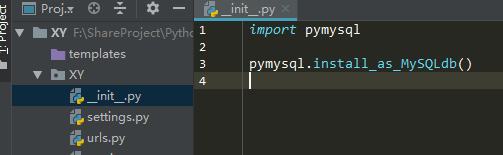
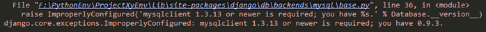
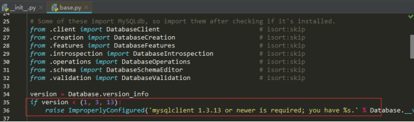
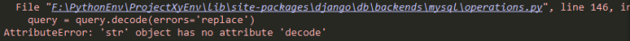
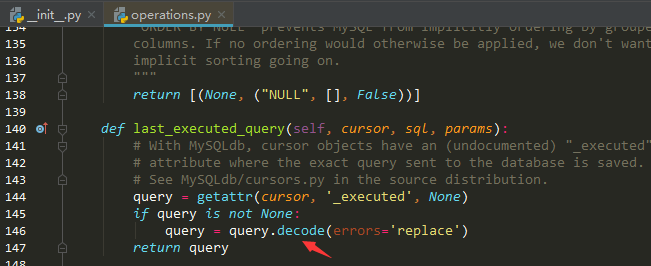
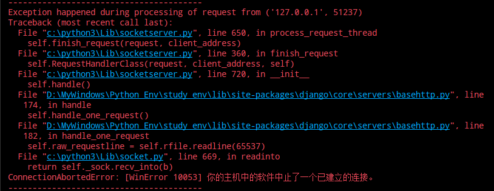
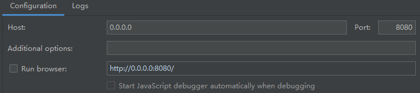
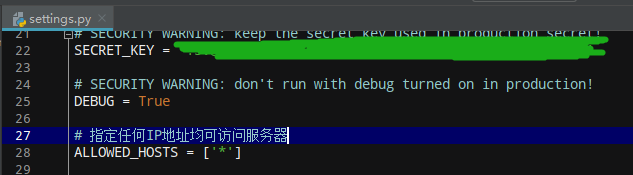

# Django

## 编码规范

1. 代码布局

    - 缩进：4个空格代表缩进的层级，需要折行的情况下，需要保持代码元素对齐，在使用悬挂缩进方式对齐时，第一行不需要有参数元素，最后一行不要对接下来的行造成干扰。尽量不要让代码折行，会影响阅读体验。

        ```python
        # 参数较多的情况下，参照以下方法
        foo = long_function_name(var_one, var_two,
                                								 var_three, var_four)
        
        # 使用更多的缩进来区分剩下的部分
        def long_function_name(
        				var_one, var_two, var_three,
        				var_four):
            print(var_one)
         
        # 悬挂缩进需要增加一级缩进
        foo = long_function_name(
        		var_one, var_two,
        		var_three, var_four )
        
        # 换行是要跟在操作的元素更容易匹配
        incom = (  gross_wages
                             + taxable_interest
                             + ( dividends - qualified_dividends )
                             -  ira_deduction
                             - student_loan_interest )
        
        # 对于 import 内容过多的情况，可以使用以下方法
        form xx_module import (
                a, b, c,
                d, e, f,
        )
        ```

    - 优先使用空格（space），而不是 Tab。

    - 空行，顶级的类或者方法周围（上下）应该各有两个空行。类内部的方法周围（上下）需要各有一个空行。多余的空行可以用来划分相关的函数或者相关的代码块。

    - import 语句需要放到文件顶部，在模块注释和文档注释之后，且在模块级全局变量和常量定义之前。

        ```python
        import sys
        import os
        from subprocess import Popen, PIPE
        ```

        需要按照以下顺序来组织不同的引用（各组引用之间要用空行分隔），推荐使用绝对路径来引用，明确的相对引用也是可以的。避免使用通配符（*）来引用：

        1. 标准库的引用
        2. 相关第三方库的引用
        3. 本项目中其他模块的引用

    - 模块级别的双下划线命名

        通用语 dunder（double underscore），表示变量两侧各有两个下划线的命名方式，如：\__version__ 和 \_\_author__ 。

        ```python
        """
        __all__、__version__、__author__，等定义需要放在 docstring（文档注释）之后，其他 import 语句之前，除了（from __future__ import xxxx 这种引用外）
        """
        from __future__ import barry_as_FLUFL
        
        __all__ = {'a', 'b', 'c'}
        __version__ = '0.1'
        __author__ = 'Cardinal Biggles'
        
        import os
        import sys
        ```

2. Model（模型）中的编码规范

    - 使用小写的下划线命名替代驼峰式命名

        ```python
        class Person(models.Model):
            first_name = models.CharField(max_length=20)
            last_name = models.CharField(max_length=40)
        ```

    - 顺序和空行，一个模型中一般有几种类型的定义，顺序如下（注意：每种定义之间要用空行分隔）：

        - 字段定义
        - 自定义 managers 属性
        - class Meta 定义
        - def \__str__ 方法
        - def save 方法
        - def get_absolute_url 方法
        - 其他方法定义

    - choices 字段的用法。如果用到了带有 choices 参数的字段，choices 的定义需要大写。
    
3. 项目结构

    构建原则：根据使用频率以及需要依赖的文件合理地规划项目文件结构。总结：让操作更轻松。

    （project）通用结构：

    - **LICENSE**：开源项目一般会配置此项，表示开源协议。
    - **MANIFEST.in**：与 setup.py 配合使用
    - **README.md**：项目介绍
    - **conf/**：存放项目相关的配置文件。比如：部署时用到的 Nginx 配置，Supervisor 的配置或者其他相关的配置。
    - **fabfile/**：针对 Fabric 的配置，这个也可是一个独立文件。如果功能较多，可拆分成多个模块，并将其放在 fabfile 包下，通过 \__init__.py 进行暴露。
    - **others/**：其他一些有必要放到源码管理里面的内容。
    - **requirements.txt**：项目依赖模块，新开发人员通过 pip install -r requirements.txt 来安装好项目所有依赖。
    - **setup.py**：用来打包项目
    - **src/**：项目源码目录
    - **.gitignore**：用来省略一些不需要被纳入源码管理的内容。

    合理的项目结构非常重要，在实际拆分中，还有 url 的拆分和 views 的拆分。目的一样都是保证项目结构的合理性，降低后期的开发和维护成本。

## WSGI - Web 框架基础

WSGI，全称 Web Server Gateway Interface（Web 服务器网关接口）。这是Python中定义的一个网关协议，规定了 Web Server 如何跟应用程序交互。Web Server 可以理解为一个 Web 应用的容器，通过它可以启动应用，进而提供HTTP 服务。而应用程序是指基于框架所开发的系统。该协议最主要的目的就是保证在Python中所有Web Server 程序或者说 Gateway 程序，能够通过统一的协议跟 Web 框架或者说Web应用进行交互。

## Setting 配置

Django 所有的配置都在这个模块中，同一份配置怎么来更好的区分开发环境和线上环境？所涉及的数据库配置、域名的配置、缓存的配置等。理论上，开发环境的配置跟生产环境的配置完全没关系，在维护生产环境的配置时，不需要考虑其他环境的配置。

具体做法，把之前的内容放到 settings/base.py 中，删除原 settings.py 文件，同时新增 \__init__.py、develop.py 和 product.py 文件。拆分独立模块后，把需要独立配置的内容分别放置在不同的模块中，比如 DATABASES 配置，在 develop.py 中可以配置 SQLite 数据库，在 product.py 中可以配置正式的 MySQL数据库。

拆分完 settings 之后，需要修改两个文件：manage.py 和 wsgi.py 。可以通过设定环境变量 PROJECT_PROFILE 为 develop 或者  product，让 Django 加载不同的配置。

```python
# 均需要重新设定这两个文件的（.manage.py probject/wsgi.py）
os.environ.setdefault("DJANGO_SETTINGS_MODULE", 'project.settings.%s' % profile)
```

### 配置为中文

```python
LANGUAGE_CODE = 'zh-hans'	# 语言 中文
TIME_ZONE = 'Asia/Shanghai'		# 时区
USE_I18N = True		# 语言 多国语言？
USE_L10N = True		# 数据和时间格式
USE_TZ = True		# 启用时区
```

### 配置MySQL数据库

```shell
# 安装 PyMySQL 包
pip install PyMySQL
```

配置 DATABASES 选项内容

```python
DATABASES = {
    'default': {
        'ENGINE': 'django.db.backends.mysql',
        'NAME': 'you_data_name',		# 要接入的数据库名称
        'USER': 'you_login_name',		# 登录数据库的用户名
        'PASSWORD': 'you_login_password',		# 登录数据库的登录口令
        'HOST': '127.0.0.1',		# MYSQL 服务器地址，可以是域名或是IP地址
        'PORT': '3306'		# MYSQL 服务器端口
    }
}
```

编辑配置项目配置目录下的 \__init__.py 文件内容



#### 版本报错的解决方案

会弹出错误信息，说版本不符，只须将弹出错误代码注释掉即可。





## 错误集

### 'str' object has no attribute 'decode'



解决方法：把 decode 方法改为 encode 方法即可



### 数据库无法同步

频繁更改数据表结构，可能会出现 makemigrations 和 migrate 无法同步数据库的可能

```shell
Python manage.py makemigrations -empty you_app_name
makemigrations
migrate
```

### [WinError 10053] 



原因：没有指定IP地址来运行django开发版WEB服务器。

解决：不能使用 127.0.0.1 作为服务器地址。可指定任意IP地址可访问本服务器，或特定IP地址才能访问本服务器。暂时还不能解决错误提示





