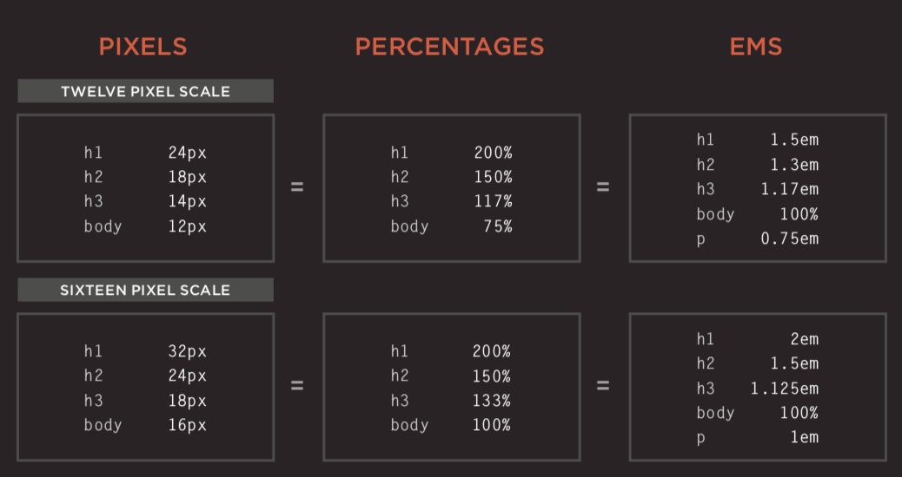

# Python 基础

## 文件头注释的区别

```python
#! /usr/bin/python		去usr/bin/ 目录下找python去执行, 绝对路径
#! /usr/bin/env python	在#!/usr/bin/env 中找到python的安装路径，然后去执行它，用法灵活，推荐使用
#-*-conding:utf-8-*- 	制定编码位 utf-8
```

## 变量

### global

- global 标志实际上是为了提示 python 解释器，表时被修饰的变量是全局变量。这样解释器就可以从当前空间（current scope） 中读写相应变量了。
- Python 的全局变量是模块（module）级别
- 每个 Python 函数拥有对应的  \__global__ 字典，该字典与函数所属模块的 (\__dict__\) 字典完全相同，函数的全局变量也会从这个字典中获取。

上面内容意思是，python 解释器发现函数中的某个变量被 **global** 关键字修饰，就去函数的 \__globals__ 字典变量中寻找（因为 python 中函数也是 一等对象）；同时，一个模块中每个函数的  \_\_globals__  字典变量都是模块 \_\_dict__ 字典变量的引用，二者值完全相同。

### nonlocal

用于指明某个特定的变量为封闭作用域，并重新绑定它。

### 变量类型

```python
a = 10
print(type(a))	# 使用type()可以检查变量的类型
>>> <class 'int'>
```

##### 整型  (Int)

Python Number 数据类型用于存储数值。数据类型是不允许改变的，如果改变Number数据类型的值，将重新分配内存空间。

```python
# del 语句删除一些Nember对象引用，可以删除单个或多个对象
del var
```

```python
# 整型 支持二进制,八进制,十进制,十六进制 的表示法
a = 0b100
print(a) # 直接把二进制转换为十进制显示出来: 4
a = 0o100
print(a) # 八进制 转为 十进制输出: 64
a = 0x100
print(a) # 十六进制转为 十进制输出: 256
# 方法
# 把字符转换整型 int(string)
a = int("10")
"""
返回参数的绝对值, 数字的绝对值可以被认为是与零的距离
	任何有理数的绝对值都是大于或等于0的数,这是绝对值的非负性
	绝对值待于同一个正数的数有两种,这两个数互为相反数或相等
	互为相反数的两个数的绝对值相等
	正数的绝对值是它本身
	负数的绝对值是它的相反数
	0 的绝对值是0
"""
abs(int_value)
```

##### 浮点型 (Float)

浮点数也就是小数，因为按照科学记数法表示时，一个浮点数的小数点位置是可变的，浮点数除了数学写法（如，123.456）之外还支持科学计数法（如：1.23456e2)

```python
float(str_value)	# 将一个字符串的数值转换为浮点数，注意：字符串不是数值，转换会报错
```

##### 字符串型  (str)

字符串是以单引号或双引号括起来的任意文本，比如：'hello' 和 "hello",字符串还有原始字符串表示法、字节字符串表示法，Unicode字符串表示法，而且可以书写成多行的形式（用三个单引号或三个双引号开头，三个单号或三个双引号结尾）。

```python
# str() 可将其他类型的变量转换为str类型
name = "Jack"	# str
age = 18		# int
course = ['web','Java','Python','MySQL','Linux']	# list
greads = [80,89,93,80,50]	# list
temp = {'name':'Jack', 'age':18}	# dict
# 都可以使用 str(value_name) 转换成为字符串类型（str) 
```

###### 应用方法

```python
s = "windows Python"
# len() 获取字符串的长度
len(s)	>>> 13
# 把字符串的第一个字母大写，即使字符串有其他字符是大写，也会把第一个字母写，其他字母小写
s.capitalize()	>>> "Windows python"
# 大小写相互转换，原大写变为小写，原小写变为大写
s.swapcase()	>>> "WINDOWS pYTHON"
# 转换为小写 不管原先是大写或是小写，统一转成小写输出
s.lower()    >>> "windows python"
# 每个单词单字母大写
s.title()    >>> "Windows Python"
# 转换为大写，不管原先是大写还是小写，统一转成大写输出
s.upper()   >>> "WINDOWS PYTHON"
# 居中显示，可自定义填充字符,参数1是显示长度，参数2是以什么字符来填充
s.center(20)		>>> "   windows Python   "
s.center(20,'*')	>>> "***windows Python***"
# s.count('要寻找的字符'，起始位置，结束位置) 找子字符串个数，返回子字符在字符串中的个数
s.count('o')			>>> 2	# 遍历字符串，返回要寻找的字符在字符串中的个数
s.count('o',6)			>>> 1	# 从第6个开始查找计算个数
s.count('o',6,13)		>>> 1	# 从第6个 至 第 13-1个范围内开始查找计算个数
s.count('py',1,14)		>>> 0	# 为什么是0，因为区分大小写
s.count('on',1,len(s))	>>> 1	# 从第1个 至 整个字符串长度 -1 个范围内开始查找
# encode / decode 编码 / 解码
s2 = s.encode(encoding='UTF-8', errors='strict')		>>> b'windows Python'
encoding 参数可选，即要使用的编码，默认编码为：'UTF-8'
常用编码类型有：'UTF-8, gb2312, cp936, gbk'
errors 参数可选，设置不同错误的处理方案。默认为：'strict'，意为编码错误引起一个UnicodeEncodeError。
其他可能值有：'ignore, replace, xmlcharrefreplace' 以及通过 codecs.register_error() 注册其它的值。

s1 = s2.decode()		>>> 'windows Python'
# endswith() 判断字符串的后缀名是否为某字符元素
s.endswith('python')	>>> False # 区分大小写
s.endswith('Python')	>>> True
s.endswith('on',0,9)	>>> False # 指定范围内是否以on字符串结尾
# expandtabs() 将\t 替换为制定空格数，默认为8个
s1 = 'asd\tfgh\ttjkl'
print(s1)         >>>'asd	fgh	tjkl'
s1.expandtabs()	  >>>'asd     fgh     tjkl'
s1.expantdabs(3)  >>>'asd   fgh   tjkl'		# 指定空格的数量
# find / rfind 寻找子字符串，返回首次出现的索引 / 返回最后一次出现的位置，找不到返回 -1
# find(str,beg=0,end=len(string)) str:查找的字符串，beg:开始查找的位置，默认为0,end：结束查找的位置，默认为字符串的长度
s.find('s')    >>> 6
s.rfind('o')   >>> 12 # 返回最后一次出现的位置索引
# index(str,beg,end) 寻找子字符串，返回索引，找不到报错
s.index('o')   >>> 4
# join() 将序列中的元素以指定的字符连接生成一个新的字符串
"-".join(s)   >>> "w-i-n-d-o-w-s- -P-y-t-h-o-n"
"*".join(s)   >>> "w*i*n*d*o*w*s* *P*y*t*h*o*n"
# ljust(len,str) / rjust(len,str) 返回一个原字符串左右对齐，并使用指定字符填充至长度width的新字符串
s.ljust(20,'*')   >>> "windows Python******"
s.rjust(20,'-')   >>> "******windows Python"
# strip()/lstrip()/rstrip() 截掉字符串左或右的空格或指定字符
s1 = "        asdfghjkl     "
s2 = "********aadsfdglif*****"
s1.strip()     >>> "asdfghjkl"
s2.strip()     >>> "aadsfdglif"
s2.rstrip()    >>> "********aadsfdglif"
s2.lstrip()    >>> "aadsfdglif*****"
# partition() 使用指定字符作为分隔符将字符串进行分割
s = "asdfghjkl"
s.partition('fgh')   >>> ('asd', 'fgh', 'jkl')
# replace() 将指定字符替换成另一字符
s = 'asdfghjkl'
s.replace('df',"!@#$%^&*")   >>> "as!@#$%^&*ghjkl"
# split()/replit() 移除字符串头尾指定的字符（默认为空格）
s = 'asdfghjkl'
s.split('gh')   >>> ['asdf', 'jkl']
s.rsplit('gh')  >>> ['asdf', 'jkl']
# splitlines() 分割行 以 \n 来分割字符串
s = "asd\nuyj\njjj\nhfdskhf"
s.splitlines()   >>> ['asd', 'uyj', 'jjj', 'hfdskhf']
# startswith(str,start,end) 判断字符串是否以某个字符串开始，是返回 True 
s = 'asdfghjkl'
s.startswith('asd')     >>> True
s.startswith('dfg',2)   >>> True
s.startswith('dfg',2,7) >>> True
s.startswith('fds')     >>> False
```

###### 字符串格式化 format

```python
# 位置映射
"{}:{}".format('192.168.0.1',8080)   >>> '192.168.0.100:8888'
# 关键字映射, ('192.168.0.1','8080') 是个元组，{0}和{1}就是元组的索引，server 是关键字映射关系
"{server}{1}:{0}".format(8080,'192.168.0.1',server='Web Server Info:')
>>> 'Web Server Info:192.168.0.1:8080'
# 元素访问, 元素索引对应关系
"{0[0]}.{0[1]}.{0[2]}".format(('www','baidu','com'))
>>> "www.baidu.com"
# 填充对齐 ^、<、> 分别是居中，左对齐，右对齐
# * 填充符（不写就用空格填充），> 对齐符（右对齐），2 表示字符宽度
"{0}*{1}={2:*>2}".format(3,2,2*3)     >>> "3*2=*6"
"{0}*{1}={2:0>2}".format(3,2,2*3)     >>> "3*2=06"
for i in range(1,10):	# 九九乘法表
    a = 1
    while a <= i:
        print("{0}*{1}={2:0>2}".format(a,i,a*i),end='\t')
        a += 1
    print()
"""
1*1=01	
1*2=02	2*2=04	
1*3=03	2*3=06	3*3=09	
1*4=04	2*4=08	3*4=12	4*4=16	
1*5=05	2*5=10	3*5=15	4*5=20	5*5=25	
1*6=06	2*6=12	3*6=18	4*6=24	5*6=30	6*6=36	
1*7=07	2*7=14	3*7=21	4*7=28	5*7=35	6*7=42	7*7=49	
1*8=08	2*8=16	3*8=24	4*8=32	5*8=40	6*8=48	7*8=56	8*8=64	
1*9=09	2*9=18	3*9=27	4*9=36	5*9=45	6*9=54	7*9=63	8*9=72	9*9=81
"""
# 精度设置	{:.2f} 表示浮点型，2f 表示精度（也就是小数点后保留位数）
"{:.2f}".format(321.22345)     >>> 321.22	# 不足位数，会在后面补充0
"{:.2f}".format(321.22545)     >>> 321.23	# 会四舍五入
```

###### 字符串判断

```python
# isalnum() 如果string至少有一个字符并且所有字符都是字母或数字，则返回True,否则返回Fals
"aogkwif9887632".isalnum()   >>> True
"aogkwif988#7632".isalnum()  >>> False
# isalpha() 如果string至少有一个字符并且所有字符都是字母则返回True，否则返回False
print("aodkgwoks".isalpha())    >>> True
print("aodkgwoks10".isalpha())  >>> False
# isdecimal() 检查字符串是否只包含十进制字符。只存在于unicode对象
print("0x100".isdecimal())  >>> False
print("100.01".isdecimal()) >>> False
print("100".isdecimal())    >>> True
# isdigit() 如果string只包含数字则返回True， 否则返回False
"10".isdigit()   >>> True
"10a".isdigit()  >>> False
# isupper() 字符串所有字符都是大写，返回True,否则返回False
# islower() 字符串所有字符都是小写，返回True,否则返回False
# isnumeric() 字符串只包含数字字符，则返回true,否则返回False
# isspace() 字符串只包含空格，则返回true,否则返回False
# istitle() 字符串中所有的单词拼写首字母是否为大写，且其他字母为小写，则返回true,否则返回False
```

###### 字符串的切片

```python
str1 = "abc123456"
str1[2]	#c 从字符串中取出指定位置的字符（下标运算）
# 字符串切片，从指定的开始索引到指定的结束索引
str1[2:5] # c12	 取指定片段
str1[2:]  # c123456  最后一个不指定索引的话，就从起始位置取到最后
str1[2::2] # c246 从第二个开始，间隔着取出字符
str1[::2]  # ac246 从第一个开始， 间隔着取出字符
str1[::-1]  # 654321cba 从字符串后面开始取出所有字符
str1[-3:-1] # 45 从倒数第3个开始取，取到最后
```

##### 布尔型

布尔值只有True， False 两种值，可以直接给出，也可以通过布尔运算给出

##### 复数型

形如3+5j，跟数学上的复数表示一样，唯一不同的是虚部的 i 换成了 j 。

#### 变量命名

###### 硬性规则

- 变量名由字母（广义的Unicode字符，不包括特殊字符)、数字和下划线构成，数字不能开头。
- 大小写敏感（大写的A和小写的a是两个不同的变量）
- 不要跟关键字和系统保留字冲突

###### PEP8 要求

- 用小写字母拼写，多个单词用下划线连接
- 受保护的实例属性用单个下划线开头
- 私有的实例属性用两个下划线开头。

## 数据类型

### 列表 list

#### 列表的增、删、改、查

```python
list1 = [1,2,3,4,5,6]
print(list1 * 3)	# >>> [1, 2, 3, 4, 5, 6, 1, 2, 3, 4, 5, 6, 1, 2, 3, 4, 5, 6]
len(list1)		    # >>> 6 计算列表长度（元素个数）
# 下标（索引）运算 list[index] 取出列表中该索引值的元素，如果索引值超出列表范围，抛出错误
list1[0]	# >>> 1
list1[5]	# >>> 6
list1[7]	# >>> IndexError: list index out of range
list1[-1]	# >>> 6
list1[-3]	# >>> 4
# list 列表的元素的赋值
list1[0] = 10	# >>> [10,2,3,4,5,6]
# list 列表的增
list1.append(100)	# >>> [1, 2, 3, 4, 5, 6, 100]	在列表尾部增加元素
# list 列表的插入, list.insert(index,element_or_object)
list1.insert(1,2000)	# >>> [1, 2000, 2, 3, 4, 5, 6] 在指定的索引中插入新的元素或对象
list1 += [1000, 2000]	# >>> [1, 2, 3, 4, 5, 6, 1000, 2000] 在列表尾部追加新的列表
# list 列表的删除元素
list2 = [1, 2, 3, 4, 16, 5, 6, 13]
list2.remove(16)	# >>> [1, 2, 3, 4, 5, 6, 13]	从列表中删除指定元素
del list2[2]	    # >>> [1, 2, 4, 16, 5, 6, 13] 删除列表中指定索引值的元素
list2.clear()	    # >>> []  清空列表中所有元素或对象
```

#### 切片操作

通过切片操作可以实现对列表的复制或者将列表中的一部分取出来创建新的列表

```python
fruits = ['grape','apple','strawberry','waxberry']
fruits += ['pitaya', 'pear', 'mango']	# 在列表后追加新的列表元素
# 循环遍历列表元素
for fruit in fruits:
    # 不换行，直接一行打印出所有元素，使用了字符串的title()函数，单词首字母大写
    print(fruit.title(), end=' ')
# 取出了索引为1，2，3的元素组成新的列表 fruits2
# 注意： fruits3 = fruits 并没有复制列表，只是创建了新的引用
fruits2 = fruits[1:4]	# >>> ['apple', 'strawberry', 'waxberry'] 
# 完整切片操作来复制列表
fruits3 = fruits[:]
# 还可以通过反向切片操作来获得倒转后的列表的拷贝
fruits4 = fruits[::-1]
fruits5 = fruits[-3:-1]   # >>> ['pitaya', 'pear'] 倒数回第3个和第1个元素
```

#### 排序操作

```python
list1 = ['orange', 'apple', 'zoo', 'internationalization', 'blueberry']
# sorted 函数返回列表排序后的拷贝不会修改传入的列表
# 函数的设计就应该像 sorted 函数一样尽可能的不产生副作用
# reverse = False 是默认值，按照字母的顺序进行排序
list2 = sorted(list1)   # >>> ['apple', 'blueberry', 'internationalization', 'orange', 'zoo']
# reverse = True ， 按照字母的顺离进行倒序排序
list2 = sorted(list1, reverse=True)  # >>> ['zoo', 'orange', 'internationalization', 'blueberry', 'apple']
# 通过 key 关键字参数指定根据字符串长度进行排序，而不是默认的字母表顺序
list2 = sorted(list1,key=len) # >>> ['zoo', 'apple', 'orange', 'blueberry', 'internationalization']
# 给列表对象发出排序消息直接在列表对象上进行排序
list1.sort(reverse=True) # >>> ['zoo', 'orange', 'internationalization', 'blueberry', 'apple']
```

#### 列表生成式语法 - 创建列表

```python
# 列表的生成表达式语法创建列表容器
f = [x for x in range(1,10)]
# 等价于：
f1 = []
for x in range(1,10):
    f1.append(x)
>>> [1, 2, 3, 4, 5, 6, 7, 8, 9]

f = [x + y for x in 'ABCDE' for y in '1234567']
# 等价于：
f1 = []
for x in 'ABCDE':
    for y in '1234567':
        f1.append(x + y)
>>>  ['A1', 'A2', 'A3', 'A4', 'A5', 'A6', 'A7', 'B1', 'B2', 'B3', 'B4', 'B5', 'B6', 'B7', 'C1', 'C2', 'C3', 'C4', 'C5', 'C6', 'C7', 'D1', 'D2', 'D3', 'D4', 'D5', 'D6', 'D7', 'E1', 'E2', 'E3', 'E4', 'E5', 'E6', 'E7']

# 使用循环的语法方式创建列表，需要耗费较多的内存空间，创建列表后元素都是已经准备就绪
f = [x ** 2 for x in range(1,1000)]
# 可使用 sys.getsizeof(f) 来查看对象占用内存的字节数
sys.getsizeof(f)

# 使用以下代码创建的不是一个列表，而是一个生成器对象
# 通过生成器可以获取到数据，但是它不占用额外的空间存储数据
# 每次需要数据的时侯，就通过内部的运算得到数据（需要花费额外的时间）
f = (x + y for x in 'ABCDE' for y in '1234567')
# 不过取出数据需要用到循环来取出
for val in f:
    print(val)

# 另一种定义生成器的方式，通过关键字 yield 将一个普通函数改造成生成器函数。
# 演示一个斐波拉切数列的生成器。
"""
所谓的斐波拉切数列（Fibonacci Sequence）,又称黄金分割数列，这个数列从第3项开始，每一项都等于前面两项之和。
递推的方法定义：F(1)=1,F(2)=2,F(n)=F(n-1)+F(n-2)(n>=3,n∈N*)
"""
def fib(n):
    a, b = 0, 1
    for _ in range(n):
        a, b = b, a + b
        yield a
        
def main():
    for val in fib(20):
        print(val)
if __name__ == "__main__":
    main()
    >>> 1, 1, 2, 3, 5, 8, 13, 21, 34, 55, 89, 144, 233, 377, 610, 987, 1597, 2584, 4181, 6765, 
```

#### 关于 yield 用法的解释

```python
"""
yield 初步认识：先看做为 return ，普通的意思就是返回某个值，返回之后，程序就不再往下运行。
然后第二步，即然是个 return ，再把它看做是生成器（generator）的一部分
（带yield的函数才是真正的迭代器）
"""
def foo():
    print('Starting...')
    while True:
        res = yield 4
        print('res:', res)

if __name__ == '__main__':
    # 赋值生成器 foo() 给变量 g, 因为函数foo()中有yield，就表示该函数是一个迭代器
    g = foo()
    # 迭代器需要使用 next 方法来执行
    """
    1. 执行 print('Starting...') 代码,打印输出 Starting...
    2. 进入 while 循环
    3. 可以把 yield 当做是一个 return ，那么 res = 这个代码并未执行
       而是执行了 yield 4, 那么迭代器就返回了 4，至此，代码运行完毕
    """
    print(next(g))
    # 执行print，打印输出 20 个 * 号
    print('*'*20)
    """
    继续通过方法next()执行迭代器，这次与上次的next()不同，这时侯是从上一个next()停止的地方
    开始执行，也就是要执行res的赋值操作，但是注意！这个时侯赋值操作的右边是没有值的（因为刚才那个
    是return出去了，并没有给赋值操作的左边传参数），所以这时侯res赋值是None, 所以接着下面的输出
    就是 res:None
    程序会继续在while里执行，又一次碰到yield，这时侯同样 return 回 4，然后程序停止。同样print
    出的 4 是迭代器返回的 4
    """
    print(next(g))
    """
    yield 与 return 的关系和区别：带yield的函数就是一个生成器，而不是一个函数。
    这个生成器有一个函数就是next函数，next就相当于下一步生成哪个数，这一次的next开始的地方
    接着上一次的next停止的地方执行，所以调用next的时侯，生成器并不会从foo函数的开始执行。
    只是接着上一步停止的地方开始，然后遇到yield后，return 出要生成的数，此步就结束。
    """
    """
    程序会从yield关键字那一行继续向下运行，send会把7这个值赋值给res变量，由于send方法中
    包含next方法，所以程序会继续向下运行，执行print方法，打印出 res:7，然后再运行下去，
    while循环回来，再遇到 yield ，返回 4
    """
    print(g.send(7))
    
# 输出结果
Starting...
4
********************
res: None
4
res: 7
4
```


### 集合 Set

Python 中的集合跟数据上的集合是一致的，不允许有重复元素，而且可以进行交集、并集、差集等运算。Python 中允许通过一些特殊的方法来为某种类型或数据结构自定义运算符，例如 & 运算符跟 intersection 方法的作用就是一样的，但是使用运算符可让代码更加直观。

https://blog.csdn.net/qq_33206497/article/details/82717806

https://www.cnblogs.com/gkx0731/p/9428575.html

```python
# 集合特性：不允许有重复元素, 自动去除重复的元素，只留其一
set1 = {1,2,3,3,3,2}	>>> {1,2,3}
# 集合添加元素的方法
set1.add(4)
set1.add(5)
>>> {1,2,3,4,5}
set1.update([11,12])	>>> {1,2,3,4,5,11,12}
# 集合删除元素
set1.discard(5)		>>> {1,2,3,4,11,12}
# remove 的元素如果不存在会引发 KeyError,推荐使用
if 5 in set1:
    set1.remove(5)
# 遍历集合
for elem in set1:
    print(elem, end=' ')	>>> 1 2 3 4 11 12
# 取出集合首位元素后，并删除该首位元素
set1.pop()
>>> 1 
>>> {2,3,4,11,12}
# 集合的交集、并集、差集、对称差运算
set1 = {1,2,3,3,3,2}		>>> {1,2,3}
set2 = set(range(1,10))		>>> {1,2,3,4,5,6,7,8,9}
set3 = {2,3,4,5,4,3,2,1}	>>> {1,2,3,4,5}
# 交集 返回两个或更更多集合中都包含的元素
set1 & set2					>>> {1,2,3}
set1.intersection(set2)		 >>> {1,2,3}
set1 & set2 & set3			>>> {1,2,3}
# 并集 合并两个或多个集合的元素返回，重复的元素只返回一个
set1 | set2 | set3 		>>> {1,2,3,4,5,6,7,8,9}
set1.union(set2,set3)
# 差集 返回集合的差集 即返回的集合元素包含在第一个集合中，但不包含在第二个集合中
# 集合1去除掉包含集合2中的元素，剩余的元素返回
set2 - set1			>>> {4,5,6,7,8,9}
set2.difference(set1)
# 对称差集 返回两个集合中不重复的元素集合，即会移除两个集合中都存在的元素
set1 ^ set2		>>> {4,5,6,7,8,9}
set1.symmetric_difference(set2)
# 判断子集，如果集合1中的所有元素都包含在集合2中，则返回True，集合1就是集合2的子集
set1 <= set2
set1.issubset(set2)
# 判断超集 判断集合1是否包含集合2中的所有元素，是则返回True，集合1是集合2的超集
set2 >= set1
set2.issuperset(set1)
# 判断两个集合是否包含相同的元素，没有包含返回True，有则返回False
set1.isdisjoint(set2)
```

### 元组  tuple

Python 的元组与列表类似，不同之处在于元组的元素不能修改。由于元组的不可修改的特性，给元组的的赋值，都是重新引用新的元组，原来的元组将被垃圾回收。

```python
# 定义元组
t = ('hyh', 40, True, '广东茂名')
# 遍历元组
for member in t:
    print(member)
# 获取元组中某个值
t[0]
# 将元组转换成列表数据类型
person = list(t)
# 将列表转换成元组
t = tuple(person)
```

#### 元组不可修改这个特性的应用：

1. 元组中的元素是无法修改的，事实上我们在项目中尤其是多线程环境中可能更喜欢使用的是那些不变对象（一方面因为对象状态不能修改，所以可以避免由此引起的不必要的程序错误，简单的说就是一个不变的对象要比可变的对象更加容易维护；别一方面因为没有任何一个线程能够修改不变对象的内部状态，一个不变对象自动就是线程安全的，这样就可以省掉处理同步化的开销。一个不变对象可以方便的被共享访问）。故结论：如果不需要对元素进行添加、删除、修改的时侯，可以考虑使用元组。当然如果一个方法要返回多个值，使用元组也是不错的选择。
2. 元组在创建时间和占用的空间上面都优于列表。

### 字典  Dictionary

字典是另一种可变容器模型，类似于我们生活中使用的字典，它可以存储任意类型对象，与列表、集合不同的是，字典的每个元素都是由一个键和一个值组成的 “键值对”，键和值通过冒号分开。键一般是唯一的，值可以取任何数据类型。

#### 字典健的特性

1. 不允许同一个键出现两次，创建时如果同一个键被赋值两次，后一个值会被记住。
2. 键必须不可变，所以可以用数字，字符串或元组充当，但列表就不行。

```python
scores = {'name':'power_hyh', 'age':40, 'grender':'male'}
# 通过键来获取字典中对应的值,如果键在字典中不存在，会报错
scores['name']
>>> 'power_hyh'
# 对字典进行遍历（遍历的其实是键，再通过键获取对应的值）
for elem in scores:
    print("%s : %s" % (elem,scores[elem]))
# 更新字典中的元素
scores['name'] = 'hyh'
scores['age'] = 30
# 检查键名是否存在字典中
if key_name in dict:
    pass
scores.__contains__(key)  # 如果键存在返回true,否则返回False
# 通过 get 方法获取键对应的值，如果设有默认值，取不到就返回默认值
scores.get(key_name, None)
# 删除字典中的元素
del scores['name']	# 删除字典中键名为 “name” 的条目
del scores		   # 删除字典
scores.popitem()	# 随机返回并删除字典中的一对键和值，默认是最后一对
scores.pop(key)		# 删除字典中指定的键的一对键和值元素，没有返回 default 值
# 清空字典
scores.clear()
# 键名的唯一性，所以当键名在字典中存在，赋值就是修改，不存在，赋值就是添加
scores['occupation'] = 'Engineer'
```

#### 内置函数与方法

```python
# 返回字典键的总数
len(dict1)
# str() 把字典转换成为字符串
string = str(dict1)
# copy() 字典浅复制, 属于深拷贝父对象，不会随父对象的修改而改变，所子对象是引用，还是会随父对象中的子对象改变而改变
dict2 = dict1		# 浅拷贝，引用对象
dict3 = dict1.copy() # 浅拷贝：深拷贝父对象（一级目录），子对象（二级目录）不拷贝，还是引用
"""
dict.fromkeys(iterable[,value=None])
iterable 用于创建新的字典的键的可迭代对象（字符串、列表、元祖、字典）
value 可选参数，字典所有键对应同一个值的初始值。默认为None
返回一个新字典
"""
dict.fromkeys((1,2,3),'tuple')				# >>> {1: 'tuple', 2: 'tuple', 3: 'tuple'}
dict.fromkeys([1,2,3],'list')				# >>> {1: 'list', 2: 'list', 3: 'list'}
dict.fromkeys("123",'str')				    # >>> {'1': 'str', '2': 'str', '3': 'str'}
dict.fromkeys({1:'one',2:'two'},'dict')	     # >>> {1: 'dict', 2: 'dict'}
# dict.items() 以列表返回可遍历的（键，值）元组列表
for key,value in dict.items():
    print(key, value)
# dict.keys() 以列表返回一个字典中所有的键
dict1.keys()
# dict.values() 以列表返回一个字典中所有值
dict1.values()
# dict.setdefault(key,default=None) 如果键不存在于字典中，将会添加键并将值设为 default
# dict1.update(dict2) 把 dict2 字典的值添加到 dict1 中
dict1 = {'1':10,'2':11}
dict2 = {'3':12}
dict1.update(dict2)	# >>> {'1': 10, '2': 11, '3': 12}
```

### 运算符

| 运算符 优先级从高到低的顺序                | 描述                             |
| :----------------------------------------- | -------------------------------- |
| [ ] [ : ]                                  | 下标，切片                       |
| **                                         | 指数                             |
| ~ + -                                      | 按位取反，正，负号               |
| *  /   %   //                              | 乘，除，模(返回除法的余数)，整除 |
| +   -                                      | 加， 减                          |
| >>  <<                                     | 右移， 左移                      |
| &                                          | 按位与                           |
| ^  \|                                      | 按位异或， 按位或                |
| <=  ,  <  ,  >  ,  >=                      | 小于等于，小于，大于，大于等于   |
| ==， !=                                    | 等于，不等于                     |
| is , is not                                | 身份运算符（ 在里面， 不在里面） |
| in, not in                                 | 成员运算符（是成员，不是成员）   |
| not  , or , and                            | 逻辑运算符（不是， 或， 且）     |
| =,+=,-=,*=,/=,%=,//=,**=,&=,\|=,^=,>>=,<<= | （复合）赋值运算符               |

## 循环结构

### for-in 循环

明确的知道循环执行的次数或者是要对一个容器进行迭代

```python
"""
用for循环实现1~100求和
range 可用来产生一个不变的数值序列，而且这个序列通常用来循环中
range(101) 产生一个0到100的整数序列
range(1,100) 产生一个1-99的整数序列
range(1,100,2) 产生一个1-99的奇数序列，其中2是步长，即数值序列的增量
range(100,0,-1) 产生一个100到1的序列，每次循环-1
"""
sum = 0
for x in range(101):
    sum += x
print(sum)	
>>> 5050
```

#### enumerate 函数

用于将一个可遍历的数据对象（如列表、元组或字符串）组合为一个索引序列，同时列出数据和数据下标，一般用在for循环当中。

```python
list1 = [1,2,3,4,5,6,7,8,9]
for index, value in enumerate(list1):
    print("%02d" % value, end = " ")
```

#### while 循环

如果要构造不知道具体循环次数的循环结构，推荐使用while循环。在while循环中，可使用关键字 break提前终止循环，关键字 continue ，放弃本次循环后续代码直接让循环进入下一轮。

## 函数和模块的使用

### 函数的作用

编程大师Martin Fowler 先生曾经说过：“代码有很多种坏味道，重复是最坏的一种！”， 要写出高质量的代码，首先要解决的就是重复代码的问题。解决代码的重复，就是把重复使用的代码封装到一个称之为“函数”的功能模块中，在需要使用的地方，只需调用这个“函数”就可以了。

#### 定义函数

def 关键字来定义函数，和变量一样每个函数也有一个名字，命名规则和变量的命名规则是一致的。函数后面的圆括号中可以放置传递给函数的参数，这一点和数学上的函数非常的相似，程序中函数的参数就相当于是数学上说的函数的自变量，而函数执行完成后我们可以通过return 关键字来返回一个值，这相当于数学上说的函数的因变量。

```python
def factorial(num):
    """
    求阶乘
    :param num: 非负整数
    :return: num的阶乘
    """
    result = 1
    for n in range(1,num + 1):
        result *= n
    return result

m = int(input('m = ').strip())
n = int(input('n = ').strip())
# 当需要计算阶乘的时侯,不用再写循环求阶乘,而是直接调用已经定义好的函数
print(factorial(m) // factorial(n) // factorial(m - n))
```

#### 函数的参数

Python对函数参数的处理，在Python中函数的参数可以有默认值，也支持使用可变参数，所以Python并不需要像其他编程语言一样支持函数的重载，因为我们在定义一个函数的侯可以让它有多种不同的使用方式。

```python
from random import randint
def rool_dice(n=2):
    """
    摇色子
    :param n:色子的个数
    return: n颗色子点数之和
    """
    total = 0
    for _ in range(n):
        total += randint(1,6)
    return total
# 如果没有指定参数,那么就会使用默认值,摇两颗色子
rool_dice()
rool_dice(3)

def add(a=0,b=0,c=0):
    return a + b + c
# 传递参数时可以不按照设定的顺序进行传递
add(1,2,3)
add(1)
add(1,2)
add(b=1,c=30,a=230)
```

在上面两个函数的参数都设定了默认值,这就意味着如果在调用函数的时侯如果没有传入对应参数的值时，将使用该参数的默认值,所以在上面的代码中可以用各种不同的方式去调用add函数，这与其他编程语言中函数重载的效果是一致的。

add函数还有更好的实现方案，因为可能会对0个或多个参数进行加法运算，而具体有多少个参数是由调用者来决定，我们作为函数的设计者对这一点是一无所知的，因此在不确定参数个数的时侯，可以使用可变参数。

```python
# 在参数名前面的*表示args是一个可变参数
# 即在调用add函数时可以传入0个或多个参数
def add(*args):
    total = 0
    for val in args:
        total += val
    return total
add()
add(1,2)
add(1,2,3,4,5,6)
```

##### 一、位置参数

位置参数是指直接放在函数名后括号中的参数，用逗号隔开。

```python
def make_pizza(size, topping):
    print("Making a " + str(size) + " -inch pizza with " + topping)
if __name__ == "__main__":
    # 调用函数时，直接传递2个参数给函数
    make_pizza(10,"durian")

>>> Making a 10 -inch pizza with durian
```

##### 二、关键子参数

关键字参数是指用等号赋值的参数。如果关 键字形参有默认值，则在调用函数时未提供参数的情况下使用默认值。如果调用函数时提供了实参，则实参会代替函数定义里的默认值。

```python
def make_pizza(size=10, topping="durian"):
    print("Making a " + str(size) + "-inch pizza with " + topping)
    
if __name__ == "__main__":
    # 如果调用函数时，不传递实参给函数，则输出默认值
    make_pizza()
    >>> Making a 10 -inch pizza with durian
    
    # 如果调用函数时，传递实参给函数，则输出传递给函数的实参值，而不是默认值
    make_pizza(20, "cheese")
    >>> making a 20 -inch pizza with cheese
```

##### 三、任意数量参数 F（*arge）

上面位置参数个数跟位置都必须一样。**如果想要灵活使用任意数量的参数，定义函数时可在形参名前加一个星号。**

```python
def make_pizza(*toppings):
    print("Making a 10 -inch with the following toppings.")
    for topping in toppings:
        print(" - " + topping)
        
       
 if __name__ == "__main__":
    # 向函数传递2个参数以调用函数，看到定义函数时形参只有一个，但实际上调用时可传递任意数量的实参。
    # 在函数内部是以元组形式存在
    make_pizza("durian", "cheese")
    >>> Making a 10 -inch with the following toppings.
    - durian
    - cheese    
```

##### 四、任意数量关键字参数 F (**arges)

**如果需要提供任意数量的键值对类型的参数，开在形参名前面加两个星号。**在函数内部，是以元组形式存在。

```python
def make_pizza(**toppings):
    print("Making a 10 -inch with the following toppings.")
    for key,value in toppings.items():
        print(key + " : " + value)
        
        
 if __name__ == "__main__":
    # 向函数传递2个关键字实参来调用函数。虽然定义函数时形参看起来是1个，但实际上调用时可传递任意数量的关键字实参。在函数内部是以字典形式存在。
    make_pizza(topping1="druian", topping2="cheese")
>>> Making a 10 -inch with the following toppings.
topping1 : durian
topping2 : cheese
```

##### 五、综合使用4种类型的参数

以上四种参数都可以单独使用，也可以混合使用。**混合使用时，位置参数必须在关键字参数之前，关键字参数必须在带星号的可变参数之前，带一个星的可变参数必须在带二个星的可变关键字参数之前。**

```python
def make_pizza(size, origin="durian", *fruits, **vegetables):
    toppings = []
    toppings.append(origin)
    for fruit in fruits:
        toppings.append(fruit)
    for value in vegetables.values():
        toppings.append(value)
    print("Making a " + str(size) + "-inch pizza with the following toppings:")
    print(toppings)
    
if __name__ == "__main__":
    make_pizza(8, "pineapple", "peach", vegetable1="onion", vegetable2="zeen pepper")
```

#### 函数的使用方式（进阶）

将函数视为"一等公民"

- 函数可以赋值给变量
- 函数可以作为函数的参数
- 函数可以作为函数的返回值

高阶函数的用法（ filter、map 以及它们的替代品）

```python
items = list(map(lambda x : x ** 2, filter(lambda x: x % 2, range(1, 10))))
items = [x ** 2 for x in range(1, 10) if x % 2]
```

位置参数、可变参数、关键字参数、命名关键字参数

参数的元信息（代码可读性问题）

匿名函数和内联函数的用法（ lambda 函数）

闭包和作用域问题

- Python 搜索变量的LEGB顺序（ Local > Embedded > Global > Built - in ）
- global 和 nonlocal 关键字的作用

装饰器函数（使用装饰器和取消装饰器）


### 用模块管理函数

在同一个Python文件中定义了两个同名函数，由于Python中没有函数重载的概念，那么就会存在后面定义的函数覆盖了前面定义的函数，也就意味着两个函数同名，实际上只有一个函数存在作用。

在Python中，每个文件就代表一个模块（module），我们在不同的模块中可以有同名的函数，在使用函数的时侯可以通过 import 关键字导入指定模块就可以区分到底要使用哪个模块中的同名函数。

module1.py

```python
def foo():
    print("hello,world！")
```

module2.py

```python
def foo():
    print('goodby, world!')
```

test.py

```python
form module1 as m1	# 导入module1模块，并命名为 m1
form module2 as m2  # 导入module2模块，并命名为 m2
m1.foo()	# 使用m1中的foo() 函数
m2.foo()	# 使用m2中的foo() 函数
```

需要注意的是，如果我们导入的模块除了定义函数之外还有可能执行代码，那么Python解释器在导入这个模块时就会执行这些代码，事实上我们可能并不希望这样，因此我们在模块中编写了执行代码，最好是将这些执行代码放下如下所示的条件中，这样的话，除非直接运行该模块，否则在导入该模块时这些可执行代码是不会执行的。

```python
def foo():
    pass

def bar():
    pass

# __name__是Python中一个隐含的变量，它代表了模块的名字
# 只有被Python解释器直接执行的模块的名字才是__main__
if __name__ == "__main__":
    print('call foo()')
    foo()
    print('call bar()')
    bar()
```

#### 变量作用域

```python
def foo():
    b = 'hello'	# 局部作用域，对于 bar 函数而言，是嵌套作用域
    
    def bar():	# Python 中可以函数内部再定义函数
        c = True	# 局部作用域
        print(a)
        print(b)
        print(c)
        
    bar()
    # print(c) # NameError: name 'c' is not defined

if __name__ == "__main__":
    a = 100	# global variable 全局变量，属于全局作用域
    # print(b)	# NameError: name 'b' is not defined
    foo()
    
    >>> 100
    >>> hello
    >>> True
```

在 if 分支中定义的变量 a，这是一个全局变量（global variable），属于全局作用域，因为它没有定义在任何一个函数中。foo 函数中定义了变量 b ，这是一个定义在函数中的局部变量（local variable），属于局部作用域，在 foo 函数的外部并不能访问到它；但对于 foo 函数内的 bar 函数来说，变量 b 属于嵌套作用域，在 bar 函数中我们是可以访问到它的。bar 函数中的变量 c 属于局部作用域，在 bar 函数之外是无法访问的。事实上，Python 查找一个变量时会按照 ”局部作用域“、”嵌套作用域“、”全局作用域“ 和 ”内置作用域“ 的顺序进行搜索，前三者我们在上面的代码已经看到了，所谓的 ”内置作用域“ 就是 Python 内置的那些隐含标识符 min、len 等都属于内置作用域。

```python
def foo():
    a = 200
    print(a)  # >>> 200

if __name__ == "__main__":
    a = 100
    foo()
    print(a) # >>> 100
```

在以上代码中，通过函数 foo 来改变全局变量 a 的值，实际上是做不到的。因为当我们在函数 foo 中写 a = 200 的时侯，是重新定义了一个名字为 a 的局部变量，它跟全局作用域的 a 并不是同一个变量，因为局部作用域中有了自已的变量 a ,因此 foo 函数不再搜索全局作用域中的 a 。如果希望在 foo 函数中修改全局作用域中的 a 。代码如下：

```python
def foo():
    global a
    a = 200
    print(a)	# >>> 200
    
if __name__ == "__main__":
    a = 100
    foo()
    print(a)	# >>> 200
```

我们可以使用 global 关键字来指示 foo 函数中的变量 a 来自全局作用域，如果全局作用域中没有 a ，那么下面一行的代码就会定义变量 a 并将基置于全局作用域。同理，如果我们希望函数内部的函数能够修改嵌套作用域中的变量，可以使用 nonlcal 关键字来指示变量来自于嵌套作用域。

在实际开发中，应该尽量减少对全局变量的使用，因为全局变量的作用域和影响过于广泛，可能会发生意料之外的修改和使用，除此之外全局变量比局部变量拥有更长的生命周期，可能导致对象占用的内存长时间无法被垃圾回收。

事实上，减少对全局变量的使用，也是降低代码之间耦合度的一个重要举措，同时也是对迪米特法则的践行。减少全局变量的使用就意味着我们应该尽量让变量的作用域在函数内部，但是如果我们希望将一个局部变量的生命周期延长，使其在函数调用结束后依然可以访问，这时侯就需要使用闭包。（注意：闭包 与 匿名函数 在实际上是不同的概念）

推荐将 Python 代码按照以下格式进行书写

```python
def main():
    # Todo: Add your code here
    pass

if __name__ == "__main__":
    main()
```

## 错误处理

在程序运行过程中，可能会遇到各种错误。这其中有可以修复的Bug，也有无法预测的错误情况，在Python中，有一套内置的错误处理机制，来帮助我们处理错误情况。

### try

当觉得一段代码可能会出错时，就可以用 **try 语句**。如果这段代码出错，则直接跳过后面的代码，转到 **except X** 语句块，**except X** 是用来捕获错误类型X的，最后可以加上 **finally 语句**，如果有 **finally 语句**，则执行。

```python
def fn(a):
    try:
        print('try')
        r = 10 / a
        print('result：', r)
    except ZeroDivisionError as e:
        print('except:', e)
    finally:
        print('finally')
    print('end')
    return
# 出现错误的情况，当给fn传入0时，就会出现除数为0的错误：
"""
>>>fn(0)
try 
except: division by zero 
finally 
end 
"""
```

分析执行过程，执行 try 语句中的 r = 10 / a ，发现错误，直接跳过 print('result:', r) 代码，直接执行 except X 语句块，捕获取错误类型 ZeroDivisionError，并执行语句块中代码，最后执行 finally 语句块代码。 **try ... excpet X** 语句可以跨越多层调用，不管调用多少个函数，只要其中一个出错，能捕获到就可以处理。

### except 错误类型

事实上，Python 中的错误也是 class，所有的错误都继承自 BaseException，当可能出现多种错误时，可以加入多个 except X 语句来捕获不同可能产生的错误，如果不能全部预料到所有的出错类型，可以在最后添加：except BaseExcept as e，或者直接写 except: 也是可以的。不加的话，最终会让 Python 解释器打印出该错误。

[常见的错误类型和继承关系](https://docs.python.org/zh-cn/3/library/exceptions.html#exception-hierarchy)

### 无出现错误情况

可以在所有except 后加 else ，若没有出现错误，则会执行 else 语句。这样的话，在没有出现错误的情况下，会执行完 try 语句块下代码后，跳过 except 语句块代码，到 else 语句块代码，最后执行 finally 语句块代码。

### 记录错误

Python 内置的 logging 模块就是用来记录错误的。可以通过配置，logging 把错误记录到日志文件里，方便事后排查。

### 执出错误 raise

既然错误是 class ，那我们也可以自已定义一个错误类型，遇到自认为是错误情况时，抛出一个错误实例。用 **raise 语句** 可以将一个错误实例抛出。只有在必要的时侯才自已定义错误，一般情况下还是用 Python 内置的错误类型，也是可以用 raise 语句抛出。

虽然 raise 和 try 语句都有打印错误信息的作用，但两者的用途并不冲突， raise 语句负责抛出错误信息，而 try 语句负责检查是否有错误信息并捕获信息，若没有 try 语句，那么错误信息就要让 Python 解释器来处理。

## 装饰器

### @wraps(func) 的作用

装饰器本身就是个函数

```python
import time
# 定义一个装饰器
def log(func):
    # 创建一个闭包函数
    def wrapper(*args, **kwargs):
        start = time.time()	# 启动时间
        result = func(*args, **kwargs)	
        end = time.time()	# 结束时间
        print("The func '{}' used {}s.".format(func.__name__, end - start))
        return result
    return wrapper

# 如何使用这个装饰器 只是执行了 fuck = log(fuck)
@log
def fuck(name):
    """Fuck someone"""
    print("Fuck",name)

"""
也就是说，表面上是执行了 fuck("myself"),事实上执行的都是 log(fuck)("myself")
因为python里面都是对象。
"""
```

当使用一个装饰器之后，会将原本的函数元信息给覆盖掉。譬如：函数名称、函数文档等。

```python
# 如上面代码所示，fuck() 函数使用了 @log 装饰器，这时打印他的函数名称和函数文档
print(fuck.__name__)
print(fuck.__doc__)
# 就会如发现函数名称不是叫 fuck，函数文档也变成了 none
```

解决办法就是定义装饰器的时侯用 warps 装饰器装饰接受原函数参数的那一层就行了。如下

```python
import time
from functools import wraps
def log(func):
    @wraps(func)
    def wrapper(*args, **kwargs):
        start = time.time()
        result = func(*args, **kwargs)
        end = time.time()
        print("The func '{}' used {}s.".format(func.__name__, end - start))
        return result
    return wrapper
```

## 面向对象

把一组数据结构和处理它们的方法组成对象（object），把相同行为的对象归纳为类（class），通过类的封装（encapsulation）隐藏内部细节，通过继承（inheritance）实现类的特化（specialization）和泛化（specialization），通过多态（polymorphism）实现基于对象类型的动态分派。  

面向对象设计原则：

- 单一职责原则（SRP）- 一个类只做该做的事情（类的设计要高内聚）
- 开闭原则（OCP） - 软件实体应该对扩展开发对修改关闭
- 依赖倒转原则（DIP）- 面向抽象编程（在弱类型语言中已经被弱化）
- 里氏替换原则（LSP）- 任何时侯可以用子类对象替换掉父类对象
- 接口隔离原则（ISP）- 接口要小而专不要大而全（Python 中没有接口的概念）
- 合同聚合复用原则（CARP）- 优先使用强关联关系而不是继承关系复用代码
- 最小知识原则（迪米特法则，LoD）- 不要给没有必然联系的对象发消息

GoF设计模式

- 创建型模式：单例、工厂、建造者、原型
- 结构型模式：适配器、门面（外观）、代理 
- 行为型模式：迭代器、观察者、状态、策略

### 类的定义

```python
class Student(object):
    # __init__ 是一个特殊方法，用于在创建对象是进行初始化操作
    # 通过这个方法，我们可以为学生对象绑定name和age两个属性
    def __init__(self, name, age):
        self.name = name
        self.age = age
        
    def study(self, course_name):
        print("%s正在学习%s." % (self.name, course_name))
        
    # PEP 8 要求标识符的名称用全小写多个单词用下划线连接
    def watch_movie(self):
        if self.age < 18:
            print("%s未满18岁。" % self.name)
        else:
            print("%s大于18周岁，是成年人了！" % self.name)
```

写在类中的函数，通常称之为（对象的）方法，这些方法就是对象可以接收的消息。

#### 访问可见性 - Private、Protected

访问可见性，即访问权限。通常属性设置分为私有的（private）和公有的（protected）。

```python
class Test(object):
	def __init__(self, foo):
        self.__foo = foo	# 希望属性为私有的，命名是前面用两个下划线作开头
       
    def __bar(self):
        print(self.__foo)
        print('__bar')
        
 def main():
    test = Test('hello')
    test.__bar()
    # AttributeError:'Test' object has no attribute '__bar'
    print(test.__foo)
    # AttributeError:'Test' object has no attribute '__foo'

if __name__ == "__main__":
    main()
```

Python并没有从语法上严格保证私有属性或方法的私密性，它只是给私有的属性和方法换了一个名字来妨碍对它们的访问，事实上如果知道更换名字的规则仍然可以访问到它们。之所以这样设定，就是“We are all consenting adults here”。因为绝大多数程序员都认为开放比封闭要好，而且程序员要自已为自已的行为负责。

```python
class Test(object):
	def __init__(self, foo):
        self.__foo = foo	# 希望属性为私有的，命名是前面用两个下划线作开头
       
    def __bar(self):
        print(self.__foo)
        print('__bar')
        
 def main():
    test = Test('hello')
    test.__bar()
    # AttributeError:'Test' object has no attribute '__bar'
    test._Test__bar()	# 这样就可以访问私有方法
    print(test.__foo)
    # AttributeError:'Test' object has no attribute '__foo'
    print(test._Test__foo)	# 访问对象的私有属性

if __name__ == "__main__":
    main()
```

实际开发中，并不建议将属性设置为私有的，因为这样会导致子类无法访问。所以会遵循一种命令惯例：就是让属性名以单下划线开头来表示属性是受保护的，本类之外的代码在访问这样的属性时应该保持慎重。这并不是语法上的规则，这是一种暗示或隐喻。

#### @property 、@object.setter （操作类属性装饰器）

上面说到建议将属性命名以单下划线开头，通过这种方式来暗示属性是受保护的，不建议外界直接访问，那么如果想访问属性可以通过属性的getter（访问器）和setter（修改器）方法地蚝对应的操作，那么就是使用@property包装器来包装getter和setter方法，使得对属性的访问既安全又方便。

```python
class Person(object):
    def __init__(self, name, age):
        self._name = name
        self._age = age
        
    # 访问器 - getter 方法
    @property
    def name(self):
        return self._name
    
    @property
    def age(self):
        return self._age
    
    # 修改器 - setter 方法
    @age.setter
    def age(self, age):
        self._age = age
        
    def play(self):
        if self._age <= 16:
            print("%s不够16周岁。" % self._name)
        else:
            print("%s已满16周岁。" % self._name)
            
    def main():
        person = Person('小子', 12)
        person.play()
        person.age = 22
        person.play()
        
if __name__ == "__main__":
    main()
```

#### __slots__ 绑定属性或方法

如果需要限定自定义类型的对象只能绑定某些属性，可以通过在类中定义__slots__变量来进行限定，注意的是，__slots__的限定只对当前类的对象生效，对子类并不起任何作用。

```python
class Person(object):
    # 限定Person对象只能绑定_name, _age 和 _gender 属性
    __slots__ = ('_name', '_age', '_gender')
    
    def __init__(self, name, age):
        self._name = name
        self._age = age
        
    @property
    def name(self):
        return self._name
    
    @property
    def age(self):
        return self._age
    
    @age.setter
    def age(self, age):
        self._age = age
        
def main():
    person = Person('小子', 22)
    person._gender = '男'	# 允许的
    person._is_gay = True
    # AttributeError: 'Person' ojbect has no attribute '_is_gay'
```

#### 静态方法 @staticmethod

在类中定义的方法都是对象方法，也就是说这些方法都是发送给对象的消息。如果判断创建对象时传递参数是否符合创建这个对象的条件，可先行在类中定义一个静态方法来检验这些参数是否符合创建对象条件。例如以下创建三角形对象

```python
from math import sqrt
class Triangle(object):
    def __init__(self, a, b, c):
        self._a = a
        self._b = b
        self._c = c
        
    @staticmethod
    def is_valid(a, b, c):
         return a + b > c and b + c >a and a + c > b
    
    def perimeter(self):
        return self._a + self._b + self._c
    
    def area(self):
        half = self.perimeter() / 2
        return sqrt(half * self._a) * (half - self._b) * (half - self._c)
        
        
def main():
    a, b, c = 3, 4, 5
    # 在创建三角形对象前，先使用该类内部定义好的静态方法来校验传入参数是否能创建三角形
    if Triangle.is_valid(a, b, c):
        t = Triangle(a, b, c)
        print(t.perimeter())
        # 也可以通过给类发消息来调用对象方法，但是要传入接收消息的对象作为参数
        print(Triangle.perimeter(t))
        print(t.area())
    else:
        print("无法构建三角形")
        
if __name__ == "__main__":
    main()
```

#### 类方法 @classmethod

类方法的第一个参数约定名为cls，它代表的时当前类相关的信息的对象（类本身也是一个对象，有的语言会称之为类的元数据对象），通过这个参数我们可以获取和类相关的信息并且可以创建出类的对象。

```python
from time import time, localtime, sleep

class Clock(object):
    """数字时钟"""
    
    def __init__(self, hour=0, minute=0, second=0):
        self._hour = hour
        self._minute = minute
        self._second = second
        
    @classmethod
    def now(cls):
        ctime = localtime(time())
        return cls(ctime.tm_hour, ctime.tm_min, ctime.tm_sec)
    
    def run(self):
        """时钟运行"""
        self._second += 1
        if self._second == 60:
            self._second = 0
            self._minute += 1
            if self._minute == 60:
                self._minute = 0
                self._hour += 1
                if self._hour == 24:
                    self._hour = 0
                    
    def show(self):
        """显示时钟"""
        return "%02d:%02d:%02d" % (self._hour, self._minute, self._second)
    
    
def main():
    # 通过类方法创建对象并获取系统时间
    clock = Clock.now()
    while True:
        print(clock.show())
        sleep(1)
        clock.run()
```

#### 类之间的关系（is-a、has-a、use-a）

类和类之间的关系有三种：is-a、has-a和use-a关系

- is-a 继承或泛化，好比学生和人的关系、手机和电子产品的关系，都属于继承关系。

- has-a 关系通常称之为关联，比如部门和员工的关系，汽车和引擎的关系都属于关联关系；关联关系如果是整体和部分的关联，那么称为聚合关系；如果整体进一步负责了部分的生命周期（整体和部分是不可分割的，同时存在也同时消亡）那么这种就是最强的关联关系，称为合成关系。

- use-a关系通常称之为依赖，如果司机有一个驾驶的行为（方法），其中（的参数）使用到了汽车，那么司机和汽车的关系就是依赖关系。

  可以使用UML（统一建模语言）来进行面向对象建模。

#### 继承与多态

- 让一个类从另一个类那里将属性和方法直接继承下来，从面减少复复代码的编写，提供继承信息的类称为父类，也可叫做超类和基类；得到继承信息的类称为子类，也可叫派生类或衍生类。子类除了继承父类提供的属性和方法，还可以定义自已特有的属性和方法，所以子类比父类拥有更多的能力，在实际开发中，经常用子类对象去替换一个父类对象，这是面向对象编程中一个常见的行为，对应的原则称之为 **里氏替换原则**。

```python
class Person(object):
    """人"""
    
    def __init__(self, name, age):
        self._name = name
        self._age = age
       
    @property
    def name(self):
        return self._name
    
    @property
    def age(self):
        return self._age
    
    @age.setter
    def age(self, age):
        self._age = age 
       
    def play(self):
        print("%s 正在愉快的玩。" % self._name)
        
    def watch_av(self):
        if self._age >= 18:
            print("%s 在看新闻。" % self._name)
        else:
            print("%s 在看动画片。" % self._name)
       
   
class Student(Person):
    """学生，继承了Person类"""
    
    def __init__(self, name, age, grade):
        super().__init__(name, age)
        self._grade = grade
        
    @property
    def grade(self):
        return self._grade
    
    @grade.setter
    def grade(self, grade):
        self._grade = grade
       
    def study(self, course):
        print('%s 的 %s 正在学习%s' % (self._grade, self._name, course))
    
  
class Teacher(Person):
    """老师，继承了Person类"""
    
    def __init__(self, name, age, title):
        super().__init__(name, age)
        self._title = title
        
    @property
    def title(self):
        return self._title
    
    @title.setter
    def title(self, title):
        self._title = title
       
    def teach(self, course):
        print('%s%s 正在讲%s' % (self._name, self._title, course))
        
def main():
    stu = studen("hyh", 15, '初三')
    stu.study('数学')
    stu.watch_av()
    t = Teacher('power', 38, '教授')
    t.teach('Python 程序设计')
    t.watch_av()
    
   
if __name__ == "__main__":
    main()
```

以上代码中，子类通过继承了父类的方法后，可以对父类已有的方法给出新的实现版本，这称为**方法重写（override）**，通过方法重写可以让父类的同一个行为在子类中拥有不同的实现版本，当调用这个经过子类重写的方法时，不同的子类对象表现出不同的行为，这就是**多态（poly-morphism）**。

```python
from abc import ABCMeta, abstractmethod

class Pet(object, metaclass=ABSMeta):
    """宠物"""
    
    def __init__(self, nickname):
        self._nickname = nickname
       
    @abstractmethod
    def make_voice(self):
        """发出声音"""
        pass
   
class Dog(Pet):
    """狗"""
    
    def make_voice(self):
        print('%s:汪汪汪...' % self._nickname)
   
class Cat(Pet):
    """猫"""
    
    def make_voice(self):
        print('%s：喵...喵...' % self._nickname)
       
def main():
    pets = [Dog("旺财"),Cat('凯蒂'), Dog("大王")]
    for pet in pets:
        pet.make_voice()
      
   
if __name__ == "__main__":
    main()
```

在上面的代码，把 Pet 类处理成了一个**抽象类**，所谓的抽象类就是不能够创建对象的类，这种类的存在就是专门为了让其他类去继承它。在Python中，通过 abc 模块的 ABCMeta 元类和 abstractmethod 包装器来达到抽象类的效果，如果一个类中存在抽象方法，那么这个类就不能够实例化（创建对象）。Dog、Cat 两个子类分别对 Pet 类中的 make_voice 抽象方法进行了重写并给出了不同的实现版本，所以当在 main 函数中调用该方法时，这个方法就表现出了多态行为（同样的方法做了不同的事情）。


## 文件操作

Python 实现文件的读写操作，通过内置函数（open），可以指定文件名、操作模式、编码信息等来获得操作文件的对象，以便对文件进行读写操作。

| 操作模式 | 具体含义                         |
| :------- | -------------------------------- |
| 'r'      | 读取（默认）                     |
| 'w'      | 写入（会先截断之前的内容）       |
| 'x'      | 写入，如果文件已经存在会产生异常 |
| 'a'      | 追加，将内容写到已有文件的未尾   |
| 'b'      | 二进制模式                       |
| 't'      | 文本模式（默认）                 |
| '+'      | 更新（既可以读又可以写）         |

### 读写文本文件

```python
"""
使用Python 异常机制对可能在运行时发生状况的代码进行适当的处理
"""
f = None
try:
    f = open('file_name.txt', 'r', encoding='utf-8')	#encoding 指定编码，如不指定，默认值是None
    print(f.read())
except FileNotFoundError:
    print("无法打开指定的文件！")
except LookupError:
    print("指定了未知的编码！")
except UnicodeDecodeError:
    print("读取文件时解码错误！")
finally:	# finally 称为总是执行代码块，适合用来做释放外部资源的操作
    if f:
        f.close()
```

上下文语法，通过 with 关键字指定文件对象的上下文环境并在离开上下文环境时自动释放文件资源。

```python
try:
    with open('file_name', 'r', encoding='utf-8') as f:
        # 一次性读取整个文件内容
        print(f.read())
        # 通过 for-in 循环逐行读取
        for line in f:
            print(line, end='')
            time.sleep(0.5)
        # 读取文件按行读取到列表中
        lines = f.readlines()
        for line in lines:
            print(line, end='')
except FileNotFoundError:
	print('无法打开指定的文件!')
except LookupError:
	print('指定了未知的编码!')
except UnicodeDecodeError:
	print('读取文件时解码错误!')
```

### 读写二进制文件

复制图片文件的功能，如以下代码

```python
try:
    with open('photo_name.jpg', 'rb') as f1:
        data = f1.read()
        print(type(data))
    with open('target_name.jpg', 'wb') as f2:
        f2.write(data)
except FileNotFoundError as e:
    print('指定的文件无法打开！')
except IOError as e:
    print('读写文件时出现错误！')
print('图片复制完成！')
```

### 读写JSON文件

如果把一个列表或者一个字典中的数据保存到文件中，该如何操作？将数据以JSON格式进行保存。JSON是“JavaScript Object Notation” 的缩写，本来是 JavaScript 语言中创建对象的一种字面量语法，已被广泛应用于跨平台跨语言的数据交换，原因是纯文本，任何系统任何语言处理纯文本没有任何问题。

| JSON >>              | Python       | Python >>                              | JSON         |
| -------------------- | ------------ | -------------------------------------- | ------------ |
| object               | dict         | dict                                   | object       |
| array                | list         | list, tuple                            | array        |
| string               | str          | str                                    | string       |
| number( int / real ) | int / float  | int, float, int- & float-derived Enums | number       |
| true / false         | True / False | True / False                           | true / false |
| null                 | None         | None                                   | null         |

使用（json）模块可以将字典或列表以JSON格式保存，或生成JSON格式的文本

```python
import json
def main():
    mydict = {
        'name':'Ris',
        'age':40,
        'qq':2660508,
        'friends':['loklee', 'his'],
        'cars':[
            {'brand':'BYD', 'max_speed': 180},
            {'brand':'宝马', 'max_speed': 240},
            {'brand':'奔驰', 'max_speed': 240}
        ]
    }
    try:
        with open('data.json', 'w', encoding='utf-8') as f:
            json.dump(mydict, f)
    except IOError as e:
        print(e)
    print("保存数据完成！")
```

JSON 模块主要有四个比较重要的函数：

- dump	将Python对象按照JSON格式序列化到文件中
- dumps	将Python对象处理成JSON格式的字符串
- load	将文件中的JSON数据反序列化成对象
- loads	将字符串的内容反序列化成Python对象

序列化（serialization）在计算机科学的数据处理中，是指将数据结构或对象状态转换为可以存储或传输的形式，这样在需要的时侯能够恢复到原先的状态，而且通过序列化的数据重新获取字节时，可以利用这些字节来产生原始对象的副本。

从一系列字节中提取数据结约的操作，就是反序列化（deserialization）。

```python
import requests
import json

def main():
    resp = requests.get('http://api.tianapi.com/guonei/?key=APIKey&num=10')
    data_model = json.loads(resp.text)
    for news in data_model['newslist']:
        print(news['title'])
```

在Python中要实现序列化和反序列化除了使用json模块之外，还可以使用pickle 和 shelve 模块，但是这两个模块是使用特有的序列化协议来序列化数据，因此序列化后的数据只能被 Python 识别。

## 图像处理

### Pillow 操作图像

```python
pip install pillow 		# 安装
from PIL import Image

image = Image.open('./res/photo.jpg')
image.format, image.size, image.mode
('JPEG', (500, 750), 'RGB')
image.show()
```

#### 剪裁图像

```python
image = Image.open('./res/guido.jpg')
rect = 80, 20, 310, 360
image.crop(rect).show()
```

#### 生成缩略图

```python
image = Image.open('./res/guido.jpg')
size = 128, 128
image.thumbnail(size)
image.show()
```

#### 缩放和粘贴图像

```python
image1 = Image.open('./res/luohao.png')
image2 = Image.open('./res/guido.jpg')
rect = 80, 20, 310, 360
guido_head = image2.crop(rect)
width, height = guido_head.size
image1.paste(guido_head.resize((int(width/1.5), int(height/1.5))), (172, 40))
```

#### 旋转和翻转

```python
image = Image.open('./res/guido.png')
image.rotate(180).show()
image.transpose(Image.FLIP_LEFT_RIGHT).show()
```

#### 操作像素

```python
image = Image.open('./res/guido.jpg')
for x in range(80, 310):
    for y in range(20, 360):
        image.putpixel((x,y), (128, 128, 128))
```

#### 滤镜效果

```python
from PIL import Image, ImageFilter

image = Image.open('./res/guido.jpg')
image.filter(ImageFilter.CONTOUR).show()
```

## 正则表达式

[正式表达式30分钟入门教程](https://deerchao.cn/tutorials/regex/regex.htm)

正则表达式是一种工具，定义了字符串的匹配模式。（如何检查一字符是否有跟某种模式匹配的部分或者从一个字符串将与模式匹配的部分提取出来或者替换掉）。如果需要匹配的字符是正则表达式中的特殊字符，那么可以使用\进行转义处理，例如想匹配小数点，可以写成 (\.) 就可以了，因为直接写 . 会匹配任意字符。同理，想匹配圆括号必须写成\ (和 \)， 否则圆括号被视会正则表达式中的分组。 

| 符号         | 解释                              | 示例             | 说明                                                         |
| ------------ | --------------------------------- | ---------------- | ------------------------------------------------------------ |
| .            | 匹配任意字符                      | b.t              | 可以匹配 bat/but/b#t/b1t 等                                  |
| \w           | 匹配字母/数字/下划线              | b\wt             | 可以匹配 bat/b1t/b_t 等                                      |
| \s           | 匹配空白字符（包括\r、\n、\t 等） | love\syou        | 匹配 love you                                                |
| \d           | 匹配数字                          | \d\d             | 可以匹配 01 、23、99等                                       |
| \b           | 匹配单词的边界                    | \bThe\b          |                                                              |
| ^            | 匹配字符串的开始                  | ^The             | 可以匹配The开头的字符串                                      |
| $            | 匹配字符串的结束                  | .exe$            | 可以匹配以.exe结尾的字符串                                   |
| \W           | 匹配非字母、数字、下划线          | b\Wt             | 可以匹配 b#t / b1t / b_t 等                                  |
| \S           | 匹配非空白字符                    | love\Syou        | 可以匹配 love#you，但不能匹配 love you                       |
| \D           | 匹配非数字                        | \d\D             | 可以匹配9a、3#、0F 等                                        |
| \B           | 匹配非单词边界                    | \d\D\Bio\B       |                                                              |
| []           | 匹配来自字符集的任意单一字符      | [aeiou]          | 可以匹配任一元音字母字符                                     |
| [^]          | 匹配不在字符集中的任意单一字符    | [^aeiou]         | 可以匹配任一非元音字母字符                                   |
| *            | 匹配0次或多次                     | \w*              |                                                              |
| +            | 匹配1次或多次                     | \w+              |                                                              |
| ?            | 匹配0次或1次                      | \w?              |                                                              |
| {N}          | 匹配N次                           | \w{3}            |                                                              |
| {M,}         | 匹配至少M次                       | \w{3,}           |                                                              |
| {M,N}        | 匹配至少M次，至多N次              | \w{3, 6}         |                                                              |
| \|           | 分支                              | foo\|bar         | 可以匹配foo或者bar                                           |
| (?#)         | 注释                              |                  |                                                              |
| (exp)        | 匹配exp并捕获到自动命名的组中     |                  |                                                              |
| (?<name>exp) | 匹配exp并捕获到名为name的组中     |                  |                                                              |
| (?:exp)      | 匹配exp但是不捕获匹配的文本       |                  |                                                              |
| (?=exp)      | 匹配exp前面的位置                 | \b\w+(?=ing)     | 可以匹配 I'm dancing中的danc                                 |
| (?<=exp)     | 匹配exp后面的位置                 | (?<=\bdanc)\w+\b | 可以匹配(I love dancing reading) 中的第一个ing.              |
| (?!exp)      | 匹配后面不是exp的位置             |                  |                                                              |
| (?<!exp)     | 匹配前面不是exp的位置             |                  |                                                              |
| *?           | 重复任意次，但尽可能少重复        | "a.*b"  "a.*?b"  | 将正则表达式应用于aabab， 前者会匹配整个字符串 aabab， 后者会匹配aab 和 ab 两个字符串 |
| +?           | 重复1次或多次，但尽可能少重复     |                  |                                                              |
| ??           | 重复0次或1次，但尽可能少重复      |                  |                                                              |
| {M,N}?       | 重复M到N次，但尽可能少重复        |                  |                                                              |
| {M,}?        | 重复M次以上，但尽可能少重复       |                  |                                                              |

#### Python 对正则表达式的支持

re模块，是支持正则表达式，以下是re模块中的核心函数。在实际开发中也可以用正则表达式对象的方法替代对这些函数的使用，如果一个正则表达式需要重复的使用，那么先通过compile函数编译正则表达式并创建 出正则表达式无疑是更为明智的选择。

| 函数                                         | 说明                                                         |
| -------------------------------------------- | ------------------------------------------------------------ |
| compile(pattern, flags=0)                    | 编译正则表达式返回正则表达式对象                             |
| match(pattern, string, flags=0)              | 用正则表达式匹配字符串，成功返回匹配对象，否则返回None       |
| search(pattern, string, flags=0)             | 搜索字符串中第一次出现正则表达式的模式，成功返回匹配对象，否则返回None |
| split(pattern, string, maxsplit=0, flags=0)  | 用正则表达式指定的模式分隔符拆分字符串，返回列表             |
| sub(pattern, repl, string, count=0, flags=0) | 用指定的字符串替换原字符串中与正则表达式匹配的模式，可以用count指定替换的次数 |
| fullmatch(pattern, string, flags=0)          | match函数的完全匹配（从字符串开头到结尾）版本                |
| findall(pattern, string, flags=0)            | 查找字符串所有与正则表达式匹配的模式，返回字符串的列表       |
| finditer(pattern, string, flags=0)           | 查找字符串所有与正则表达式匹配的模式，返回一个迭代器         |
| purge()                                      | 清除隐式编译的正则表达式的缓存                               |
| re.l / re.IGNORECASE                         | 忽略大小写匹配标记                                           |
| re.M /re.MULTILINE                           | 多行匹配标记                                                 |


## 进程和线程

**进程就是操作系统中执行的一个程序**。操作系统以进程为单位分配存储空间，每个进程都有自身的地址空间、数据栈以及其他用于跟踪进程执行的辅助数据。进程可以通过fork或spawn的方式来创建新的进程来执行其他的任务，不过新的进程也有自已独立的内存空间，因此必须通过进程间通信机制（IPC，Inter-Process Communication）来实现数据共享，具体的方式包括管道、信号、套接字、共享内存区等。

一个进程还可以拥有多个可以获得CPU调度的执行单元，这就是所谓的**线程**。由于线程在同一个进程下，它们可以共享相同的上下文，因此相对于进程而言，线程间的信息共享和通信更加容易。 Python实现并发编程主要有3种方式：多进程、多线程、多进程+多线程。

### Python中的多进程

Unix 和 Linux 操作系统中提供了 fork() 系统调用来创建进程，调用 fork() 函数的是父进程，创建出的是子进程，子进程是父进程的一个拷贝，但是子进程拥有自已的PID。

fork() 函数非常特殊，它会返回两次，父进程中可以通过 fork() 函数的返回得到子进程的PID，而子进程中的返回值永远都是0。Python 的 os 模块提供了 fork() 函数。由于 Windows 系统没有 fork() 调用，因此要实现跨平台的多进程编程，可以使用 multiprocessing（n. 多重处理） 模块的 Process 类来创建子进程，而且该模块还提供了更高级的封装，例如批量启动进程的进程池（Pool）、用于进程间通信的队列（Queue）和管道（Pipe）等。

单进程用时，不合理也没有效率！

```python
from random import randint
from time import time, sleep


def download_task(filename):
    print('开始下载{}...'.format(filename))
    time_to_download = randint(5, 10)
    sleep(time_to_download)
    print('{}下载完成！耗费了{}秒！'.format(filename, time_to_download))


def main():
    start = time()
    download_task("Python 从入门到住院.pdf")
    download_task('Peking Hot.avi')
    end = time()
    print('总共耗费了{:.2f}秒！'.format(end - start))


if __name__ == "__main__":
    main()
    
"""
开始下载Python 从入门到住院.pdf...
Python 从入门到住院.pdf下载完成！耗费了9秒！
开始下载Peking Hot.avi...
Peking Hot.avi下载完成！耗费了6秒！
总共耗费了15.00秒！
"""
```

处理一下，通过引用 multiprocessing 中 Process 来创建多进程来同时处理这二个下载任务。也可以使用 subprocess 模块中的类和函数来创建和启动子进程，然后通过管道来和子进程通信。

```python
from multiprocessing import Process
from random import randint
from time import time, sleep


def download_task(filename):
    print('开始下载{}...'.format(filename))
    time_to_download = randint(5, 10)
    sleep(time_to_download)
    print('{}下载完成！耗费了{}秒！'.format(filename, time_to_download))


def main():
    start = time()
    # 通过Process创建进程对象，通过target参数传入函数来表示进程启动后要执行的代码，args是一个元组，代表了传递给函数的参数。
    p1 = Process(target=download_task, args=('Python从入门到住院.pdf',))
    # Process对象的start方法，用来启动进程
    p1.start()
    p2 = Process(target=download_task, args=('Peking Hot.avi',))
    p2.start()
    # join 方法表示等待进程执行结束
    p1.join()
    p2.join()
    end = time()
    print('总共耗费了{:.2f}秒！'.format(end - start))


if __name__ == "__main__":
    main()
   
"""
开始下载Python从入门到住院.pdf...
开始下载Peking Hot.avi...
Python从入门到住院.pdf下载完成！耗费了6秒！
Peking Hot.avi下载完成！耗费了7秒！
总共耗费了7.62秒！
"""
```

### 进程间的通信

multiprocessing 模块中的 Queue 类，是可以被多个进程共享的队列，底层是通过管道 和信号量（semaphore）机制来实现的。

### Python中的多线程

直接使用 threading 模块的 Thread 类来创建线程。

```python
from random import randint
from threading import Thread
from time import time, sleep


class DownloadTask(Thread):

    def __init__(self, filename):
        super().__init__()
        self._filename = filename

    def run(self):
        print('开始下载%s...' % self._filename)
        time_to_download = randint(5, 10)
        sleep(time_to_download)
        print('%s下载完成! 耗费了%d秒' % (self._filename, time_to_download))


def main():
    start = time()
    t1 = DownloadTask('Python从入门到住院.pdf')
    t1.start()
    t2 = DownloadTask('Peking Hot.avi')
    t2.start()
    t1.join()
    t2.join()
    end = time()
    print('总共耗费了%.2f秒.' % (end - start))


if __name__ == '__main__':
    main()
   
"""
开始下载Python从入门到住院.pdf...
开始下载Peking Hot.avi...
Peking Hot.avi下载完成！耗费了8秒！
Python从入门到住院.pdf下载完成！耗费了9秒！
总共耗费了9.02秒
"""
```

也可以通过继承 Thread 类的方式来创建自定义的线程类，然后再创建线程对象并启动线程。

```python
from random import randint
from threading import Thread
from time import time, sleep


class DownloadTask(Thread):

    def __init__(self, filename):
        super().__init__()
        self._filename = filename

    def run(self):
        print('开始下载%s...' % self._filename)
        time_to_download = randint(5, 10)
        sleep(time_to_download)
        print('%s下载完成! 耗费了%d秒' % (self._filename, time_to_download))


def main():
    start = time()
    t1 = DownloadTask('Python从入门到住院.pdf')
    t1.start()
    t2 = DownloadTask('Peking Hot.avi')
    t2.start()
    t1.join()
    t2.join()
    end = time()
    print('总共耗费了%.2f秒.' % (end - start))


if __name__ == '__main__':
    main()
```

因为多个线程可以共享进程的内存空间，因此要实现多个线程间的通信就相对简单，大家能想到的最直接的办法就是设置一个全局变量，多个线程共享这个全局变量即可。但是当多个线程共享同一个变量的时侯，就很可能会产生不可控的结果从而导致程序失效甚至崩溃。如果一个资源被多个线程竞争使用，那么我们通常称之为“临界资源”，对“临界资源”的访问需要加上保护，否则资源会处于混乱状态。避免这种情况发生，就要通过锁来保护临界资源，只有获得锁的线程才能访问临界资源，而其他没有得到锁的线程只能被阻塞起来，直到获得锁的线程释放了锁，其他线程才有机会获得锁，进而访问被保护的临界资源。

### 多进程与多线程的选择

无论是多进程或是多线程，只要数量一多，效率肯定上不去，因为操作系统在切换进程或者线程时，需要先保存当前执行的现场环境（CPU寄存器状态、内存页等），然后，把新任务的执行环境准备好（恢复上次的寄存器状态、切换内存页等），才能开始执行。而这个切换是需要耗费时间的，如果同时进行的任务一旦多到一个限度，就会令操作系统忙于切换任务，使系统处于假死状态，使得系统性能急剧下降，最终导致所有的任务都做不好。

对于是否采用多线程操作，首先要考虑任务的类型。可以把任务分为计算密集型和I/O密集型。计算密集型任务的特点是要进行大量的计算，消耗CPU资源，不提议使用Python这样的脚本语言去执行。除了计算密集型任务，其他涉及到网络、存储介质I/O的任务都可以视为I/O密集型任务，这类任务的特点就是CPU消耗很少，任务的大部分时间都在等待I/O操作完成。

#### 单线程 + 异步 I/O

现代操作系统对 I/O 操作的改进中最为重要的就是支持异步 I/O。如果充分利用操作系统提供的异步I/O支持，就可以用单进程单线程模型来执行多任务，这种全新的模型称为**事件驱动模型**。Nginx 就是支持异步 I/O 的Web服务器，它在单核CPU上采用单进程模型就可以高效地支持多任务。Node.js 开发的服务器端程序就是使用这种工作模式。

Python 语言中，单线程 + 异步 I/O 的编程模型称为协程，有了协程的支持，就可以基于事件驱动编写高效的多任务程序。协程最大的优势就是极高的执行效率，因为子程序切换不是线程切换，而是由程序自身控制 ，因此，没有线程切换的开销。第二个优势就是不需要多线程的锁机制，因为只有一个线程，也不存在同时写变量冲突，在协程中控制共享资源不用加锁，只需要判断状态就好了，所以执行效率比多线程高很多。如果想要充分利用CPU的多核特性，最简单的方法就是多进程 + 协程，既充分利用多核 ，又充分发挥协程的高效率，可获得极高的性能。

##  网络编程

### 网络基础 

| OSI Model                  | Data（数据）   | Layer(层)                                                    |
| -------------------------- | -------------- | ------------------------------------------------------------ |
| Host Layers       (主机层) | Data           | Application（Network Process to Application）应用层 网络到应用 |
|                            |                | Presentation（Data Representation and Encryption） 表现层 数据表示和加密 |
|                            |                | Session（Interhost Communication）会话层 中间寄主的沟通      |
|                            | Segments字段   | Transport （End-to-End Connections and Reliability）运输层 端到端之间的可靠性连接 |
| Media Layers（媒体层）     | Packets 数据包 | Network（Path Determination and IP (Logical Addressing)）网络 （路径和IP地址的确定，逻辑寻址） |
|                            | Frames 帧      | Data Link （MAC and LLC (Physical Addressing)）数据链路 （MAC 和 LLC （物理地址）） |
|                            | Bits 位        | Physical（Media, Signal, and Binary Transmission） 物理（介质，信号，和二地制传输） |

  

#### TCP/IP 模型

 实现网络通信的基础是网络通信协议，所谓的协议就是通信计算机双方必须共同遵从的一组约定，例如怎么建立连接、怎样互相识别等，网络协议的三要素：**语法、语义和时序**。协议族就是一系列的协议及其构成的通信模型，通常把这套称之为 TCP/IP 模型。从逻辑上分解为四个层次，自层向上依次为：**网络接口层、网络层、传输层和应用层**。

  

IP通常被翻译为网际协议，服务于网络层，主要实现了寻址和路由的功能。每个接入网络的主机都要有自已的IP地址，IP地址就是主机在计算机网络上的身份标识。但是由于IPv4资源的匮乏，不是每台计算机都拥有一个可以接入公共区域网络的全球唯一性的IP地址。而可能是一个局域网（Lan）中的内部IP地址，通过网络地址转换（NAT）服务来实现对公共区域网络的访问。在计算机网络上有大量被我们称之为“路由器”的网络中继设备，它们会存储转发我们发送到公共网络上的数据分组，让其从源头发出的数据最终能够找到传送到目的地的通路，这项功能就是所谓的路由。

TCP 全称传输控制协议，它是基于IP提供的寻址和路由服务而建立起来的负责实现端到端可靠传输的协议。之所以称为可靠的传输协议是因为TCP向调用者承诺了三件事：

1. 数据不传丢不传错（利用握手、校验和重传机制来实现）
2. 流量控制（通过滑动窗口匹配数据发送者和接收者之间的传输速度）
3. 拥塞控制（通过RTT时间以及对滑动窗口的控制缓解网络拥堵）

#### 网络应用模式

- C/S 模式、B/S 模式，C 指的是 Client (客户端)，通常是一个需要安装到某个计算机操作系统上的应用程序；B 则指的是 Browser (浏览器)，它几乎是所有图形化操作系统都默认安装的一个应用程序。通过 C 或 B 就可实现对  S (Server 服务器 ) 的访问。
- 去中心化的网络应用模式，不管是 B/S 还是  C/S 都需要有服务器的存在，服务器就是整个应用模式的中心，而去中心化的网络应用通常没有固定的服务器或者固定的客户端，所有应用的使用者既可以作为资源的提供者，也可以作为资源的访问者。

### 网络资源的访问

#### HTTP（超文本传输协议）

HTTP是超文本传输协议（Hyper-Text Transfer Protocol）的简称，是一种用于分布式、协作式和超媒体信息系统的应用层协议，是数据通信的基础。最初设计的目的就是为提供一种发布和接收HTML页面的方法，通过HTTP或者HTTPS（超文本传输安全协议）请求的资源由URL（统一资源标识符）来标识。

#### JSON 格式

JSON（JavaScript Object Notation）是一种轻量级的数据交换语言。以易于让人阅读的文本（纯文本）为基础，用来传输由属性值或者序列性的值组成的数据对象。与XML一样都适用于异构系统之间的数据交换，但是比XML更加轻便和优雅。

```html
// XML 格式
<?xml version="1.0" encoding="UTF-8"?>
<message>
    <from>Alice</from>
    <to>Bob</to>
    <content>Will you marry me?</content>
</message>

// JSON 格式
{
	"from": "Alice",
	"to": "Bob",
	"content": "Will you marry me?"
}
```

### 基于传输协议的套接字编程

套接字是一套用C语言写成的应用程序开发库，主要用于实现进程间通信和网络编程，并在网络应用开发中广泛使用。在Python中也可以基于套接字来使用传输层提供的传输服务，并基于此开发网络应用。实际开发中使用的套接字可以分为三类：**流套接字（TCP套接字）、数据报套接字和原始套接字**。

#### TCP套接字

使用TCP协议提供的传输服务来实现网络通信的编程接口。在Python中通过创建socket对象并指定type属性为SOCK_STREAM来使用TCP套接字。由于一台主机可以拥有多个IP地址，而且可能会配置 多个不同的服务，因此作为服务器端的程序，就需要在创建套接字对象后将其绑定到指定的IP地址和端口上。这里的端口并不是物理设备，而是对IP地址的扩展，用于区分不同的服务，例如通常把HTTP服务与80端口绑定，而MySQL数据库服务默认绑定在3306端口上，这样当服务器收到用户请求时就可以根据端口号来确定用户请求的HTTP服务还是数据库服务。端口的取值范围是0 ~ 65535，而1024以下的端口通常称为“著名端口”（留给FTP、HTTP、SMTP等著名服务使用的端口，也可以称为周知端口），自定义的服务通常不使用这些端口，除非自定义的是HTTP或FTP这样的著名服务。

```python
# 做一个提供时间服务的服务器
from socket import socket, SOCK_STREAM, AF_INET
from datetime import datetime


def main():
    # 1.创建套接字对象并指定使用哪种传输服务
    # family=AF_INET - IPv4地址
    # family=AF_INET6 - IPv6地址
    # type=SOCK_STREAM - TCP套接字
    # type=SOCK_DGRAM - UDP套接字
    # type=SOCK_RAW - 原始套接字
    server = socket(family=AF_INET, type=SOCK_STREAM)
    # 2.绑定IP地址和端口(端口用于区分不同的服务)
    # 同一时间在同一个端口上只能绑定一个服务否则报错
    server.bind(('192.168.1.2', 6789))
    # 3.开启监听 - 监听客户端连接到服务器
    # 参数512可以理解为连接队列的大小
    server.listen(512)
    print('服务器启动开始监听...')
    while True:
        # 4.通过循环接收客户端的连接并作出相应的处理(提供服务)
        # accept方法是一个阻塞方法如果没有客户端连接到服务器代码不会向下执行
        # accept方法返回一个元组其中的第一个元素是客户端对象
        # 第二个元素是连接到服务器的客户端的地址(由IP和端口两部分构成)
        client, addr = server.accept()
        print(str(addr) + '连接到了服务器.')
        # 5.发送数据
        client.send(str(datetime.now()).encode('utf-8'))
        # 6.断开连接
        client.close()


if __name__ == '__main__':
    main()
```

运行了，可以通过windows系统的telnet来访问该服务器。也可以用Python的程序来实现TCP客户端的功能，相较于实现服务器程序，客户端代码就简单多了。

```python
from socket import socket


def main():
    # 1.创建套接字对象默认使用IPv4和TCP协议
    client = socket()
    # 2.连接到服务器(需要指定IP地址和端口)
    client.connect(('192.168.1.2', 6789))
    # 3.从服务器接收数据
    print(client.recv(1024).decode('utf-8'))
    client.close()


if __name__ == '__main__':
    main()
```

但是以上服务器代码并没有使用多线程或者异步I/O的处理方式，这样也就意味着当服务器与一个客户端处于通信状态时，其他客户端只能排队等待。以下使用一个多线程技术处理多用户请求的服务器，该服务器会向连接到服务器的客户端发送一张图片。

```python
from socket import socket, SOCK_STREAM, AF_INET
from base64 import b64encode
from json import dumps
from threading import Thread


def main():
    
    # 自定义线程类
    class FileTransferHandler(Thread):

        def __init__(self, cclient):
            super().__init__()
            self.cclient = cclient

        def run(self):
            my_dict = {}
            my_dict['filename'] = 'guido.jpg'
            # JSON是纯文本不能携带二进制数据
            # 所以图片的二进制数据要处理成base64编码
            my_dict['filedata'] = data
            # 通过dumps函数将字典处理成JSON字符串
            json_str = dumps(my_dict)
            # 发送JSON字符串
            self.cclient.send(json_str.encode('utf-8'))
            self.cclient.close()

    # 1.创建套接字对象并指定使用哪种传输服务
    server = socket()
    # 2.绑定IP地址和端口(区分不同的服务)
    server.bind(('192.168.1.2', 5566))
    # 3.开启监听 - 监听客户端连接到服务器
    server.listen(512)
    print('服务器启动开始监听...')
    with open('guido.jpg', 'rb') as f:
        # 将二进制数据处理成base64再解码成字符串
        data = b64encode(f.read()).decode('utf-8')
    while True:
        client, addr = server.accept()
        # 启动一个线程来处理客户端的请求
        FileTransferHandler(client).start()


if __name__ == '__main__':
    main()
```

客户端代码：

```python
from socket import socket
from json import loads
from base64 import b64decode


def main():
    client = socket()
    client.connect(('192.168.1.2', 5566))
    # 定义一个保存二进制数据的对象
    in_data = bytes()
    # 由于不知道服务器发送的数据有多大每次接收1024字节
    data = client.recv(1024)
    while data:
        # 将收到的数据拼接起来
        in_data += data
        data = client.recv(1024)
    # 将收到的二进制数据解码成JSON字符串并转换成字典
    # loads函数的作用就是将JSON字符串转成字典对象
    my_dict = loads(in_data.decode('utf-8'))
    filename = my_dict['filename']
    filedata = my_dict['filedata'].encode('utf-8')
    with open('/Users/Hao/' + filename, 'wb') as f:
        # 将base64格式的数据解码成二进制数据并写入文件
        f.write(b64decode(filedata))
    print('图片已保存.')


if __name__ == '__main__':
    main()
```

使用了JSON作为数据传输的格式（通过JSON格式对传输的数据进行了序列化和反序列化的操作），但是JSON并不能携带二进制数数（也就是图片、文件），因此对图片的二进制进行了Base64编码处理。（Base64是一种用64个字符表示所有二进制数据的编码方式，通过将二进制数据每6位一组的方式重新组织，刚好可以使用0-9的数字、大小写字母以及“+”和“/” 总共64个字符表示从000000 到 111111 的64种状态）以上代码并未做异常状态处理。

#### UDP套接字

UDP 简称用户数据报协议。TCP 和 UDP 都是提供端到端传输服务的协议，二者的差别就如同打电话和发短信的区别，后者不对传输的可靠性和可达性做出任何承诺从而避免了TCP中握手和重传的开销，所以在强调性能而不是数据完整性的场景中（例如传输网络音视频数据），UDP可能是更好的选择。

### 网络应用的开发与使用

#### SMTP - 简单邮件传输协议

SMTP 是一个建立在TCP（传输控制协议）提供的可靠数据传输服务的基础上的应用级协议，它规定了邮件的发送者如何跟发送邮件的服务器进行通信的细节，而Python中的 smtplib 模块将这些操作简化成了几个简单的函数。以下代码是如何使用Python发送邮件。

```python
from smtplib import SMTP
from email.header import Header
from email.text import MIMEText


def main():
    # 请自行定义以下邮件发送者和接收者
    sender = 'power_hyh@163.com'
    receivers = ['2660508@qq.com', '12000686@qq.com']
    message = MIMEText('Python发送邮件示例。', 'plain', 'utf-8')
    message['From'] = Header('发送人', 'utf-8')
    message['Subject'] = Header('示例代码实验邮件', 'utf-8')
    smtper = SMTP('smtp.163.com')
    # 登录口令，登录邮件服务器的口令
    smtper.login(sender, 'secretpass')
    smtper.sendmail(sender, receivers, message.as_string())
    print("邮件发送完成！")
   
if __name__ == "__main__":
    main()
```

如果是发送带附件的邮件，则使用以下代码

```python
from stmplib import SMTP
from email.header import Header
from email.mime.text import MIMEText
from email.mime.image import MIMEImage
from email.mime.multipart import MIMEMultipart
import urllib


def main():
    # 创建一个带附件的邮件消息对象
    message = MIMEMultipart()
    
    # 创建文本内容
    text_content = MIMEText("邮件中的正文信息内容", 'plain', 'utf-8')
    message['Subject'] = Header('标题内容', 'utf-8')
    # 将文本内容添加到邮件消息对象中
    message.attach(text_content)
    
    # 读取文件并将文件作为附件添加到邮件消息对象中
    with open('/Users/Ris/Desktop/Hello.txt', 'rb') as f:
        txt = MIMEText(f.read(), 'base64', 'utf-8')
        txt['Content-Type'] = 'text/plain'
        txt['Content-Disposition'] = 'attachment; filename=hello.txt'
        message.attach(txt)
       
    # 读取文件并将文件作为附件添加到邮件消息对象中
	with open('/User/Ris/Desktop/test.xlsx', 'rb') as f:
        xls = MIMEText(f.read(), 'base64', 'utf-8')
        xls['Content-Type'] = 'application/vnd.ms-excel'
        xls['Content-Disposition'] = 'attachment; filename=month-data.xlsx'
        message.attach(xls)
        
    # 创建SMTP对象
    smtper = SMTP('smtp.163.com')
    # 开启安全连接
    # smtper.starttls()
    sender = 'power_hyh@163.com'
    receivers = ['2660508@qq.com']
    # 登录到SMTP服务器
    # 注意此处不是使用密码，而是邮件客户端授权码进行登录，须到邮箱中进行设置
    smtper.login(sender, 'secretpass')
    # 发送邮件
    smtper.sendmail(sender, receivers, message.as_string())
    # 与邮件服务器断开连接
    smtper.quit()
    print('发送完成!')
   
if __name__ == "__main__":
    main()
```

#### 发送短信

可以使用短信平台提供的API接口以实现其发送短信的服务。

```python
import urllib.parse
import http.client
import json

def main():
    host = "106.ihuyi.com"
    sms_send_uri = "/webservice/sms.php?method=Submit"
    # 下面的参数需要填入自已注册的账号和对应的密码
    params = urllib.parse.urlencode({'account':'你的账号', 'password': "你的密码", 'content': '您的验证码是：147258。请不要把验证码泄露给其他人。', 'mobile': '接收者的手机号', 'format':'json'})
    print(params)
    headers = {'Content-type': 'application/x-www-form-urlencoded', 'Accept': 'text/plain'}
    conn = http.client.HTTPConnection(host, port=80, timeout=30)
    conn.request('POST', sms_send_uri, params, headers)
    response = conn.getresponse()
    response_str = response.read()
    jsonstr = response_str.decode('utf-8')
    print(json.loads(jsonstr))
    conn.close()
   
if __name__ == "__main__":
    main()
```

# Python 进阶

## 数据结构和算法

- 算法：解决问题的方法和步骤。
- 评价算法的好坏：渐近时间复杂度 和 渐近空间复杂度。
- 渐近时间复杂度的大O标记：
  - 常量时间复杂度 - 布隆过滤器 / 哈希存储
  - 对数时间复杂度 - 折半查找 （二分查找）
  - 线性时间复杂度 - 顺序查找 / 桶排序
  - 对数线性时间复杂度 - 高级排序算法（归并排序、快速排序）
  - 平方时间复杂度 - 简单排序算法（选择排序、插入排序、冒泡排序）
  - 立方时间复杂度 - Floyd 算法 / 矩阵乘法运算
  - 几何级数时间复杂度 - 汉诺塔
  - 阶乘时间复杂度 - 旅行经销商问题 - NP

### 排序算法（选择、冒泡和归并）

```python
def select_sort(origin_items, comp=lambda x, y: x < y):
	"""
	简单选择排序
	1. 参数传入数组，条件表达式：顺序（默认），逆序
	2.第一层循环一个个往下找
	3.第二层循环比较，如果第二层的数字小于第一层的数字，则最小指针指向第二层数字，目的是找到最小的数字
	"""
    items = origin_items[:]
    for i in range(len(items) - 1):
        min_index = i
        for j in range(i + 1, len(items)):
            if comp(itmes[j], items[min_index]):
                min_index = j
        items[i], items[min_index] = items[min_index], items[i]
    return items

def main():
	list=[]
    for _ in range(10):
        list.append(randint(1, 100))
    print(list)
    
    # 默认从小到大排序
    res = select_sort(list)
    # 更改比较方式，从大到小
    res = select_sort(list, comp=lambda x, y : x > y)
    print(res)
```

#### 匿名函数 - lambda

```python
# lambda 函数又称匿名函数，临时一用，业务逻辑简单。允许快速定义单行的最小函数，可以用在任何需要函数的地方。
lambda x, y : x + y
# x，y 是函数的两个参数，冒号后面的表达式是函数的返回值 
```

使用场景

```python
"""函数式编程""" 
# 一个整数列表，要求按照列表中元素的绝对值大小升序排列
list1 = [3,4,-4,-1,0,-2,-6]
sorted(list1, key=lambda x: abs(x))
# >>> [0, -1, -2, 3, -4, 5, 6]
# 排序函数 sorted 支持接收一个函数作为参数，该参数作为 sorted 的排序依据。

"""Python 中常见的 filter筛选、map小刷子、reduce合并，都可以使用 lamdba 表达式来生成"""
# 对于序列来讲，有三个函数式工具： filter(), map(), reduce()

# map(function, sequence): 把sequence中的值当参数逐个传给function，返回一个包含函数执行结果的list。如果 function 有两个参数，即 map(function, sequence1, sequence2)
# 求 1 ~ 20 的平方
list(map(lambda x:x*x, range(1,21)))
# [1, 4, 9, 16, 25, 36, 49, 64, 81, 100, 121, 144, 169, 196, 225, 256, 289, 324, 361, 400]
```

####  高质量的冒泡排序法（搅拌排序）

```python
def bubble_sort(origin_items, comp=lambda x, y: x > y):
    """
    高质量冒泡排序（搅拌排序）
    Args:
        origin_items:提供数组
        comp: 传入排序比较方式（匿名函数）

    Returns: 返回排好序的数组

    """
    # 完整复制参数origin_items列表至items
    items = origin_items[:]
    # 遍历数组items,序号从0 ～ 9
    for i in range(len(items) - 1):
        # 设置变量 swapped(交换) 为 False (假)
        swapped = False
        # 遍历，从0～9,1～8，2~7...9~0
        for j in range(i, len(items) - 1 - i):
            # 如果 x > y 为 True(真)
            if comp(items[j], items[j + 1]):
                # 那么这二个数对调位置
                items[j], items[j + 1] = items[j + 1], items[j]
                # 并且变量赋值为真
                swapped = True
        # 如果变量swapped为真
        if swapped:
            # 赋值改回为假
            swapped = False
            # 从后向前遍历，起始值是数组items总数-2-i, 结束值是i的值，每次递减1
            for j in range(len(items) - 2 - i, i, -1):
                # 如果数组前一个数大于后一个数
                if comp(items[j - 1], items[j]):
                    # 那么这二个数互相交换位置
                    items[j], items[j - 1] = items[j - 1], items[j]
                    swapped = True
        # 如果swapped 不是 真
        if not swapped:
            # 跳出for循环
            break
    return items

```

#### 归并排序

先分割数组，再对比排序，然后组合

```python
def merge(items1, items2, comp):
    """
    合并（将两个无序的列表合并成一个有序列表）
    Args:
        items1:
        items2:
        comp:

    Returns:

    """
    items = []  # 初始化一个空列表
    index1, index2 = 0, 0   # 初始化2个记录ID序号的变量
    # 如果二个ID的值都小于二个数组的总数的话
    while index1 < len(items1) and index2 < len(items2):
        # 比较这二个数组中的数，按照指定的排序方式
        if comp(items1[index1], items2[index2]):
            items.append(items1[index1])
            index1 += 1
        else:
            items.append(items2[index2])
            index2 += 1
    # 把剩余没有排序的数组添加到新的数组中
    items += items1[index1:]
    items += items2[index2:]
    return items


def merge_sort(items, comp=lambda x, y: x <= y):
    """
    归并排序, merge_sort 迭代分组，分别调用merge方法进行排序
    Args:
        items: 传入数组
        comp: 传入匿名函数，比较规则

    Returns:

    """
    if len(items) < 2:
        return items[:]
    mid = len(items) // 2
    # 左切片，迭代
    left = merge_sort(items[:mid], comp)
    # 右切片，迭代
    right = merge_sort(items[mid:], comp)
    return merge(left, right, comp)


def main_merge_sort():
    list = []
    for _ in range(10):
        list.append(randint(1, 100))
    print('起始', list)

    # 默认从小到大排序
    res = merge_sort(list)
    print('结束', res)
   
"""
起始 [81, 71, 82, 95, 9, 23, 30, 70, 39, 79]
结束 [9, 23, 30, 39, 70, 71, 79, 81, 82, 95]
"""
```

### 查找算法

#### 顺序查找

```python
def seq_search(items, key):
    """
    顺序查找
    Args:
        items:
        key:

    Returns:

    """
    for index, item in enumerate(items):
        if item == key:
            return index
    return -1


def main_seq_search():
    list = []
    for _ in range(10):
        list.append(randint(1, 100))
    print('初始：', list)

    print("没找到") if seq_search(list, 10) == -1 else print('找到了')
```

#### 拆半查找

```python
def bin_search(items, key):
    """
    拆半查找
    Args:
        items:
        key:
    Returns:
    """
    start, end = 0, len(items) - 1
    while start <= end:
        mid = (start + end) // 2
        if key > items[mid]:
            start = mid + 1
        elif key < items[mid]:
            end = mid - 1
        else:
            return mid
    return -1


def main_bin_search():
    list = []
    for _ in range(10):
        list.append(randint(1, 100))
    seek = randint(1, 100)
    print('待查列表：', list, '待查值：', seek)
    print('没找到') if bin_search(list, seek) == -1 else print('找到了')
```

### 生成式

```python
def main_generate():
    stock = {
        'A': 181.88,
        'B': 1176.96,
        'C': 129.24,
        'D': 78.44,
        'E': 186.89,
        'F': 218.09,
        'G': 11.29
    }
    # 新字典由价格大于100元的股票构成，字典生成式
    # 键名：键值 遍历字典stock,只要键值大于100的，就加入到新的字典中
    p = {key: value for key, value in stock.items() if value > 100}
    print(p)

    # 列表嵌套
    names = ['包包', '白菜', '土豆', '烧饼', '豆浆', '油条']
    subjects = ['足球', '蓝球', '游泳', '卡丁车']
    grades = [[None] * len(subjects) for _ in range(len(names))]
    print(grades)
    for row, name in enumerate(names):
        for col, subject in enumerate(subjects):
            grades[row][col] = randint(0, 100)
    print(grades)
```

## 常用算法

### 穷举法

又称为暴力破解法，对所有的可能性进和验证，直到找到正确答案。

```python
def the_money_to_chicken():
    """
    百钱百鸡 - 穷举法
    公鸡 5 元一只，母鸡 3 元一只，小鸡 1 元三只
    问：100元买100只鸡，可以买公鸡、母鸡、小鸡各多少只？
    Returns:

    """
    # 公鸡，最多可买 20 只
    for x in range(20):
        # 母鸡，最多可买 33 只
        for y in range(33):
            z = 100 - x - y
            if 5 * x + 3 * y + z // 3 == 100 and z % 3 == 0:
                print("公鸡：{}只、母鸡：{}只、小鸡：{}只".format(x, y, z))


def five_points_fish():
    """
    五人分鱼 - 穷举法
    A、B、C、D、E五人在某天夜里合伙捕鱼 最后疲惫不堪各自睡觉
    第二天A第一个醒来 他将鱼分为5份 扔掉多余的1条 拿走自己的一份
    B第二个醒来 也将鱼分为5份 扔掉多余的1条 拿走自己的一份
    然后C、D、E依次醒来也按同样的方式分鱼 问他们至少捕了多少条鱼
    Returns:

    """
    # 假设最后的一个人 E ，分到最少，有6条鱼
    fish = 6
    while True:
        # 假设总数起始数是 6 条
        total = fish
        enough = True
        for _ in range(5):
            # 如果减去多余的一条，刚好够分5份
            if (total - 1) % 5 == 0:
                # 那么总数是：总数 - 1，整除5 X 4个人的份
                total = (total - 1) // 5 * 4
            else:
                # 如果不够分，那这么这个足够多就是假，跳出循环
                enough = False
                break
        # 如果足够多是真的话，就结束
        if enough:
            print(fish)
            break
        # 上面足够多不行，那就再加上5来试下，这个5就是5个人分
        fish += 5
```

### 贪婪法

在对问题求解时，总是做出在当前看来是最好的选择，不追求最优解，快速找到满意解。

```python
class Thing(object):
    """
    物品
    """

    def __init__(self, name, price, weight):
        self._name = name
        self._price = price
        self._weight = weight

    @property
    def name(self):
        return self._name

    @property
    def price(self):
        return self._price

    @property
    def weight(self):
        return self._weight

    @name.setter
    def name(self, name):
        self._name = name

    @price.setter
    def price(self, price):
        self._price = price

    @weight.setter
    def weight(self, weight):
        self._weight = weight

    @property
    def value(self):
        """
        Returns: 价格重量比
        """
        return self._price / self._weight


def input_thing():
    name_str, price_str, weight_str = input().split()
    return name_str, int(price_str), int(weight_str)


def main_greed():
    # 接收要拿走的总重量，房间内物品的总数量
    max_weight, num_of_things = map(int, input().split())
    all_things = []
    # 录入物品名称 单价 重量
    for _ in range(num_of_things):
        all_things.append(Thing(*input_thing()))
    # 列表按指定方式(价格与重量比)进行排序
    all_things.sort(key=lambda x: x.value, reverse=True)
    total_weight = 0
    total_price = 0
    # 遍历物品列表
    for thing in all_things:
        # 只要累计重量不超过承受重量，就拿走
        if total_weight + thing.weight <= max_weight:
            print("小偷拿走了{}".format(thing.name))
            total_weight += thing.weight
            total_price += thing.price
    print('总价值：{} 美元'.format(total_price))
   
"""
录入了最大能拿走的重量：30 房间里物品总数量：6
物品名称 单价 重量
电脑     200  20
收音机    20   4
钟       175  10
花瓶      50   2
书        10   1
油画     1000  9

小偷拿走了油画
小偷拿走了花瓶
小偷拿走了钟
小偷拿走了书
小偷拿走了收音机
总价值：1255 美元
"""
```

### 分治法

把一个复杂的问题分成两个或更多的相同或相似的子问题，再把子问题分成更小的子问题，直到可以直接求解的程度，最后将子问题的解进行合并得到原问题的解。

```python
"""
快速排序 - 选择枢轴对元素进行划分，左边都比枢轴小右边都比枢轴大
"""
def quick_sort(origin_items, comp=lambda x, y: x <= y):
    items = origin_items[:]
    _quick_sort(items, 0, len(items) - 1, comp)
    return items


def _quick_sort(items, start, end, comp):
    if start < end:
        pos = _partition(items, start, end, comp)
        _quick_sort(items, start, pos - 1, comp)
        _quick_sort(items, pos + 1, end, comp)


def _partition(items, start, end, comp):
    pivot = items[end]
    i = start - 1
    for j in range(start, end):
        if comp(items[j], pivot):
            i += 1
            items[i], items[j] = items[j], items[i]
    items[i + 1], items[end] = items[end], items[i + 1]
    return i + 1
```

### 回溯法

又称为试探法，按选优条件向前搜索，当搜索到某一步发现原先选择并不优或达不到目标时，就退回一步重新选择。比较经典的问题包括骑士巡逻、八皇后和迷宫寻路等。

如果要解决一个回溯法的问题，通常要确定三个元素：

1. 选择。对于每个特定的解，肯定是由一步步构建而来的，而每一步怎么构建，肯定都是有限个选择，要怎么选择，这个要知道。同时，在编程时侯要定下，优先或合法的每一步选择的顺序，一般是通过多个 if 或者 for 循环来排列。
2. 条件。对于每个特定的解的某一步，它必然要符合某个解要求符合的条件，如果不符合条件，就要回溯，其实回溯也就是递归调用的返回。
3. 结束。当到达一个特定结束条件时侯，就认为这个一步步构建的解是符合要求的解了。把解存下来或打印出来。对于这一步来说，有时侯也可以另外写一个 issolution 函数来进行判断。注意：当到达第三步后，有时侯还需要构建一个数据结构，把符合要求的解存起来，便于当得到所有解后，把解空间输出来。这个数据结构必须是全局的，作为参数之一传递给递归函数。

对于回溯法来说，每次递归调用，很重要的一点是把每次递归的不同信息传递给递归调用的函数。而这里最重要的要传递给递归调用函数的信息，就是把上一步做过的某些事情的这个选择排除，避免重复和无限递归。另外还有一个信息必须传递给递归函数，就是进行了每一步选择后，暂时还没有构成完整的解，这个时侯前面所有选择的汇总也要传递进去。而且一般情况下，都是能从传递给递归函数的参数处，得到结束条件的。

递归函数的参数的选择，要遵循四个原则：

1. 必须要有一个临时变量（可以就直接传递一个字面量或者常量进去）传递不完整的解，因为每一步选择后，暂时还没构成完整的解，这个时侯这个选择的不完整解，也要想办法传递给递归函数。也就是，把每次递归的不同情况传递给递归调用的函数。
2. 可以有一个全局变量，用来存储完整的每个解，一般是个集合容器（也不一定要有这样一个变量，因为每次符合结束条件，不完整解就是完整解了，直接打印即可）。
3. 最重要的一点，一定要在参数设计中，可以得到结束条件。一个选择是可以传递一个量，也许是数组的长度，也许是数量，等等。
4. 要保证递归函数返回后，状态可以恢复到递归前，以此达到真正回溯。


```python
# 骑士巡逻
"""
在一个棋盘中，有一个骑士，他是个骑士就会骑着马，众所周知，马走日字，因此骑士巡逻的步骤就是：骑士从棋盘中的某一点出发，按日字的步伐遍历棋盘的每一个点而不重复。
"""
# 定义棋盘大小
SIZE = 5
# 定义一个全局变量，用于记录第total种巡游方式。
total = 0

def print_board(board):
    for row in board:
        for col in row:
            print(str(col).center(4), end='')
        print()

def patrol(board, row, col, step=1):
    if row >= 0 and row < SIZE and \
        col >= 0 and col < SIZE and \
        board[row][col] == 0:
        board[row][col] = step
        # 当最后一步恰好等于 25（本案例5*5）时，打印输出巡游路线
        if step == SIZE * SIZE:
            global total
            total += 1
            print(f'第{total}种走法: ')
            print_board(board)
        # 下一步可能会走的位置
        patrol(board, row - 2, col - 1, step + 1)
        patrol(board, row - 1, col - 2, step + 1)
        patrol(board, row + 1, col - 2, step + 1)
        patrol(board, row + 2, col - 1, step + 1)
        patrol(board, row + 2, col + 1, step + 1)
        patrol(board, row + 1, col + 2, step + 1)
        patrol(board, row - 1, col + 2, step + 1)
        patrol(board, row - 2, col + 1, step + 1)
        board[row][col] = 0

def main():
	# 生成5*5的棋盘
    board = [[0] * SIZE for _ in range(SIZE)]
    #设定巡游起点为索引（4,4）
    patrol(board, SIZE - 1, SIZE - 1)

if __name__ == '__main__':
    main()
```

# 模块函数详解

## random	随机数

### sample(population,k)

从population中取样，一个取k个，返回一个k长的列表。从指定序列中随机获取指定长度的片断并随机排列。并不会修改原有序列。

```python
from random import sample
list1 = [1,2,3,4,5,6,7,8,9]
list2 = []
list2 = sample(list1,3)
```

### randint(a,b)

生成一个指定范围内的整数。其中参数a是下限，参数b是上限，生成的随机数n: a <= n <= b

```python
from random import randint
randint(1,16)
```

#### random()

生成一个0到1的随机浮点数： 0 <= n < 1.0

```python
import random
random.random()
```

#### uniform(a,b)

用于生成一个指定范围内的随机浮点数，两个参数各指定上限与下限，如果 a > b 则生成的随机数n : a<=n<=b, 如果 a<b，则 b <= n <= a

## math 模块

提供对浮点数的数学运算函数

[Python - math 库](https://www.jianshu.com/p/00ee3f350a0f)

```python
# 取大于等于x的最小的整数值，如果x是一个整数，则返回x
math.ceil(x)
# 取小于等于x的最大的整数值，如果x是一个整数，返回自身
math.floor(x)
# 把y的正负号加到x前面，可以使用0
math.copysign(x, y)
# 求x的余弦，x必须是弧度
math.cos(x)
# 把x从弧度转换成角度
math.degrees(x)
# 把角度 x 转换成弧度
math.radians(x)
# e 表示一个常量
math.e
# 返回 math.e 值的 x 次方, e的值：2.718281828459045
math.exp(x)
# 返回 math.e 值的 x 次方 - 1
math.expm1(x)
# 返回 x 的绝对值
math.fabs(x)
# 取 x 的阶乘的值 
# (必须为正整数，一个正整数的阶乘，是所有小于及等于该数的正整数的积，并且0的阶乘为1，自然数n的阶乘写作n!)
# n! = 1 x 2 x 3 x 4 ... x (n-1)n
"""
阶乘主要用于排列和组合的计算，Gamma函数和伽玛函数也与阶乘有关。
"""
match.factorial(x)
"""
通过递归函数来计算阶乘，要注意不要栈溢出
函数的调用是通过栈（stack）这种数据结构来实现，每当进入一个函数调用，栈就会加一层栈帧，每当函数返回，栈就会减一层栈帧。由栈的大小不是无限的，所以，递归调用的次数过多，会导致栈溢出。
解决递归调用栈溢出的方法是通过尾递归优化。
尾递归是指，在函数返回的时侯，调用自身本身，并且，return 语句不能包含表达式。这样，编译器或解释器就可以把尾递归做优化，使递归本身无论调用多少次，都只占用一个栈帧，不会出现栈溢出的情况。
"""
# 使有递归 二阶乘
def fact_iter(num, product):
    if num == 1:
        return product
    return fact_iter(num - 1, num * product)
# 返回 x/y 的余数，其值是一个浮点数
math.fmod(x, y)
#  迭代器里的每个元素进行求和操作
math.fsum((1,2,3,4,))
>>> 10.0
# 返回 x 和 y 的最大公约数
"""
公约数，又称公因数，是一个能被若干个整数同时均整除的整数
"""
math.gcd(x, y)
# 常量，圆周率
math.pi
# 返回 x 的 y 次方， 即 x**y
math.pow(x, y)
# 返回 x 值的平方根 即，x = y * y, 返回这个y值
math.sqrt(x)
# 求 x (x 为弧度) 的正弦值
math.sin(x)
# 求 x (x 为弧度) 的正切值
math.tan(x)
# 返回 x 的整数部分
math.trunc(x)
```

## heapq 堆列算法模块

著名的数据结构是堆（heap），它是一种优先队列。优先队列让你能够以任意顺序添加对象，并随时（可能是在两个添加对象之间）找出（并删除）最的元素。相比于列表方法（min)，这样的做的效率要高得多。 实际上，Python 没有独立的堆类型，而只有一个包含一些堆操作函数的模块（heapq），这里 q 表示队列，它包含6个函数，其中4个与堆操作直接相关，必须使用列表来表示堆对象本身。

| 函数                 | 描述                            |
| -------------------- | ------------------------------- |
| heappush(heap, x)    | 将 x 压入堆中                   |
| heappop(heap)        | 从堆中弹出最小的元素            |
| heapify(heap)        | 让列表具备堆特征                |
| heapreplace(heap, x) | 弹出最小的元素，并将 x 压入堆中 |
| nlargest(n, iter)    | 返回 iter 中 n 个最大的元素     |
| nsmallest(n, iter)   | 返回 iter 中 n 个最小的元素     |

### heappush

用于在堆中添加一个元素。注意，不能将它用于普通列表（list），而只能用于使用各种堆函数创建的列表。原因是元素的顺序很重要（虽然元素的排列顺序看起来有点随意，并没有严格的排序），但是元素的排列顺序并不是所说的那样随意，它必须保证一点：**位置 i 处的元素总是大于位置 i // 2 处的元素（反过来说，小于位置 2 * i  和 2 * i + 1 处的元素）。这是底层堆算法的基础，称为堆特征（heap property）**。

```python
import heapq
from random import shuffle	# 把列表顺序打乱

def main_heappush():
    data = list(range(10))
    print(data)
    shuffle(data)
    print(data)
    heap = []
    for n in data:
        heapq.heappush(heap, n)
    print(heap)
    heapq.heappush(heap, 0.5)
    print(heap)
   
"""
[0, 1, 2, 3, 4, 5, 6, 7, 8, 9]
[3, 0, 9, 1, 2, 6, 8, 5, 7, 4]
[0, 1, 6, 3, 2, 9, 8, 5, 7, 4]
[0, 0.5, 3, 2, 1, 7, 6, 9, 5, 8, 4]
"""
```

### heappop

弹出最小的元素（总是位于索引 0 处），并确保剩余元素中最小的那个位于索引 0 处（保持堆特征）。

```python
heap = [0, 0.5, 3, 2, 1, 7, 6, 9, 5, 8, 4]
heapq.heappop(heap)	# 0
heapq.heappop(heap)	# 0.5
heapq.heappop(heap) # 1
print(heap)
"""
[2, 5, 3, 6, 9, 8, 4, 7]
"""
```

### heapify

通过执行尽可能少的移位操作将列表变成合法的堆（具备堆特征），如果堆并不是使用heappush来创建的，应在使用heappush和heappop之间使用 heapify 这个函数。

```python
heap = [5, 8, 0, 3, 6, 7, 9, 1, 4, 2]
heapq.heapify(heap)
"""
[0, 1, 5, 3, 2, 7, 9, 8, 4, 6] 
"""
```

### heapreplace

从堆中弹出最小的元素，再压入一个新元素，相比依次执行函数 heappop 和 heappush ，这个函数的效率更高。

```python
heap = [0, 1, 5, 3, 2, 7, 9, 8, 4, 6]
heapreplace(heap, 0.5) # 0
"""
[0.5, 1, 5, 3, 2, 7, 9, 8, 4, 6]
"""
```

### nlargest(n, iter) 和 nsmallest(n, iter)

作用是找出可迭代对象iter中最大和最小的n个元素，虽然这种任务也可以通过先排序（如使用函数sorted）再切片来完成，但是堆算法的速度更快，使用的内存更少，而且使用起来也更容易。

```python
import heapq

def main_heaqp():
    list1 = [35, 25, 12, 99, 87, 63, 58, 78, 88, 92]
    list2 = [
        {'name': 'A股票', 'shares': 100, 'price': 91.1},
        {'name': 'B股票', 'shares': 50, 'price': 543.22},
        {'name': 'C股票', 'shares': 200, 'price': 21.09},
        {'name': 'D股票', 'shares': 35, 'price': 31.75},
        {'name': 'E股票', 'shares': 45, 'price': 16.35},
        {'name': 'F股票', 'shares': 75, 'price': 115.65}
    ]
    print('找到 list1 中最大的3个数', heapq.nlargest(3, list1))
    print('找到 list1 中最小的3个数', heapq.nsmallest(3, list1))
    print('找到 list2 中shares最大的2个股票', heapq.nlargest(2, list2, key=lambda x: x['shares']))
    print('找到 list2 中price最大的2个股票', heapq.nlargest(2, list2, key=lambda x: x['price']))
  
"""
找到 list1 中最大的3个数 [99, 92, 88]
找到 list1 中最小的3个数 [12, 25, 35]
找到 list2 中shares最大的2个股票 [{'name': 'C股票', 'shares': 200, 'price': 21.09}, {'name': 'A股票', 'shares': 100, 'price': 91.1}]
找到 list2 中price最大的2个股票 [{'name': 'B股票', 'shares': 50, 'price': 543.22}, {'name': 'F股票', 'shares': 75, 'price': 115.65}]
"""   
```

## Itertools 迭代器

### count(初值=0，步长=1) 

count 迭代器会返回从传入的起始参数开始的均匀间隔的数值。count 也可以接收指定的步长参数。

```python
for i in itertools.count(10):
    if i > 20:
        break
    else:
        print(i)
```

### islice(count(10), 5)

从10开始，输出5个元素后结束。islice 的第二个参数控制何时停止迭代。但其含义并不是“达到数字5时停止”，而是“当迭代了5次之后停止”。

```python
for i in itertools.islice(count(10),5):
    print(i)
```

### cycle

创建一个 for 循环，使其在三个字母 XYZ 间无限循环。要添加一个简单的计算器来跳出循环。

```python
count = 0
for item in itertools.cycle('XYZ'):
    if count > 7:
        break
    print(item)
    count += 1
```

### 可终止迭代器

#### accumulate(可迭代对象[, 函数])

accumulate 迭代器将返回累计求和结果，或者传入两个参数的话，由传入的函数累积计算的结果。默认设定为相加。

```python
from itertools import accumulate
list(accumulate(range(10)))
"""
[0, 1, 3, 6, 10, 15, 21, 28, 36, 45]
传入10个数字，0~9，迭代器依次将传入数字累加
[0，前数值+1，前数值+2，前数值+3，前数值+4,...前数值+9]
"""
import operator
list(accumulate(range(1,5), operator.mul))
"""
[1, 2, 6, 24]
[1x1, 2x1, 3x2, 6x4]
"""
```

还有其他一些例子，例如贷款分期偿还，混沌递推关系等。

#### chain(* 可迭代对象)

chain 迭代器能够将多个可迭代对象合并成一个更长的可迭代对象。

```python
from itertools import chain

my_list = list(chain(['foo', 'bar'], ['ls', '/some/dir'], [0, 1, 2, 3, 4, 5]))
"""
['foo', 'bar', 'ls', '/some/dir', 0, 1, 2, 3, 4, 5]
"""
```

## collections 模块

是Python内建的一个集合模块，提供了许多有用的集合类。

### namedtuple

tuple 可以表示不变集合，例如，一个点的二维坐标就可以表示为：p = (1, 2)，但是单纯看（1，2），又很难看出这是表示一个二维坐标。单单定义一个class 又小题大做，这时就可以使用 namedtuple ，这是一个函数，用来创建一个自定义的tuple 对象，并且规定了 tuple 元素的个数，并可以用属性而不是索引来引用 tuple 的某个元素。这样就可以很方便的使用 namedtuple 来定义一种数据类型，并具备 tuple 的不变性，可以根据属性来引用，使用十分方便。

```python
from collections import namedtuple
Point = namedtuple('Point', ['X', 'Y'])
p = point(1, 2)
p.x # 1
p.y # 2
# namedtuple('名称', [属性list])，定义一个拥有坐标和半径的圆
Circle = namedtuple('Circle', ['X', 'Y', 'R'])
# 并且可以验证创建的对象是 tuple 的一种子类
isinstance(p, Point)	# True
isinstance(p, tuple)	# True
```

### deque

使用 list 存储数据时，按索引访问元素很快，但是插入和删除元素就很慢，因为 list 是线性存储，数据量大的时侯，插入和删除效率很低，deque 为了高效实现插入和删除操作的双向列表，适合用于队列和栈

```python
from collections import deque
q = deque(['a', 'b', 'c'])
# 在尾部追加元素
q.append('x')
# 在头部追加元素
q.appendleft('y')
# 删除尾部元素
q.pop()
# 删除头部元素
q.popleft()
```

### defaultdict

在使用 dict 时，如果引用的 key 不存在，就会抛出 keyError ，如果希望 key 不存在时，返回一个默认值，就可以用 **defaultdict** 。注意：默认是调用函数返回的，而函数在创建 defaultdict 对象时传入默认值。除了在 key 不存在时返回默认值， defaultdict 的其他行为跟 list 是完全一样的。

```python
from collections import defaultdict
dd = defaultdict(lambda: 'N/A')
dd['key1'] = 'abc'
dd['key1']	# 如果存在，就返回 abc
dd['key2']	# 不存在，就返回默认值：N/A
```

### OrderedDict

使用 dict 时， key 是无序的。在对 dict 做迭代时，我们无法确定 key 的顺序。如果要保持 key 的顺序，可以使用 OrderedDict 。注意，key 会按照插入的顺序排序，不是 key 本身的排序。

```python
from collections import OrderedDict
od = collections.OrderedDict([('a', 1),('b', 2),('c', 3)])
# OrderedDict([('a', 1), ('b', 2), ('c', 3)])
```

OrderedDict 可以实现一个FIFO（先进先出）的 dict，当容量超出限制时，先删除最早添加的 key 。

```python
from collections import OrderedDict

class LastUpdatedOrderedDict(OrderedDict):

    def __init__(self, capacity):
        super(LastUpdatedOrderedDict, self).__init__()
        self._capacity = capacity

    def __setitem__(self, key, value):
        containsKey = 1 if key in self else 0
        if len(self) - containsKey >= self._capacity:
            last = self.popitem(last=False)
            print('remove:', last)
        if containsKey:
            del self[key]
            print('set:', (key, value))
        else:
            print('add:', (key, value))
        OrderedDict.__setitem__(self, key, value)
```

### ChainMap

可以把一组 dict 串起来并组成一个逻辑上的 dict 。ChainMap 本身也是一个 dict ，但是查找的时侯，会按照顺序在内部的 dict 依次查找。

什么时侯使用 ChainMap Map 最合适？ 举例：应用程序往往都需要转入参数，参数可以通过命令行传入，可以通过环境变量传入，还可以有默认参数。我们可以用 chainMap 实现参数的优先级查找，即先查命令行参数，如果没有传入，再查环境变量，如果没有，就使用默认参数。

下面代码演示如何查找 user 和 color 这两个参数：

```python
from collections import ChainMap
import os, argparse
# 构造缺省参数
defaults = {
    'color': 'red', 'user': 'guest'
}
# 构造命令行参数
parser = argparse.ArgumentParser()
parser.add_argument('-u', '--user')
parser.add_argument('-c', '--color')
namespace = parser.parse_args()
command_line_args = {k:v for k, v in vars(namespace).items() if v}
# 组合成 Chainmap
combined = Chainmap(command_line_args, os.environ, defaults)
# 打印参数
print('color=%s' % combined['color'])
print('user=%s' % combined['user'])
#  没有任何参数时，打印出默认参数：
# color = red
# user = guest
# 当传入命令行参数时，优先使用命令行参数：
python3 use_chainmap.py -u bob
# color = red
# user = bob
# 同时传入命令行参数和环境变量，命令行参数的优先级较高：
user-admin color=green python3 use_chainmap.py -u bob
# color = green
# user = bob
```

### Counter

Counter 是一个简单的计数器，是一个 dict 的子类，用于计算可哈希对象。是一个集合，元素像字典键（key）一样存储，它们的计数存储为值。计数可以是任何整数值，包括0和负数。 Counter 对象有一个字典接口，如果引用的键没有任何记录，就返回一个0，而不是弹出 KeyError 

# WEB 前端

##  HTML

### 结构

- html

  - head
    - title
    - meta

  - body

### 文本

- 标题（heading）和段落（paragraph）
  - h1 ~ h6
  - p
- 上标（superscript）和下标（subscript）
  - sup
  - sub
- 空白（白色空间折叠）
- 折行（break）和水平标尺（horizontal ruler）
  - br
  - hr
- 语义化标签
  - 加粗和强调 - strong
  - 引用 - blockquote
  - 缩写词和首字母缩写词 - abbr / acronym
  - 引文 - cite
  - 所有者联系信息 - address
  - 内容的修改 - ins / del

### 列表（ list ）

- 有序列表（ordered list）- ol / li
- 无序列表（unordered list） - ul / li
- 定义列表 （definition list）- dl / dt / dd

### 链接（anchor）

- 页面链接
- 锚链接
- 功能链接

### 图像（image）

- 图像存储位置


| 标题               | 注释             |
| ------------------ | ---------------- |
| Same Folder        | 在相同的文件夹中 |
| Child Folder       | 在子文件夹       |
| Grandchild Folder  | 在孙子文件夹     |
| Prent Folder       | 在父文件夹       |
| Grandparent Folder | 在祖父母文件夹   |

- 图像及其宽度
- 选择正确的图像格式
  - JPEG
  - GIF
  - PNG
-  矢量图
- 语义化标签 - figure / figcaption

### 表格 （table）

- 基本的表格结构 - table / tr / td / th
- 表格的标题 - caption
- 跨行和跨列 - rowspan 属性  / colspan 属性
- 长表格 - thead / tbody / tfoot

### 表单（form）

- 重要属性 - action / method / enctype
- 表单控件（input）- type 属性
  - 文本框 - text / 密码框 - password / 数字框 - number
  - 邮箱 - email / 电话 - tel / 日期 - date / 滑条 - range / URL - url / 搜索 - search
  - 单选按钮 - radio / 复选按钮 - checkbox
  - 文件上传 - file / 隐藏域 - hidden
  - 提交铵钮 - submit / 图像按钮 - image / 重置按钮 - reset
- 下拉列表 - select / option
- 文本域 （多行文本） - textarea
- 组合表单元素 - fieldset / legend

### 音视频（audio / video）

- 视频格式和播放器
- 视频托管服务
- 添加视频的准备工作
- video 标签和属性：autoplay / controls / loop / muted / preload / src
- audio 标签和属性：autoplay / controls / loop / muted / preload / src / width / height / poster

### 窗口（frame）

- 框架集（过时了，不建议使用）： frameset / frame
- 内嵌窗口：iframe

### 其他

- 文档类型

  ```html
  <!doctype html>
  <!DOCTYPE HTML PUBLIC "-//W3C/DTD HTML 4.01//EN" "http://www.w3.org/TR/html4/strict.dtd">
  <!DOCTYPE HTML PUBLIC "-//W3C//DTD HTML 4.01 Transitional//EN" "http://www.w3.org/TR/html4/loose.dtd">
  ```

- 注释

  ```html
  <!-- 这是一段注释，注释不能够嵌套 -->
  ```

- 属性

  - id：唯一标识
  - class：元素所属的类，用于区分不同的元素
  - title：元素的额外信息（鼠标悬浮时会显示工具提示文本）
  - tabindex：Tab 键切换顺序
  - contenteditable：元素是否可编辑
  - draggable：元素是否可拖拽

- 块级元素 / 行级元素

- 字符实体（实体替换符）


## CSS

- CSS 的作用
- CSS 的工作原理
- 规则、属性和值


| 选择器                                      | 描述                                                         | 例子                  |
| ------------------------------------------- | ------------------------------------------------------------ | --------------------- |
| Universal selector  通用选择器              | 适用于文档中的所有元素                                       | * { }                 |
| Type selector 类型选择器                    | 匹配元素的名称                                               | h1, h2, h3 { }        |
| Class selector 类选择器                     | 匹配类元素，该元素的类属性的值与在点符号后指定的值匹配       | .note { }  p.note { } |
| Id selector ID选择器                        | 匹配一个元素，该元素的id属性的值与在磅或散列符号后指定的值匹配 | #introduction { }     |
| Child selector 子选择器                     | 匹配另一元素的直接子元素                                     | li > a { }            |
| Descendant selector 后代选择器              | 匹配另一个指定元素的后代元素（而不是该元素的直接子元素）     | p a { }               |
| Adjacent sibling selector 相邻选择器        | 匹配一个元素的下一个同级元素                                 | h1 + p { }            |
| General sibling selector 一般兄弟姐妹选择器 | 匹配一个元素的兄弟元素，虽然它不必是前面的元素               | h1 ~ p { }            |

### 颜色（color）

- 如何指定颜色
- 颜色术语和颜色对比
- 背景色

### 文本（text / font）

- 文本的大小和字型（font-size / font-family）




- 粗细、样式、拉伸和装饰（font-weight / font-style / font-stretch / text-decoration）


- 行间距（line-height）、字母间距（letter-spacing）和单词间距（word-spacing）
- 对齐（text-align）方式和缩进（text-ident）
- 链接样式（:link / :visited / :active / :hover）
- CSS3 新属性
  - 阴影效果 （text-shadow）
  - 首字母和首行文本（:first-letter / :first-line）
  - 响应用户

### 盒子（box model）

- 盒子大小的控制（width / height）
- 盒子的边框、外边距和内边距（border / margin / padding）


每个盒子都有边框（即使它不可见或指定为0像素宽），边界将一个盒子的边缘与另一个分开。边界位于边界边缘之外，你可以设置页边距的宽度，以在两个相邻框的边框之间创建空白。填充是一个盒子的边框和它所包含的任何内容之间的空间，填充可以增加内容的可读性。如果你为一个框指定了宽度，那么边框、边距和填充将被添加到它的宽度和高度中。

- 盒子的显示和隐藏（display / visibility）

- CSS3 新属性

  - 边框图像（ border-image ）
  - 投影（ border-shadow ）
  - 圆角（ border-radius ）

- 列表、表格和表单

  - 列表的项目符号（ list-style ）
  - 表格的边框和背景（ border-collapse ）
  - 表单控件的外观
  - 表单控件的对齐
  - 浏览的开发者工具

- 图像

  - 控制图像的大小（ display: inline-block ）
  - 对齐图像
  - 背景图像（ background / background-image / background-repeat / background-position ）

- 布局

  - 控制元素的位置（ position / z-index ）

    - 普通流
    - 相对定位
    - 绝对定位
    - 固定定位
    - 浮动元素（ float / clear ）

  - 网站布局

    

  - 适配屏幕尺寸

    - 固定宽度布局
    - 流体布局
    - 布局网格

## JavaScript

### JavaScript 基本语法

- 语句和注释
- 变量和数据类型
  - 声明和赋值
  - 简单数据类型和复杂数据类型
  - 变量的命名规则
- 表达式和运算符
  - 赋值运算符
  - 算术运算符
  - 比较运算符
  - 逻辑运算符
- 分支结构
  - if ... else ...
  - switch ... cas ... default ...
- 循环结构
  -  for 循环
  -  while 循环
  -  do ... while 循环
- 数组
  - 创建数组
  - 操作数组中的元素
- 函数
  - 声明函数
  - 调用函数
  - 参数和返回值
  - 匿名函数
  - 立即调用函数

### 面向对象

- 对象的概念
- 创建对象的字面量语法
- 访问成员运算符
- 创建对象的构造函数语法
  - this 关键字
- 添加和删除属性
  - delete 关键字
- 标准对象
  - Number / String / Boolean / Symbol / Array / Function
  - Date / Error / Math / RegEx / Object / Map / Set
  - JSON / Promise / Generator / Reflect / Proxy

### BOM

- window 对象的属性和方法
- history 对象
  - forward() / back() / go()
- location 对象
- navigator 对象
- screen 对象

### DOM

- DOM树
- 访问元素
  - getElementById() / querySelector()
  - getElementsByClassName() / getElementByTagName() / querySelectorAll()
  - parentNode() / previousSibling / nextSibling / children / firstChild / lastChild
- 操作元素
  - nodeValue
  - innerHTML / textContent / createElement() / createTextNode() / appendChild() / insertBefore() / removeChild()
  - className / id / hasAttribute() / getAttribute() / setAttribute() / removeAttribute()
- 事件处理
  - 事件类型
    - UI 事件：load / unload / error / resize / scroll
    - 键盘事件：keydown / keyup / keypress
    - 鼠标事件：click / dbclick / mousedown / mouseup / mousemove / mouseover / mouseout
    - 焦点事件：focus / blur
    - 表单事件：input / change / submit / reset / cut / copy / paste / select
  - 事件绑定
    - HTML 事件处理程序（不推荐使用，因为要做到标签与代码分离）
    - 传统的 DOM 事件处理程序（只能附加一个回调函数）
    - 事件监听器（旧的浏览器中不被支持）
  - 事件流：事件捕获 / 事件冒泡
  - 事件对象（低版本IE中的window.event）
    - target (有些浏览器使用 srcElement )
    - type
    - cancelable
    - preventDefault()
    - stopPropagation() (低版本IE中的 cancelBubble)
  - 鼠标事件 - 事件发生的位置
    - 屏幕位置：screenX 和 screenY
    - 页面位置：pageX 和 pageY
    - 客户端位置：clientX 和 clientY
  - 键盘事件 - 哪个键被按下了
    - keyCode 属性（有些浏览器使用 which )
    - String.fromCharCode(envent.keyCode)
  - HTML5 事件
    - DOMContentLoaded
    - hashchange
    - beforeunload

### JavaScript API

- 客户端存储：localStorage 和 sessionStorage

  ```javascript
  localStorage.colorSetting = '#a4509b';
  localStorage['colorSetting'] = '#a4509b';
  localStorage.setItem('colorSetting', '#a4509b');
  ```

- 获取位置信息：geolocation

  ```javascript
  navigator.geolocation.getCurrentPosition(function(pos){
      console.log(pos.coords.latitude)
      console.log(pos.coords.longitude)
  })
  ```

- 从服务器获取数据：Fetch API

- 绘制图形：<canvas> 的 API

- 音视频：<audio> 和 <video> 的 API

## JQuery

1. Write Less Do More （用更少的代码来完成更多的工作）
2. 使用CSS选择器来查找元素（更简单更方便）
3. 使用jQuery方法来操作元素（解决浏览器兼容性问题，应用于所有元素并施加多个方法）

### 引入 jQuery

- 下载jQuery的开发版和压缩版

- 从CDN 加载 jQuery

  ```html
  <script src="https://cdn.bootcss.com/jquery/3.3.1/jquery.min.js"></script>
  <script>
      window.jQuery || 
          document.write('<script src="js/jquery-3.3.1.min.js"></script>')
  </script>
  ```

### 查找元素

- 选择器
  - \* / element / #id / .class / selector1, selector2
  - ancestor descendant / parent > child / previous + next / previous ~ siblings
- 筛选器
  - 基本筛选器：not(selector) / :first / :last / :even / :odd / :eq(index) / :gt(index) / :lt(index) / :animated / :focus
  - 内容筛选器： :contains('...') / :empty / :parent / :has(selector)
  - 可见性筛选器： :hidden / :visible
  - 子节点筛选器： :nth-child(expr) / :first-child / :last-child / :only-child
  - 属性筛选器：[attribute] / [attribute='value'] / [attribute!='value'] / [attribute^='value'] / [attribute$='value'] / [attribute|='value'] / [attribute~='value']
- 表单： :input / :text / :password / :radio / :checkbox / :submit / :image / :reset / :button / :file / :selected / :enabled / 

### 执行操作

- 内容操作
  - 获取 / 修改内容： html() / text() / replaceWith() / remove()
  - 获取 / 设置元素：before() / after() / prepend() / append() / remove() / clone() / unwrap() / detach() / empty() / add()
  - 获取 / 修改属性：attr() / removeAttr() / addClass() / removeClass() / css()
  - 获取 / 设置表单值：val()
- 查找操作
  - 查找方法：find() / parent() / children() / siblings() / next() / nextAll() / prev() / prevAll()
  - 筛选器：filter() / not() / has() / is() / contains()
  - 索引编号：eq()
- 尺寸和位置
  - 尺寸相关：height() / width() / innerHeight() / innerWidth() / outerWidth() / outerHeight()
  - 位置相关：offset() / position() / scrollLeft() / scrollTop()
- 特效和动画
  - 基本动画：show() / hide() / toggle()
  - 消失出现：fadeIn() / fadeOut() / fadeTo() / fadeToggle()
  - 滑动效果：slideDown() / slideUp() / slideToggle()
  - 自定义：delay() / stop() / animate()
- 事件：
  - 文档加载：ready() / load()
  - 用户交互：on() / off()

### 链式操作

### 检测页面是否可用

```html
<script>
    $(document).ready(function(){	});
</script>

<script>
    $(function(){	})
</script>
```

### jQuery 插件

- jQuery Validation
- jQuery Treeview
- jQuery Autocomplete
- jQuery UI

### 避免和其他库的冲突

先引入其他库再引入 jQuery 的情况。

```html
<script src="other.js"></script>
<script src="jquery.js"></script>
<script>
    jQuery.noConflict();
    jQuery(function(){
       jQuery('div').hide(); 
    });
</script>
```

先引入jQuery再引入其他库的情况。

```html
<script src="jquery.js"></script>
<script src="other.js"></script>
<script>
    jQuery(function() {
        jQuery('div').hide();
    });
</script>
```

### 使用 Ajax

Ajax 是一种在无需重新加载整个网页的情况下，能够更新部分网页的技术。

- 原生的Ajax
- 基于jQuery 的 Ajax
  - 加载内容
  - 提交表单

