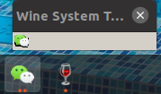
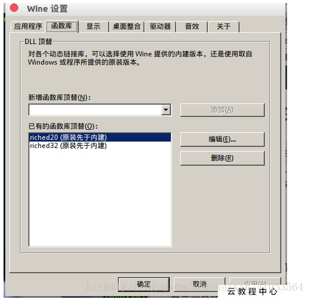
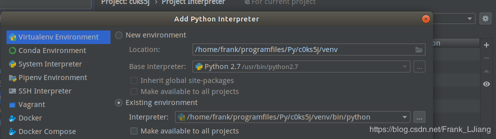
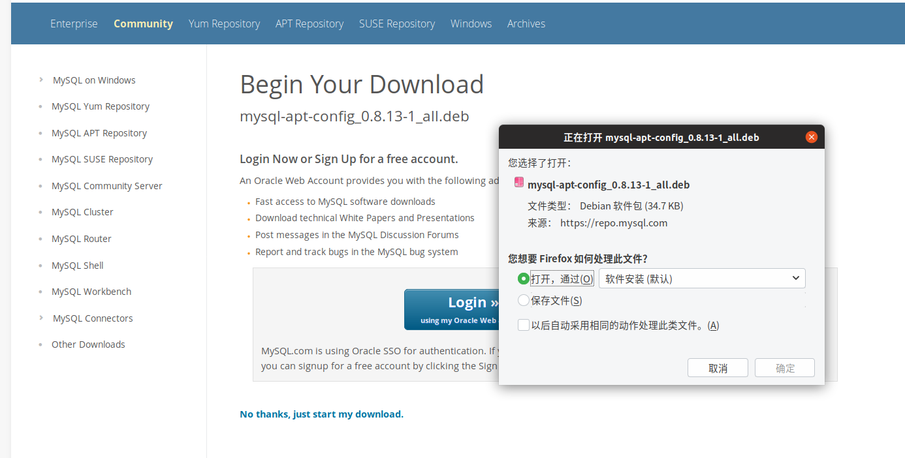
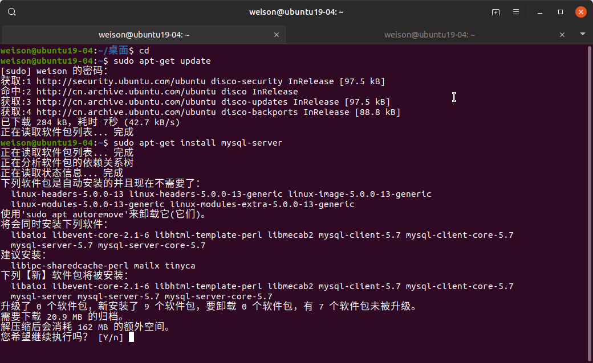
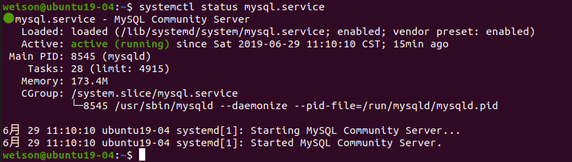

# Ubuntu 操作系统环境搭建与配置

## 制作Ubuntu启动盘

[Ubuntu镜像下载源](http://mirrors.aliyun.com/ubuntu-releases/)

[Rufus for Windows](https://rufus.en.softonic.com/)


## 安装Ubuntu系统

选择U盘启动，注意：U盘启动如果进入不了安装界面，出现（Initramfs）Unable to find a medium containing a live file system 状态。那是U盘用在USB3.0模式下的原因，所以要放在USB2.0插头上。


分区，这里以新固态硬盘500G为例，创建出500G空闲空间，在这500G空闲空间中创建一个2G分区，以用作启动引导分区。

在这里注意的是：

如果你U盘启动时选择了普通方式启动安装Ubuntu，那么就要选择“保留BIOS启动区域”。

如果你U盘启动时选择了UEFI模式启动安装Ubuntu，那么这里就要选择“UEFI 分区”，否则，安装程序会提示系统启动会找不到启动引导盘。


接着创建 交换空间，也就是虚拟内存，可以小幅度提升系统的运行性能。如果计算机内存大于512M的情况下，设置512M用作交换空间就可以，但是如果计算机要休眠的话，还是建议创建与内存同等大小的分区来用做交换空间。


创建根目录空间，根目录就是系统盘，主要存放操作系统文件和安装的第三方软件，无法扩展，所以不能太小，建议最低30G空间起步。


创建/home目录空间，是用户能自行操作的空间，可大可小，那就把剩下的所有空间都分配给/home目录空间了。


分配好空间后，就要把安装启动引导器的设备选择合适的设置，普通启动的选择biosgrub，UEFI启动的，选择 UEFI


接着就等待系统安装完毕了，如果想快的话，可以选择最小安装，这样能省掉很多默认带自带的软件，切记，不要选择安装第三方软件或驱动，这样会非常慢。

## Ubuntu系统配置 

### 创建 root 用户

```
// 会让你输入当前用户密码，输入后回车，再输入两次root密码
sudo passwd root
// 切换 root 用户模式
su root
sudo -i
```

### 输入法的变更与安装（搜狗输入法）

系统默认的输入法在某些软件如WPS、PyCharm等软件下无法输入中文，因此要更换输入法框架。

检测是否安装有 fcitx，一般情况下，新系统是没有安装fcitx输入法框架的。

```
fcitx	//检测系统是否安装有这个输入法框架
```

安装 fcitx 及相关依赖库

```
// 添加fcitx键盘输入法系统【系统默认是iBus】。把下载源添加至系统源
sudo add-apt-repository ppa:fcitx-team/nightly
// 更新系统列表
sudo apt-get update
// 安装fcitx 软件
sudo apt-get install fcitx-bin
// 安装配置工具
sudo apt-get install fcitx-config-gtk
// 安装软件包
sudo apt-get install fcitx-table-all
// 安装输入法切换工具，好像没什么作用，因为装不上
sudo apt-get install im-switch
```

替换 fcitx，“设置>区域和语言>管理已安装的语言>键盘输入法系统”处，把iBus替换成fcitx，确认后重启Ubuntu。

[下载搜狗输入法 for Linux](https://pinyin.sogou.com/linux/?r=pinyin)

直接双击 .deb 文件进行安装，完成后重启 Ubuntu。

点击右上角小键盘 > 配置 ，进入输入法配置，把不需要的输入法删除，保留需要使用的输入法，就可以使用了。

卸载iBus，以便可以使用搜狗输入法的“Shift 键切换中英文”。

```
sudo apt-get purge ibus
sudo apt-get autoremove
```

### 把 Firefox 浏览器由国际版转为中国版

Ubuntu自带的、或软件中心下载安装的Firefox浏览器，创建的账号与原windows下的Firefox浏览器创建的账号并不相同，原因是Firefox有个全球服务和本地服务，这二个服务默认的存储服务器不是同一个，所以无法同步。

[Firefox 浏览器 for Linux](https://www.firefox.com.cn/download/)

选择高级安装选项和其他平台 > Linux 64-bit

```
// 删除原 Firefox
sudo apt-get remove firefox
```

把 Firefox-latest-x86_64.tar.bz2 解压，把里面的 firefox 复制至 opt/ 目录下。

```
// 创建一个快捷方式，最终显示在应用程序集上
sudo touch /usr/share/applications/firefox.desktop
// 编辑
sudo vim /usr/share/applications/firefox.desktop
// 把以下内容添加进去
[Desktop Entry]
Name=firefox
Name[zh_CN]=火狐浏览器
Comment=火狐浏览器
Exec=/opt/firefox/firefox
Icon=/opt/firefox/browser/chrome/icons/default/default128.png
Terminal=false
Type=Application
Categories=Application;
Encoding=UTF-8
StartupNotify=true
```

### 安装媒体编解码器

```
sudo apt install ubuntu-restricted-extras
// 有些直播课还是使用 Flash 插件来播放的，如有道精品课，电视直播等，故须要安装 Flash 插件
sudo apt-get install flashplugin-installer
```

### 安装WPS

卸载 libreoffice

```
sudo apt-get remove --purge libreoffice*
```

[下载 WPS Office 2019 For Linux](https://www.wps.cn/product/wpslinux/)

安装

```
sudo dpkg -i wps-office_11.1.0.8865_amd64.deb
```

把字体补丁解压放在 /usr/share/fonts/wps-office 下

```
//直接把字体压缩包解压至指定目录下
sudo tar zxvf wps_symbol_fonts.tar.gz
sudo mv wps_symbol_fonts/*.* /usr/share/fonts/wps-office/
```

并消除一下缓存和生成新的缓存

```
sudo mkfontscale
sudo mkfontdir
sudo fc-cache
```

### PyCharm 安装与激活、配置

#### 安装

Professional：专业版提供PyCharm所有工具插件开发必备（付费）

Community：社区版提供基本功能但是明显没有专业版好（免费）

[PyCharm 官方下载](https://www.jetbrains.com/pycharm/download/#section=linux)


把里面的PyCharm文件夹复制到 /opt目录下

```
sudo mv PyCharm /opt/
```

执行命令打开安装

```
sh ./pycharm.sh
```

选择不导入任何配置(Do not import settings) > 点击OK


选择UI界面


点击Eval uate for free 试用，完成安装。

#### 激活

编辑hosts 文件，作用是屏蔽这个二个验证服务器

```
sudo vim /etc/hosts
// 0.0.0.0 account.jectbrains.com
//0.0.0.0 www.jetbrains.com
// 把以上二行代码插入，保存
```

复制  jetbrains-agent.jar 至 opt/pycharm/bin/ 目录下

修改 bin 目录中以下这二个文件：pycharm.vmoptions、pycharm64.vmoptions

添加以下代码引用，并保存退出：

-javaagent:/opt/pycharm/bin/jetbrains-agent.jar

终端命令： sh pycharm.sh 启动 PyCharm

Welcome to PyCharm 界面 > Configure > Manage License 

选择 License server ， License server address: 会显示 http://jetbrains-license-server 字样。

点击 ： Activate ， 激活完成。

#### 问题修复

ModuleNotFoundError: No module named 'distutils.core'

默认没有安装 pip， 安装 pip3

```
sudo apt-get install python3-pip	//安装
```

#### 创建快捷方式

```
sh pycharm.sh
```

新建一个工程， Tools > Creat Desktop Entry， 选择 Create the entry for all users > OK

### TeamViewer 

能在任何防火墙和NAT代理的后台用于远程控制的应用程序。

```markdown
// 安装
sudo dpkg -i teamviewer_15.0.8397_amd64.deb
```

设置跟随系统启动

选项 > Start TeamViewer with system 打勾即可。

### 微信

去微信官网下载微信 for windows 版本。

```lua
# 1.	安装 wine
sudo apt install wine
# 2.	安装微信
wine  WeChatSetup.exe
```

会直接进入windows模式的安装界面，都默认安装吧，安装完成后，扫码登录，切记，任务栏上的wine不要关闭，微信窗口关闭后，要这个小窗口中的微信图标处激活回来，关闭也是在这个图标右键退出。



#### 解决微信输入框没有输入光标的问题

1. 配置 wine，在命令行窗口使用 winecfg 打开 wine 设置，添加以下两个库。

   

   ```
   # 安装 winetricks
   sudo apt install winetricks
   # 执行以下命令，完成后重启系统，就可以解决
   winetricks riched20
   ```

#### 解决输入框无法输入中文

```
sudo vim /etc/X11/xinit/xinitrc	# 或使用 sudo gedit /etc/X11/xinit/xinitrc
```

在文件最后增加以下内容：

export GTK_IM_MODULE=fcitx
 export QT_IM_MODULE=fcitx
 export XMODIFIERS="@im=fcitx"
 exec /etc/X11/Xsession

保存后重启微信即可。

# Python 配置

## 虚拟环境搭建

在使用Python开发的过程中，难免会碰到不同的项目工程依赖不同版本的库的问题，或者是在开发过程中不想让物理环境里充斥各种各样的库，引发未来依赖灾难。因此需要对不同的工程使用不同的虚拟环境来保持开发环境以及宿主环境的清洁。

### 前期准备

安装pip，最好pip2、pip3 都装上，因为后面用workon的时侯可能会出现找不到模块。

- sudo apt-get install python-pip
- sudo apt-get install python3-pip

安装 virtualenv 以及扩展包 virtualenvwrapper，用于更方便管理虚拟环境，可以实现以下功能：

- 将所有虚拟环境整合在一个目录下
- 管理（新增、删除、复制 ）虚拟环境
- 切换虚拟环境

### 使用APT-GET 安装

- sudo apt-get install virtualenv
- sudo apt-get install virtualenvwrapper

安装后，路径会生成在 /usr/share/virtualenvwrapper，可以用户目录（home）下创建专门存放虚拟环境的目录，mkdir <fileNmae>，修改配置文件 sudo gedit ~/.bashrc ，添加以下代码：

```
 #用来专门存放虚拟环境的目录
export WORKON_HOME=~/Env
# 指定Python3 的运行文件位置
export VIRTUALENVWRAPPER_PYTHON=/usr/bin/python3 
# 设置系统启动同时配置好虚拟运行环境，可以在任何地方启动虚拟环境
source /usr/share/virtualenvwrapper/virtualenvwrapper.sh
```

运行 source ~/.bashrc

### 创建虚拟环境

```
# 基于 python2
mkvirtualenv <env_name>
基于 python3
mkvirtualenv -p python3  <env_name>
```

### 查询、进入、退出与删除虚拟环境

```
# 查询虚拟环境
workon
# 进入虚拟环境
workon envName
# 退出虚拟环境
deactivate envName
# 删除虚拟环境
rmvirtualenv envName
```

### 修改源的方法

```
# 临时使用
pip install  -i https://mirrors.aliyun.com/pypi/simple appfileName
# 永久修改
# 创建 ~/.pip/pip.conf
[global]
index-url = https://pypi.tuna.tsinghua.edu.cn/simple
```

### PyCharm 使用虚拟环境



File > setting > Project Interpreter，点击 Add Local (我的设置图标)，添加对应的环境（~/Env/<you_env_name>/bin/python3），点 ok。

# MySQL 环境搭建

## MySQL - 安装

1. MySQL APT Repository 添加至系统的软件仓库列表中。执行安装。[https://dev.mysql.com/downloads/file/?id=487007](https://dev.mysql.com/downloads/file/?id=487007)

   

2. 通过apt安装MySQL

   ```shell
   sudo apt-get update
   sudo apt-get install mysql-server
   ```

   

## MySQL - 配置

```shell
sudo mysql_secure_installation
```

```mysql
weison@ubuntu19-04:~$ sudo mysql_secure_installation
# MySQL服务器部署
Securing the MySQL server deployment.
# 使用空白密码连接到MySQL
Connecting to MySQL using a blank password.
# 密码验证插件可以用来测试密码和提高安全性。它检查密码的强度，允许用户只设置足够安全的密码，需要安装密码验证插件吗？
VALIDATE PASSWORD PLUGIN can be used to test passwords
and improve security. It checks the strength of password
and allows the users to set only those passwords which are
secure enough. Would you like to setup VALIDATE PASSWORD plugin?

Press y|Y for Yes, any other key for No: N（选择N，不会进行密码的强校验）
Please set the password for root here.

New password: 

Re-enter new password: 
# 默认情况下，mysql会安装一个匿名用户，允许任何人登录MySQL，而不必为他们创建一个用户账户。这仅用于测试，并使安装进行得更顺利。应该在迁移到生产环境之前删除它们。
By default, a MySQL installation has an anonymous user,
allowing anyone to log into MySQL without having to have
a user account created for them. This is intended only for
testing, and to make the installation go a bit smoother.
You should remove them before moving into a production
environment.

Remove anonymous users? (Press y|Y for Yes, any other key for No) : N（选择N，不删除匿名用户）

 ... skipping.
#  通常，应该只允许root从本地主机连接。这样确保不能从网络上猜测根密码。
Normally, root should only be allowed to connect from
'localhost'. This ensures that someone cannot guess at
the root password from the network.

Disallow root login remotely? (Press y|Y for Yes, any other key for No) : N（选择N，允许root远程连接）

 ... skipping.
 # 在默认情况下，mysql附带一个名为“test”的数据库，任何人都可以访问，这也仅用于测试，在转移到生产环境之前应该删除。
By default, MySQL comes with a database named 'test' that
anyone can access. This is also intended only for testing,
and should be removed before moving into a production
environment.

Remove test database and access to it? (Press y|Y for Yes, any other key for No) : N（选择N，不删除test数据库）

 ... skipping.
 # 重新加载特权表将确保到目前为止所做的所有更改都将立即生效。
Reloading the privilege tables will ensure that all changes
made so far will take effect immediately.

Reload privilege tables now? (Press y|Y for Yes, any other key for No) : Y（选择Y，修改权限立即生效）
Success.

All done! 
```

## MySQL - 远程连接配置

```mysql
# user 表，字段意义
# user 用户名，host 主机登录设定（% 可远程或本地登录，localhost 只能本地登录，指定特定IP地址登录）
# authentication_string
# plugin 密码验证方式，mysql_native_password 旧方式进行密码验证

# Linux 进入MySQL命令端
sudo mysql -uroot -p
# 切换数据库
use mysql;
# 查询表，只显示特定字段值
select User,authentication_string,Host from user;
# 创建用户
CREATE user '<user_name>'@'<host>' IDENTIFIED BY '<login_password>';
# 授权用户权限，这里是授予所有权限
GRANT ALL PRIVILEGES ON *.* TO '<user_name>'@'<host>' WITH GRANT OPTION;
# 重新设定用户密码及其密码加密方式
ALTER USER <user_name> IDENTIFIED WITH mysql_native_password BY '<login_password>';
# 修改密码加密方式，如果修改了加密方式，再使用原密码是无法再登录，须重设密码
ALTER USER <user_name> IDENTIFIED WITH mysql_native_password BY '<login_password>';
```

新建数据库，并赋予用户远程连接权限

```mysql
# 创建数据库
CREATE DATABASE <data_name>;
# 创建用户，并赋予其对某数据库远程连接权限
GRANT ALL PRIVILEGES ON <user_name>.* TO <data_name>@% IDENTIFIED BY "login_password";
```

检查服务状态

```shell
systemctl status mysql.service
或
sudo service mysql status
```

显示以下结果说明MySQL服务正常



MySQL 服务的启动与停止

```shell
# 停止
sudo service mysql stop
启动
sudo service mysql start
```

# Django

## 安装

```lua
# 在虚拟环境中安装 Django
workon	# 列出虚拟环境
workon # 进入虚拟环境
pip install -i https://mirrors.aliyun.com/pypi/simple django
```

## 基础

### MVC 模式

MVC 即 Model - View - Controller （模型 - 视图 - 控制器）模式。

- Model（模型），即数据模型。模型不是数据本身（比如数据库里的数据），而是抽象的描述数据的构成和逻辑关系。通常模型包括了数据表的各个字段和相互关系（单对单、单对多、多对多关系等）。数据库里的表会根据模型的定义来生成创建。**Django Model（模型）对应**
- View（视图）主要用于显示数据，用来展示用户可以看到的内容或提供用户可以输入或操作的界面。**Django Template（模板）**，呈现Django view传来的数据，也决定了用户界面的外观。Template里面也包含了表单，可以用来收集用户的输入。
- Controller（控制器）是应用程序中处理用户交互的部分。通常控制器负责从视图读取数据，控制用户输入，并向模型发送数据（比如增加或更新数据表）。**Django URL + View（视图）**，Django的 URL 和 View 合起来才能向 Template 传递正确的数据，用户输入提供的数据也需要 Django 的 View 来处理。