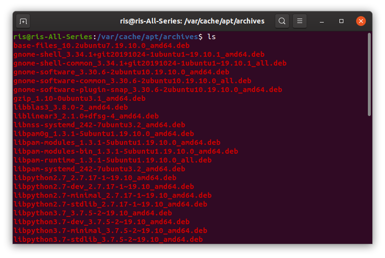
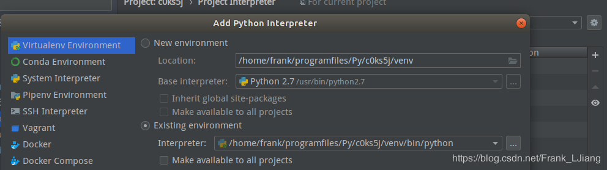
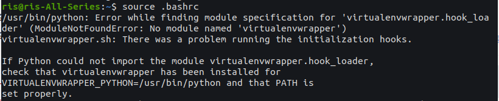
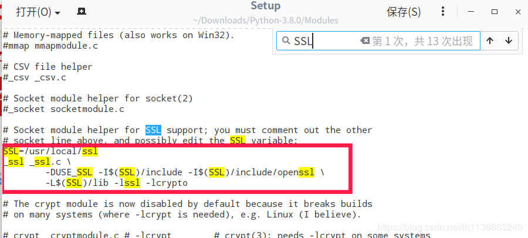
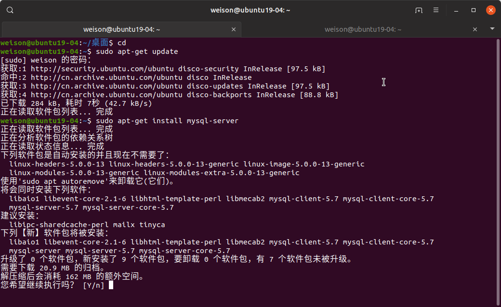

# Ubuntu

## 制作Ubuntu启动盘

[Ubuntu镜像下载源](http://mirrors.aliyun.com/ubuntu-releases/)

[Rufus for Windows](https://rufus.en.softonic.com/)


## 安装Ubuntu系统

选择U盘启动，注意：U盘启动如果进入不了安装界面，出现（Initramfs）Unable to find a medium containing a live file system 状态。那是U盘用在USB3.0模式下的原因，所以要放在USB2.0插头上。


分区，这里以新固态硬盘500G为例，创建出500G空闲空间，在这500G空闲空间中创建一个2G分区，以用作启动引导分区。

在这里注意的是：

如果你U盘启动时选择了普通方式启动安装Ubuntu，那么就要选择“保留BIOS启动区域”。

如果你U盘启动时选择了UEFI模式启动安装Ubuntu，那么这里就要选择“UEFI 分区”，否则，安装程序会提示系统启动会找不到启动引导盘。


接着创建 交换空间，也就是虚拟内存，可以小幅度提升系统的运行性能。如果计算机内存大于512M的情况下，设置512M用作交换空间就可以，但是如果计算机要休眠的话，还是建议创建与内存同等大小的分区来用做交换空间。


创建根目录空间，根目录就是系统盘，主要存放操作系统文件和安装的第三方软件，无法扩展，所以不能太小，建议最低30G空间起步。


创建/home目录空间，是用户能自行操作的空间，可大可小，那就把剩下的所有空间都分配给/home目录空间了。


分配好空间后，就要把安装启动引导器的设备选择合适的设置，普通启动的选择biosgrub，UEFI启动的，选择 UEFI


接着就等待系统安装完毕了，如果想快的话，可以选择最小安装，这样能省掉很多默认带自带的软件，切记，不要选择安装第三方软件或驱动，这样会非常慢。

## Ubuntu 配置 

### 创建 root 用户

```shell
// 会让你输入当前用户密码，输入后回车，再输入两次root密码
sudo passwd root
// 切换 root 用户模式
su root
sudo -i
```

### Nvidia 显卡配置

以后需要学习Tensorflow、PyTorch等深度学习工具，[显卡驱动与CUDA版本对应关系](https://blog.csdn.net/ZeroDegree1216/article/details/103534044)

1. 确认内核头文件，gcc 和 g++ 要安装

    ```shell
    # 查看内核
    uname -r
    # 安装对应的头文件
    sudo apt-get install linux-headers-$(uname -r)
    # 检查 gcc 与 g++ 是否安装
    gcc --version
    g++ --version
    # 如没安装，就安装吧
    sudo apt-get install gcc g++
    ```

2. 清除老的驱动版本

    ```shell
    sudo apt-get remove --purge nvidia*
    ```

3. 禁用开源的nouveau驱动

    ```shell
    # 编辑以下路径文件
    sudo gedit /etc/modprobe.d/blacklist.conf
    # 在文件后追加以下内容
    blacklist nouveau
    options nouveau modeset=0
    ```

4. 更新系统配置，并重启系统

    ```shell
    # 更新系统配置
    sudo update-initramfs -u
    # 重启电脑
    reboot
    ```

5. 重启电脑后，检查禁用nouveau驱动是否生效，没输出任何信息表示生效

    ```shell
    lsmod | grep nouveau
    ```

6. 使用Ubuntu自带的仓库进行自动化安装最为有效

    ```shell
    # 检查什么驱动最适合，推荐的后面注有 recommended
    ubuntu-drivers devices
    # 执行自动选择推荐驱动进行安装
    sudo ubuntu-drivers autoinstall
    # 重启
    reboot
    # 重启后检测
    nvidia-smi
    ```

#### 重复登录BUG

Ubuntu19.10 安装驱动后，有机率会出现重启之后页面卡死在登录页面，即使输入密码后仍然会闪动一下返回登录页面。

##### 解法方法一：

通过更换 gdm 解决该问题

```shell
# 在登录页面 ctrl + alt + F2 或 ctrl + alt + F3 进入终端状态（中文会显示乱码）
# 编辑 /etc/default/grub
# 将 GRUB_CMDLINE_LINUX_DEFAULT="quiet splash" 修改为
# GRUB_CMDLINE_LINUX_DEFAULT="nomodset"
```

安装 lightdm

```shell
sudo apt-get install lightdm
```

重启 sudo reboot

### 安装中文字体

1. 在 /usr/share/fonts 下创建新目录windows-font（自定义目录名称）

    ```shell
    sudo mkdir /usr/share/fonts/windows-font
    ```

2. 在下载解压后的字体目录中把字体文件拷贝至windows-font目录下

    ```shell
    sudo cp *.ttc /usr/share/fonts/windows-font
    ```

3. 修改权限，并更新字体缓存

    ```shell
    sudo chmod -R 777 /usr/share/fonts/windows-font
    cd /usr/share/fonts/windows-font
    sudo mkfontscale
    sudo mkfontdir
    sudo fc-cache -fv
    ```

4. 重启系统

    ```shell
    sudo reboot
    ```

## 支持软件

### 输入法（搜狗输入法）

系统默认的输入法在某些软件如WPS、PyCharm等软件下无法输入中文，因此要更换输入法框架。

检测是否安装有 fcitx，一般情况下，新系统是没有安装fcitx输入法框架的。

```
fcitx	//检测系统是否安装有这个输入法框架
```

安装 fcitx 及相关依赖库

```
// 添加fcitx键盘输入法系统【系统默认是iBus】。把下载源添加至系统源
sudo add-apt-repository ppa:fcitx-team/nightly
// 更新系统列表
sudo apt-get update
// 安装fcitx 软件
sudo apt-get install fcitx-bin
// 安装配置工具
sudo apt-get install fcitx-config-gtk
// 安装软件包
sudo apt-get install fcitx-table-all
// 安装输入法切换工具，好像没什么作用，因为装不上
sudo apt-get install im-switch
```

替换 fcitx，“设置>区域和语言>管理已安装的语言>键盘输入法系统”处，把iBus替换成fcitx，确认后重启Ubuntu。

[下载搜狗输入法 for Linux](https://pinyin.sogou.com/linux/?r=pinyin)

直接双击 .deb 文件进行安装，完成后重启 Ubuntu。

点击右上角小键盘 > 配置 ，进入输入法配置，把不需要的输入法删除，保留需要使用的输入法，就可以使用了。

卸载iBus，以便可以使用搜狗输入法的“Shift 键切换中英文”。

```
sudo apt-get purge ibus
sudo apt-get autoremove
```

### Firefox 转中国版

Ubuntu自带的、或软件中心下载安装的Firefox浏览器，创建的账号与原windows下的Firefox浏览器创建的账号并不相同，原因是Firefox有个全球服务和本地服务，这二个服务默认的存储服务器不是同一个，所以无法同步。

[Firefox 浏览器 for Linux](https://www.firefox.com.cn/download/)

选择高级安装选项和其他平台 > Linux 64-bit

```
// 删除原 Firefox
sudo apt-get remove firefox
```

把 Firefox-latest-x86_64.tar.bz2 解压，把里面的 firefox 复制至 opt/ 目录下。

```
// 创建一个快捷方式，最终显示在应用程序集上
sudo touch /usr/share/applications/firefox.desktop
// 编辑
sudo vim /usr/share/applications/firefox.desktop
// 把以下内容添加进去
[Desktop Entry]
Name=firefox
Name[zh_CN]=火狐浏览器
Comment=火狐浏览器
Exec=/opt/firefox/firefox
Icon=/opt/firefox/browser/chrome/icons/default/default128.png
Terminal=false
Type=Application
Categories=Application;
Encoding=UTF-8
StartupNotify=true
```

### 媒体编解码器

```
sudo apt install ubuntu-restricted-extras
// 有些直播课还是使用 Flash 插件来播放的，如有道精品课，电视直播等，故须要安装 Flash 插件
sudo apt-get install flashplugin-installer
```

### WPS

卸载 libreoffice

```
sudo apt-get remove --purge libreoffice*
```

[下载 WPS Office 2019 For Linux](https://www.wps.cn/product/wpslinux/)

安装

```
sudo dpkg -i wps-office_11.1.0.8865_amd64.deb
```

把字体补丁解压放在 /usr/share/fonts/wps-office 下

```
//直接把字体压缩包解压至指定目录下
sudo tar zxvf wps_symbol_fonts.tar.gz
sudo mv wps_symbol_fonts/*.* /usr/share/fonts/wps-office/
```

并消除一下缓存和生成新的缓存

```
sudo mkfontscale
sudo mkfontdir
sudo fc-cache
```

### PyCharm 

#### 安装

Professional：专业版提供PyCharm所有工具插件开发必备（付费）

Community：社区版提供基本功能但是明显没有专业版好（免费）

[PyCharm 官方下载](https://www.jetbrains.com/pycharm/download/#section=linux)


把里面的PyCharm文件夹复制到 /opt目录下

```
sudo mv PyCharm /opt/
```

执行命令打开安装

```
sh ./pycharm.sh
```

选择不导入任何配置(Do not import settings) > 点击OK


选择UI界面


点击Eval uate for free 试用，完成安装。

#### 激活

编辑hosts 文件，作用是屏蔽这个二个验证服务器

```shell
sudo vim /etc/hosts
0.0.0.0 account.jectbrains.com
0.0.0.0 www.jetbrains.com
// 把以上二行代码插入，保存
```

复制  jetbrains-agent.jar 至 opt/pycharm/bin/ 目录下

修改 bin 目录中以下这二个文件：pycharm.vmoptions、pycharm64.vmoptions

添加以下代码引用，并保存退出：

-javaagent:/opt/pycharm/bin/jetbrains-agent.jar

终端命令： sh pycharm.sh 启动 PyCharm

Welcome to PyCharm 界面 > Configure > Manage License 

选择 License server ， License server address: 会显示 http://jetbrains-license-server 字样。

点击 ： Activate ， 激活完成。

#### 问题修复

ModuleNotFoundError: No module named 'distutils.core'

默认没有安装 pip， 安装 pip3

```
sudo apt-get install python3-pip	//安装
```

#### 创建快捷方式

```
sh pycharm.sh
```

新建一个工程， Tools > Creat Desktop Entry， 选择 Create the entry for all users > OK

### TeamViewer （远程协助）

能在任何防火墙和NAT代理的后台用于远程控制的应用程序。

```shell
// 安装
sudo dpkg -i teamviewer_15.0.8397_amd64.deb
```

设置跟随系统启动

选项 > Start TeamViewer with system 打勾即可。

### 微信

去微信官网下载微信 for windows 版本。

```lua
# 1.	安装 wine
sudo apt install wine
# 2.	安装微信
wine  WeChatSetup.exe
```

会直接进入windows模式的安装界面，都默认安装吧，安装完成后，扫码登录，切记，任务栏上的wine不要关闭，微信窗口关闭后，要这个小窗口中的微信图标处激活回来，关闭也是在这个图标右键退出。


#### 输入框没输入光标

1. 配置 wine，在命令行窗口使用 winecfg 打开 wine 设置，添加以下两个库。

   

   ```
   # 安装 winetricks
   sudo apt install winetricks
   # 执行以下命令，完成后重启系统，就可以解决
   winetricks riched20
   ```

#### 输入框无法输入中文

```
sudo vim /etc/X11/xinit/xinitrc	# 或使用 sudo gedit /etc/X11/xinit/xinitrc
```

在文件最后增加以下内容：

export GTK_IM_MODULE=fcitx
 export QT_IM_MODULE=fcitx
 export XMODIFIERS="@im=fcitx"
 exec /etc/X11/Xsession

保存后重启微信即可。

### Typora

#### 下载及安装

```shell
wget -q0 - https://typora.io/linux/public-key.asc | sudo apt-key add -
# 添加 typora入库
sudo add-apt-repository 'deb https://typora.io/linux ./'
sudo apt-get update
# 执行安装
sudo apt-get install typora
```

### Imagemagick(PDF to jpg)

```shell
# 安装
sudo apt-get install imagemagick
# 更正权限问题，如出现 perform an operation not allowed by the security policy `PDF' @ error/constitute.c/IsCoderAuthorized/408
sudo vim /etc/ImageMagick-6/policy.xml
# 把 <policy domain="coder" rights="none" pattern="PDF">
# 更改为
# <policy domain="coder" rights="read|write" pattern="PDF">

# 简单转换
convert XXX.pdf XXX.jpg
# 参数设置转换图片清晰度
convert -verbose -colorspace RGB -resize 1800 -interlace none -density 300 -quality 100 XXX.pdf XXX.jpg

convert -density 300 -quality 100 XXX.pdf XXX.jpg
# -quality value 
# JPEG 和 MPEG 图像格式质量，1最低（最高压缩），100最高（最低压缩）*
# -verbose 打印图像时，详细信息识别与选择
# -colorspace 色彩选择
# -resize value 调整图像几何细节，补偿，如果存在几何字符串
# -interlace 交细方案的类型
# -density value 设置图像的密度，宽度 *

# 把多个图片拼接成一个图片 + 横向 -坚向
convert -append 1.jpg 2.jpg new.jpg
```

[ImageMagick 官方解释文档](http://www.imagemagick.org/script/command-line-options.php#quality)

## 终端命令

### apt （软件版本管理仓库）

#### apt 包管理

```shell
# sudo apt-get install appName 时下载的安装包存放目录，这些文件是可以清理的
/var/cache/apt/archives
# 清理的命令
sudo apt-get clean
```



#### apt 参数的区别

简单地说：apt = apt-get、apt-cache、apt-config 中常用命令选项的集合。

| apt命令          | 取代的命令              | 命令的功能                                |
| ---------------- | ----------------------- | ----------------------------------------- |
| apt install      | apt-get install         | 安装软件包                                |
| apt remove       | apt-get remove          | 移除软件包                                |
| apt purge        | apt-get purge           | 移除软件包及配置文件                      |
| apt update       | apt-get update          | 刷新存储库索引                            |
| apt upgrade      | apt-get upgrade         | 升级所有可升级的软件包                    |
| apt autoremove   | apt-get autoremove      | 自动删除不需要的包                        |
| apt full-upgrade | apt-get dist-upgrade    | 在升级软件包时自动处理依赖关系            |
| apt search       | apt-cache search        | 搜索应用软件                              |
| apt show         | apt-cache show          | 显示安装细节                              |
|                  | apt-get source          | 下载源码档案                              |
|                  | apt-get build-dep       | 为源码包配置编译依赖                      |
|                  | apt-get dselect-upgrade | 依照dselect的选择更新                     |
|                  | apt-get clean           | 清除下载的归档文件                        |
|                  | apt-get autoclean       | 清除旧的已下载的归档文件                  |
|                  | apt-get check           | 检验是否有损环的依赖                      |
|                  | 选项                    |                                           |
|                  | apt-get -h              | 本帮助文件                                |
|                  | apt-get -q              | 输出到日志。-无进展指示                   |
|                  | apt-get -qq             | 不输出信息，错误除外                      |
|                  | apt-get -d              | 仅下载 -不安装或解压归档文件              |
|                  | apt-get -s              | 不实际安装。模拟执行命令                  |
|                  | apt-get -y              | 假定对所有的询问选是，不提示              |
|                  | apt-get -f              | 尝试修正系统依赖损坏处                    |
|                  | apt-get -m              | 如果归档无法定位，尝试继续                |
|                  | apt-get -u              | 同时显示更新软件包的列表                  |
|                  | apt-get -b              | 获取源码包后编译                          |
|                  | apt-get -V              | 显示详细的版本号                          |
|                  | apt-get -c=?            | 阅读此配置文件                            |
|                  | apt-get -o=?            | 设置自定的配置选项。如 -o dir::cache=/tmp |

| 新的apt命令      | 命令的功能                           |
| ---------------- | ------------------------------------ |
| apt list         | 列出包含条件的包（已安装，可升级的） |
| apt edit-sources | 编辑源列表                           |

#### 常用的命令参数

| 命令行                                  | 解释                                   |
| --------------------------------------- | -------------------------------------- |
| apt-cache search packagename            | 搜索包                                 |
| apt-cache show packagename              | 获取包的相关信息，如说明、大小、版本等 |
| apt-get install packagename             | 安装包                                 |
| apt-get install packagename --reinstall | 重新安装包                             |
| apt-get -f install                      | 修复安装“-f=-fix-missing”              |
| apt-get remove packagename              | 删除包                                 |
| apt-get remove packagename --purge      | 删除包，包括删除配置文件等             |
| apt-get update                          | 更新源                                 |
| apt-get upgrade                         | 更新已安装的包                         |
| apt-get dist-upgrade                    | 升级系统                               |
| apt-get dselect-upgrade                 | 使用dselect升级                        |
| apt-get cache depends packagename       | 了解使用依赖                           |
| apt-get cache rdepends packagename      | 是查看该包被哪此包依赖                 |
| apt-get build-dep packagename           | 安装相关的编译环境                     |
| apt-get source packagename              | 下载该包的源代码                       |
| apt-get clean                           | 清理无用的包                           |
| apt-get autoclean                       | 清理无用的包                           |
| apt-get check                           | 检查是否有损环的依赖                   |

#### update、upgrade、dist-upgrade 注意事项

- update 是同步 /etc/apt/sources.list、/etc/apt/sources.list.d 中列出的源的索引，这样才能获取到最新的软件包。
- upgrade 是升级已安装的所有软件包，升级之后的版本就是本地索引里的。因此，在执行 sudo apt-get upgrade 之前一定要执行 sudo apt-get update，这样才能是最新的。
- 由于包与包之间存在各种依赖关系。sudo apt-get upgrade 只是简单地更新包，并不会管这些依赖关系，因此不会去添加包或者删除包。而 sudo apt-get dist-upgrade 就会根据依赖关系的变化，进行包的添加或删除。

安装或升级系统分以下几个步骤：

1. sudo apt-get update 获得最近的软件包列表，列表中包含一些包的信息，比如这个包是否更新过。
2. sudo apt-get upgrade 或 sudo apt-get dist-upgrade 如果这个包没有发布更新，就不去理会。如果发布了更新，就会把包下载到电脑上，并安装。

### dpkg

dpkg 只管安装，不会进行版本管理。简单来说，就是绕过apt包管理数据库对软件进行操作。

与apt的区别在于，apt会解决和安装模块的依赖问题，并会咨询软件仓库，是在线安装的。而 dpkg 只能安装本地的deb软件包，并不会去关心 Ubuntu 软件仓库内的软件，也不会去解决模块的依赖关系。

#### 安装

```shell
sudo dpkg -i packageName.deb
```

#### 卸载

```shell
sudo dpkg -r packageName    # 删除软件
sudo dpkg -P packageName    # 删除软件和配置文件
```

### tar 包管理

#### 安装三部曲：

```shell
# 解压后，依次执行
sudo ./configure
sudo make
sudo make install
```

- -c：建立压缩档案
- -x：解压
- -t：查看内容
- -r：向压缩归档文件未尾追加文件
- -u：更新原压缩包中的文件

以下五个是独立的命令，压缩解压都要用到其中某一个，可以和别的参数连用，但只能用这五个其中的一个。是根据需要在压缩或解压时可选的。

1. -z：有 gzip 属性的
2. -j：有 bz2 属性的
3. -Z：有 compress 属性的
4. -v：显示所有压缩或解压的过程
5. -O：将文件解开到标准输出

这个参数 -f 是必须要用的

- -f：使用档案名字，**切记，这个参数是最后一个参数，后面只能接档案名。**

#### 建档事例：

```shell
# 将所有的.jpg的文件打包成一个名为all.tar的包。
tar -cf all.tar *.jpg
# 将所有.gif 的文件追加到all.tar包里面去
tar -rf all.tar *.gif
# 更新 all.tar 包中的 logo.gif 文件内容。
tar -uf all.tar logo.gif
# 列出 all.tar 包中所有的文件信息
tar -tf all.tar
# 把 all.tar 包解压出来。
tar -xf all.tar
```

#### 压缩各格式事例：

```shell
# 将目录内所有的jpg格式的文件打包成 jpg.tar 档案文件包
tar -cvf jpg.tar *.jpg
# 将目录内所有的jpg格式的文件打包，使用gzip压缩成一个压缩包。包名为：jpg.tar.gz
tar -czf jpg.tar.gz *.jpg
# 将目录内所有的jpg格式的文件打包，使用bzip2压缩成一个压缩包。包名为：jpg.tar.bz2
tar -cjf jpg.tar.bz2 *.jpg
# 将目录内所有的jpg格式的文件打包，使用compress压缩成一个压缩包。包名为：jpg.tar.Z
tar -cZf jpg.tar.Z *.jpg
```

#### 解压各格式事例：

```shell
# 解压 tar 格式的包
tar -xvf fileName.tar
# 解压 tar.gz 格式的包
tar -xzvf fileName.tar.gz
# 解压 tar.bz2 格式的包
tar -xjvf fileName.tar.bz2
# 解压 tar.Z 格式的包
tar -xZvf fileName.tar.Z
```

#### 总结：

```shell
(1)、*.tar 用 tar –xvf 解压
(2)、*.gz 用 gzip -d或者gunzip 解压
(3)、*.tar.gz和*.tgz 用 tar –xzf 解压
(4)、*.bz2 用 bzip2 -d或者用bunzip2 解压
(5)、*.tar.bz2用tar –xjf 解压
(6)、*.Z 用 uncompress 解压
(7)、*.tar.Z 用tar –xZf 解压
(8)、*.rar 用 unrar e解压
(9)、*.zip 用 unzip 解压
```

### rm 删除文件或目录

```shell
# 删除一个文件
rm <file_path>
# 删除一个非空目录
# -r 递归地删除目录及其内容
# -d 删除空目录
# -f 永远不提示
rm -rf <directory_path>
```

### 执行<.sh>脚本

- **sh name.sh 执行**

    使用 sh test.sh 来执行script文件，该方法标明使用 sh  这种shell来执行test.sh文件，sh已经是一种被bash替代的shell，尽管我们在test.sh中声明使用 #!/bin/bash  来执行我们的文件，但此时使用sh而不是bash，则#!/bin/bash 已不起作用。

- **bash name.sh 执行**

    该方法其实与 sh test.sh 的原理一样，只是使用了 /bin/bash 该种shell来执行我们的脚本文件。

    所以，其实使用 dash test.sh' 也是可以的，只是取决于自己想使用那种shell来执行脚本，但sh、bash、dash三者有些许差别，对于部分关键字如 let，bash支持，而sh和dash并不支持，对于部分关键字则选择使用bash。

- **. name.sh 执行**

    ```shell
    # 执行前必须为文件添加执行的权限
    sudo chmod +x name.sh
    ```

    添加完执行权限之后，便可以使用 ./test.sh 来执行脚本，该方式与 bash test.sh 是一样的 ，默认使用 bin/bash 来执行我们的脚本。

    只有该种执行方式需要对文件添加执行权限，其他方式并不需要。

#### 区别

当我们使用 sh test.sh 、bash test.sh 、 ./test.sh  执行脚本的时候，该test.sh运行脚本都会使用一个新的shell环境来执行脚本内的命令，也就是说，使用这3种方式时，其实script是在子进程的shell内执行，当子进程完成后，子进程内的各项变量和操作将会结束而不会传回到父进程中。

- **bash name.sh**

- **source name.sh**

    source方法执行脚本是在父进程中执行的，test.sh的各项操作都会在原本的shell内生效，这也是为什么不注销系统而要让某些写入～/.bashrc的设置生效时，需要使用 source ~/.bashrc 而不能使用 bash ~/.bashrc

### 查询文件命令用法

#### which

作用是在PATH变量指定的路径中，搜索某个系统命令的位置 ，并且返回第一个搜索结果。使用这个命令可以看到某个系统命令是否存在，以及执行的到底是哪个位置的命令。

会在环境变量$PATH设置的目录里查找符合条件的文件，所以基本的功能是寻找可执行文件。

```powershell
which <可执行文件的名称>
如：which passwd
 /usr/bin/passwd
```

#### whereis

查找符合条件的文件。这些文件的属性属于原始代码，二进制文件，或是帮助文件。**只能用于程序名的搜索。** 如果省略以下参数，则返回所有信息。

- -b：只搜索二进制文件
- -m：只搜索man说明文件
- -s：源代码文件

#### locate

与find相比，locate查找的速度非常快，这是因为linux系统会将系统内的所有文件都记录在一个数据库文件中，当使用locate时，会从数据库中查找数据，而不是像find命令那样，通过遍历硬盘来查找，效率自然会很高。但该数据库文件并不是实时更新，默认情况下一周更新一次，因此会存在不确定性，可能会找到已经删除的数据。

```powershell
locate <文件或者目录名称>
-i：省略大小写
```

#### find

```powershell
find <路径> <参数>
```

当无法查找到需要的文件时，可以使用find，但是find在硬盘上遍历查找，因此非常消耗硬盘的资源，效率也非常低。因此建议大家优先使用whereis和locate，可以在使用locate之前，先使用 **updatedb** 命令，手动更新数据库。

# Python 配置

## 虚拟环境搭建

在使用Python开发的过程中，难免会碰到不同的项目工程依赖不同版本的库的问题，或者是在开发过程中不想让物理环境里充斥各种各样的库，引发未来依赖灾难。因此需要对不同的工程使用不同的虚拟环境来保持开发环境以及宿主环境的清洁。

### 前期准备

安装pip，最好pip2、pip3 都装上，因为后面用workon的时侯可能会出现找不到模块。

- sudo apt-get install python-pip
- sudo apt-get install python3-pip

安装 virtualenv 以及扩展包 virtualenvwrapper，用于更方便管理虚拟环境，可以实现以下功能：

- 将所有虚拟环境整合在一个目录下
- 管理（新增、删除、复制 ）虚拟环境
- 切换虚拟环境

### 使用APT-GET 安装

- sudo apt-get install virtualenv
- sudo apt-get install virtualenvwrapper

安装后，路径会生成在 /usr/share/virtualenvwrapper，可以用户目录（home）下创建专门存放虚拟环境的目录，mkdir <fileNmae>，修改配置文件 sudo gedit ~/.bashrc ，添加以下代码：

```shell
 # 创建专门存放虚拟环境的目录
 sudo mkdir $HOME/<yourEnvName>
 # 在 ~/.bashrc 中加入以下内容：
 
 #设置 virtualenv 的统一管理目录
export WORKON_HOME=~/Env
# 添加 virtualenvwrapper 的参数，生成干净隔绝的环境
export VIRTUALENVWRAPPER_VIRTUALENV_ARGS='--no-site-packages'
# 指定Python 解释器
export VIRTUALENVWRAPPER_PYTHON=/usr/bin/python3
# 执行 virtualenvwrapper 安装脚本
source /usr/share/virtualenvwrapper/virtualenvwrapper.sh

# 读取文件，使得立即生效
source ~/.bashrc
```

### 创建虚拟环境

```shell
# 基于 python2
mkvirtualenv -p python2 <env_name>
# 基于 python3
mkvirtualenv -p python3  <env_name>
```

### 虚拟环境操作

```shell
# 查询虚拟环境
workon
lsvirtualenv
# 进入虚拟环境
workon envName
# 退出虚拟环境
deactivate envName
# 删除虚拟环境
rmvirtualenv envName
# 列出 site-packages 目录的所有软件包
lssitepackages
# 进入虚拟环境的 sit-packages 目录
cdsitepackages
# 查询当前环境已安装的包，任一命令均可
pip list
pip freeze
# 检查当前环境哪些包需要更新，任一命令均可
pip list --outdated
pip list -o
# 升级当前环境的包
pip install -U package_name
pip install --upgrade package_name
# 在线给当前环境安装包（==，>=，<=，>，<，来指定包的版本）
pip install package_name
# 给当前环境安装已经下载好的本地安装包
pip install <目录>/<文件名>
# 卸载当前环境的包
pip uninstall package_name
# 查看包所在目录
pip show -f package_name
# 搜索包
pip search keywords
# 下载包而不安装
pip install package_name -d <目录>
```

### 重建Python环境

```shell
# 冻结环境，所谓冻结（freeze）环境，就是将当前环境的软件包等固定下来
pip freeze >packages.txt				# 安装包列表保存到文件 packages.txt 中
# 重建（rebuild）环境，就是在部署的时侯，在生产环境安装好对应版本的软件包，不要出现版本兼容等问题
pip install -r packages.txt
```

### 修改源的方法

```shell
# 临时使用
pip install  -i https://mirrors.aliyun.com/pypi/simple appfileName
# 永久修改
# 创建 ~/.pip/pip.conf
[global]
index-url = https://pypi.tuna.tsinghua.edu.cn/simple
```

### PyCharm 使用虚拟环境



File > setting > Project Interpreter，点击 Add Local (我的设置图标)，添加对应的环境（~/Env/<you_env_name>/bin/python3），点 ok。

## 虚拟环境创建错误集合

### source .bashrc



解决办法：

```powershell
python -m pip install --user virtualenvwrapper --upgrade
```


## 新增 Python 版本

### 安装

[Python 下载](http://www.python.org/ftp/python)

下载 .tgz 软件包，进行解压

```shell
tar -zxvf Python-3.8.1.tgz
```

编辑 Modules/Setup 文件，把以下红色框框内代码的注释取消(可不做)



安装依赖包

```shell
sudo apt install build-essential zlib1g-dev libncurses5-dev libgdbm-dev libnss3-dev libssl-dev libreadline-dev libffi-dev wget
```

依次执行安装步骤

```shell
# 在安装目录内执行 
Python3.8$ sudo ./configure --with-ssl
Python3.8$ sudo make
Python3.8$ sudo make install
# 另一种执行方法
./configure --enable-optimizations
# --enable-optimizations 通过运行多个测试来优化Python二进制文件
make -j 8
sudo make altinstall
```

### 创建软链接

```python
# 首先检查当前使用的版本，在Ubuntu19.10版本中，并没有预装Python2的版本，所以python 并没有指向任何python3版本
python --version
# 查看各版本的Python的启动指向位置
# 如果存在，就会显示位置路径，否则是不显示出来
which python
which python3
which python3.7
# 可以删除启动指向文件
sudo rm /usr/bin/python
# 也可以通过修改启动文件名称来达成软链接指向
sudo mv /usr/local/bin/python3.8 /usr/local/bin/python
# 或者创建新的软链接
sudo ln -s /usr/local/bin/python3 /usr/bin/python
```

### 指定软链接指向

```shell
sudo update-alternatives --install /usr/bin/python3 python3 /usr/local/bin/python3.8 2
# 暂时未能解决变更软链接指向由默认的python3.7转而指向python3.8后造成重启后，终端不能使用的Bug
```

### 默认版本控制

以系统管理员权限下进行（sudo su：切换至root身份）

```powershell
# 列取所有可用的 python 可替代版本信息
update-alternatives --list <命令名称>
update-alternatives --list python
# 如果显示 update-alternatives: error: no alternatives for python
# update-alternatives：错误：无 python 的侯选项
# 这样表示替代版本列表没有更新
# 使用以下命令把可替代版本信息添加进入这个可替代版本信息的列表
# --install 使用了多个参数用于创建符号链接。
update-alternatives --install <链接路径> <名称> <命令路径> <优先级别：整数，数字越高，优先级越高>
update-alternatives --install /usr/bin/python python /usr/bin/python3.7 1
update-alternatives --install /usr/bin/python python /usr/local/bin/python3.8 2
# 在替代版本中进行切换
update-alternatives --config <命令名称>
update-alternatives --config python
```

# MySQL 环境搭建

## MySQL - 安装

1. MySQL APT Repository 添加至系统的软件仓库列表中。执行安装。[https://dev.mysql.com/downloads/file/?id=487007](https://dev.mysql.com/downloads/file/?id=487007)

   

2. 通过apt安装MySQL

   ```shell
   sudo apt-get update
   sudo apt-get install mysql-server
   ```

   

## MySQL - 配置

```shell
sudo mysql_secure_installation
```

```mysql
weison@ubuntu19-04:~$ sudo mysql_secure_installation
# MySQL服务器部署
Securing the MySQL server deployment.
# 使用空白密码连接到MySQL
Connecting to MySQL using a blank password.
# 密码验证插件可以用来测试密码和提高安全性。它检查密码的强度，允许用户只设置足够安全的密码，需要安装密码验证插件吗？
VALIDATE PASSWORD PLUGIN can be used to test passwords
and improve security. It checks the strength of password
and allows the users to set only those passwords which are
secure enough. Would you like to setup VALIDATE PASSWORD plugin?

Press y|Y for Yes, any other key for No: N（选择N，不会进行密码的强校验）
Please set the password for root here.

New password: 

Re-enter new password: 
# 默认情况下，mysql会安装一个匿名用户，允许任何人登录MySQL，而不必为他们创建一个用户账户。这仅用于测试，并使安装进行得更顺利。应该在迁移到生产环境之前删除它们。
By default, a MySQL installation has an anonymous user,
allowing anyone to log into MySQL without having to have
a user account created for them. This is intended only for
testing, and to make the installation go a bit smoother.
You should remove them before moving into a production
environment.

Remove anonymous users? (Press y|Y for Yes, any other key for No) : N（选择N，不删除匿名用户）

 ... skipping.
#  通常，应该只允许root从本地主机连接。这样确保不能从网络上猜测根密码。
Normally, root should only be allowed to connect from
'localhost'. This ensures that someone cannot guess at
the root password from the network.

Disallow root login remotely? (Press y|Y for Yes, any other key for No) : N（选择N，允许root远程连接）

 ... skipping.
 # 在默认情况下，mysql附带一个名为“test”的数据库，任何人都可以访问，这也仅用于测试，在转移到生产环境之前应该删除。
By default, MySQL comes with a database named 'test' that
anyone can access. This is also intended only for testing,
and should be removed before moving into a production
environment.

Remove test database and access to it? (Press y|Y for Yes, any other key for No) : N（选择N，不删除test数据库）

 ... skipping.
 # 重新加载特权表将确保到目前为止所做的所有更改都将立即生效。
Reloading the privilege tables will ensure that all changes
made so far will take effect immediately.

Reload privilege tables now? (Press y|Y for Yes, any other key for No) : Y（选择Y，修改权限立即生效）
Success.

All done! 
```

## MySQL - 远程连接配置

```mysql
# user 表，字段意义
# user 用户名，host 主机登录设定（% 可远程或本地登录，localhost 只能本地登录，指定特定IP地址登录）
# authentication_string
# plugin 密码验证方式，mysql_native_password 旧方式进行密码验证

# Linux 进入MySQL命令端
sudo mysql -uroot -p
# 切换数据库
use mysql;
# 查询表，只显示特定字段值
select User,plugin,Host from user;
# 创建用户
CREATE user '<user_name>'@'<host>' IDENTIFIED BY '<login_password>';
# 授权用户权限，这里是授予所有权限
GRANT ALL PRIVILEGES ON *.* TO '<user_name>'@'<host>' WITH GRANT OPTION;
# 重新设定用户密码及其密码加密方式
ALTER USER <user_name> IDENTIFIED WITH mysql_native_password BY '<login_password>';
# 修改密码加密方式，如果修改了加密方式，再使用原密码是无法再登录，须重设密码
ALTER USER <user_name> IDENTIFIED WITH mysql_native_password BY '<login_password>';
```

新建数据库，并赋予用户远程连接权限

```mysql
# 创建数据库
CREATE DATABASE <data_name>;
# 创建用户，并赋予其对某数据库远程连接权限
GRANT ALL PRIVILEGES ON <user_name>.* TO <data_name>@% IDENTIFIED BY "login_password";
```

检查服务状态

```shell
systemctl status mysql.service
或
sudo service mysql status
```

显示以下结果说明MySQL服务正常


MySQL 服务的启动与停止

```shell
# 停止
sudo service mysql stop
启动
sudo service mysql start
```

## DBeaver

检查系统环境中是否已有java支持

```shell
java -version	# 检查java版本
# 暂不确定是否一定要下载安装，可以等报错后再安装
```

执行官网安装命令：

```shell
wget -O - https://dbeaver.io/debs/dbeaver.gpg.key | sudo apt-key add -
echo "deb https://dbeaver.io/debs/dbeaver-ce /" | sudo tee /etc/apt/sources.list.d/dbeaver.list
sudo apt-get update && sudo apt-get install dbeaver-ce
```

运行，也可在应用程序中启动

```shell
dbeaver&
```

# Django

## 安装

```shell
# 在虚拟环境中安装 Django
workon	# 列出虚拟环境
workon # 进入虚拟环境
pip install -i https://mirrors.aliyun.com/pypi/simple django
```

## 基础

### MVC 模式

MVC 即 Model - View - Controller （模型 - 视图 - 控制器）模式。

- Model（模型），即数据模型。模型不是数据本身（比如数据库里的数据），而是抽象的描述数据的构成和逻辑关系。通常模型包括了数据表的各个字段和相互关系（单对单、单对多、多对多关系等）。数据库里的表会根据模型的定义来生成创建。**Django Model（模型）对应**
- View（视图）主要用于显示数据，用来展示用户可以看到的内容或提供用户可以输入或操作的界面。**Django Template（模板）**，呈现Django view传来的数据，也决定了用户界面的外观。Template里面也包含了表单，可以用来收集用户的输入。
- Controller（控制器）是应用程序中处理用户交互的部分。通常控制器负责从视图读取数据，控制用户输入，并向模型发送数据（比如增加或更新数据表）。**Django URL + View（视图）**，Django的 URL 和 View 合起来才能向 Template 传递正确的数据，用户输入提供的数据也需要 Django 的 View 来处理。

