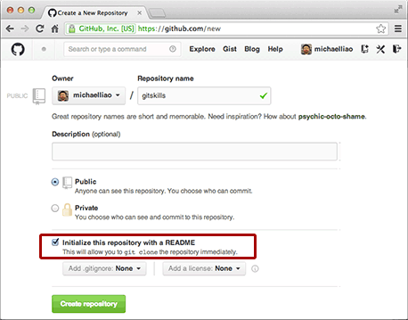

# **Git 使用**

## 配置用户名与邮箱

```shell
git config --global user.name "you_name"
git config --global user.email "you_email"
# --global 参数，表示这台机器上所有的Git仓库都会使用这个配置。
# 查看用户信息
git config user.name
git config user.email
# 查看配置信息
git config --list
```

因为Git是分布式版本控制系统，所以每个机器都必须自报家门：你的名字和Email地址。

## 创建仓库

创建工作目录并通过 **git init** 命令把这个目录变成 **Git** 可以管理的仓库。

**ls -a** 命令可以发现工作目录下多了一个 .git 的隐藏目录，该目录是Git用于跟踪管理版本库的，别手动修改.git里的文件，免得破坏了Git仓库。

```shell
# 新创工作目录
mkdir project
# 进入工作目录中
cd project
# 创建工作目录，改变成为Git可以管理的仓库
git init
```

## 添加及提交文件

组合使用 **git add、git commit、git status** 把文件提交到仓库。

**git status**：检查当前文件状态，能时刻掌握仓库当前的状态。

**git add**：告诉Git，把文件添加到仓库

```shell
git add git_github.md
```

**git commit**：把文件提交至仓库

```shell
git commit -m "本次提交的说明，这样方便从历史记录里找到改动的记录"
```

为什么Git添加文件需要add，commit 一共两步？因为 commit 可以一次提交很多文件，所以可以多次 add 不同的文件。

## 版本的控制

-  **git diff** ：把文件状态是修改的，但未提交至仓库的文件中具体修改了那些内容显示出来。

- **git log**：显示从最近到最远的提交日志，也可以简化显示（**git log --pretty=oneline**），每提交一个新版本，实际上Git会把它们自动串成一条时间线。

  ```shell
  git log --pretty=oneline
  27e9a82a434dfff56caf0df69582f56792a370f8 (HEAD -> master) 把格式作了修改
  d704af810165686a579417ed604337b08408d83c 初步添加Git学习
  ```

  在Git中，用HEAD表示当前版本

### 版本回退

**git reset --hard commit_id** ：版本回退，版本回退后，如果发觉不行，只要记录之前的版本号，也可以再跳回到第一次的版本。

**git reflog**：查看命令操作历史。

## 工作区与暂存区

**工作区**（working Directory）就是指电脑里能看到的目录。

**版本库**（Repository）在工作区中有一个隐藏目录 .git ，这个不算是工作区，而是 Git 的版本库。


在版本库里最重要的就是称为**stage**(或者叫 index ) 的暂存区，还有 Git 自动创建的第一个分支 **master**，以及指向 **master** 的第一个指针 **HEAD**。

**git add** 实际就是把文件修改添加到暂存区；

**git commit** 实际上就是把暂存区的所有内容提交到当前的分支。因为创建Git版本库时，Git会自动创建唯一一个 **master** 分支，所以，现在，git commit 就是往 master 分支上提交更改。

简单理解为，需要提交的文件修改通通放到暂存区，然后，一次性提交暂存区的所有修改。

## 撤销修改

- 场景一：当改乱了工作区某个文件的内容，想直接丢弃工作区的修改时，用命令：**git checkout -- file_name**

  这命令的意思：把在工作区里某个文件中的修改全部撤销，这里是有两种情况：

  一种是自修改后还没有被放到暂存区的，现在，撤销修改就回到和版本库一模一样的状态。

  一种是已经添加到暂存区后，又作了修改，现在，撤销修改就回到添加到暂存区后的状态。

  总之，就是让这个文件回到最近一次 git commit 或 git add 时的状态。

- 场景二：当你不但改乱了工作区某个文件的内容，还添加到暂存区时，想丢弃修改，分两步，第一步用命令 **git reset HEAD <file>**，就回到了场景一，第二步按场景一操作。

- 场景三：已经提交了不合适的修改到版本库，想要撤销本次提交，使用版本回退操作，前提是没有推送到远程库。

## 删除文件

如果在工作区中把某文件删除了，**git status** 检查时会提示某文件已被删除，那就有两个选择：

- **git rm file_name** 从版本库中删除该文件。
- 另一种情况是删错了，但是版本库里还有，**git checkout -- file_name** 可以很轻松的把误删除的文件恢复到最新版本。

**注意：从来没有被添加到版本库就被删除的文件，是无法恢复！**

## 远程仓库

### 创建 SSH KEY

(Ubuntu)在用户主目录下(home)，使用 **ls -a** 查看是否有 .ssh 目录，该目录下是否存在 id_rsa（私钥） 和 id_rsa.pub（公钥） 这两个文件，如果没有，需要生成这二个文件。

```shell
# 邮箱地址为自已的邮箱地址，提示一路回车即可
ssh-keygen -t rsa -C "youremail@example.com"
```

 登陆 [GitHub](https://github.com)，打开“Account settings”，“SSH Keys and GPG keys”页面，在“Add SSH Key”，填上任意Title，在Key文本框里粘贴 id_rsa.pub 文本中的内容。点击“Add key”，就可以看到添加成功的Key。GitHub允许添加多个Key，若干电脑对应若干个Key。在GitHub上所有仓库的源码都是公开的，任何人都可以看并下载。


### 从远程库克隆

先创建好远程库，然后从远程库克隆。创建一个新的仓库，勾选 **Initialize this repository with a README** ，这样 GitHub 会自动创建一个 README.md 文件。



使用 **git clone** 克隆出一个本地库，本地库名称与远程仓库名称是一致的。

```shell
# 克隆远程库到本地
# you_github_username : GitHub 上的用户名
# warehouse_name：GitHub 上的仓库名称
git clone git@github.com:you_github_username/warehouse_name.git

# 推送本地库到远程库
git push origin master
```

### 本地库连接远程库

在 [**GitHub**](https://github.com) 上，右上角找到“Greate a new repository”（创建一个新的存储库）。在 Repository name 中填入你的存储库名称，其他保持默认设置，点击“Create repository”，确定创建一个新的存储库。


在成功创建该存储库后，GitHub 会在新的页面上提示本地库如何与该远程存储库连接，并把本地库内容推送到该远程库中。


```shell
# 根据提示，把本地库与远程库连接关联起来
# username：为GitHub的登录账号
# repository_name：为远程存储库名称
git remote add origin git@github.com:username/repository_name.git
# 使用 git push 把本地库内容推送到远程库中
# 由于远程库是空的，第一次推送 master 分支时，加上 -u 参数，Git 不但会把本地的 master 分支内容推送到远程新的 master 分支，还会把本地的 master 分支和远程的 master 分支关联起来，在以后的推送或者拉取时就可以简化命令。
git push -u origin master
# 关联以后的提交，就可以使用简化命令了
git push origin master
```

SSH警告，当第一次使用 Git 的 **git clone** 或者 **git push** 命令连接GitHub时，会得到一个警告

```shell
The authenticity of host 'github.com (xx.xx.xx.xx)' can't be established.
RSA key fingerprint is xx.xx.xx.xx.xx.
Are you sure you want to continue connecting (yes/no)?
```

 这是因为Git使用SSH连接，而SSH连接第一次验证GitHub服务器的Key时，需要你确认GitHub的Key的指纹信息是否真的来自GitHub服务器，输入yes回车即可。

## 分支管理

分支在实际中的作用，假设准备开发一个新功能，但是需要两周才能完成，第一周写了50%代码，如果立刻提交，由于代码的不完整性，会导致别人不能干活，如果等代码全部写完再一次提交，又存在可能会丢失每天进度的巨大风险。

如果有了分支，就可以创建一个属于自已的分支，别人看不到，还会继续在原来的分支上正常工作，而你在自已的分支上干活，想提交就提交，直到开发完毕后，再一次性合并到原来的分支上，这样，既安全又不影响别人工作。

Git 鼓励大量使用分支：

- 查看分支：**git branch**

- 创建分支：**git branch <name>**

- 切换分支：**git checkout <name>** 或者 **git switch <name>**

- 创建 + 切换分支：**git checkout -b <name>** 或者 **git switch -c <name>**

- 合并某分支到当前分支：**git merge <name>**

  当Git无法自动合并分支时，就必须首先解决冲突。解决冲突后，再提交，合并完成。解决冲突就是把Git合并失败的文件手动编辑为我们希望的内容，再提交。**git log --graph** 可以看到分支合并图

  **git merge --no-ff -m "merge with no-ff" <name>** 合并参数 --no-ff 表示禁用 Fast forward，因为合并要创建新的commit，所以要加上 -m 参数，把commit 描述写进去。

  通常情况下，合并分支时，如果可能，Git 会用 Fast forward 模式，但是这种模式下，删除分支后，会丢掉分支信息。但是强制禁用 Fast forward 模式，Git 就会在 merge 时生成一个新的 commit ，这样，从分支历史上就可以看出分支信息。

- 删除分支：**git branch -d <name>**

在实际开发中，按照 几个基本原则进行分支管理：

- master 分支应该是非常稳定的，也就是仅用来发布新版本，平时不能在上面干活；
- 干活都在dev分支上，也就是说，dev 分支是不稳定的，到某个时侯，要发布某个版本时，再把 dev 分支合并到 master 上，在 master 分支发布版本；
- 平时都在dev分支上干活，每人都有自已的分支，时不时往dev分支上合并就可以了。

所以团队合作的分支看起来就像这样：


### BUG 修复

修复bug时，会通过创建新的bug分支进行修复，然后合并，最后删除；当手头工作没有完成时，先把工作现场 **git stash** 保存一下，然后去修复 bug，修复后，再 **git stash pop** 恢复回到之前保存的工作现场。

在master 分支上修复的bug，想要合并到当前dev分支，可以用 **git cherry-pick <commit> **  命令，把bug提交的修改“复制”到当前分支，避免重复劳动。

### Feature 分支

每添加一个新的功能，最好新建一个 feature 分支，在上面开发，完成后，合并，最后删除该 feature 分支。

要删除这类分支，要使用 **git branch -D <feature-name>** 才能删除成功。